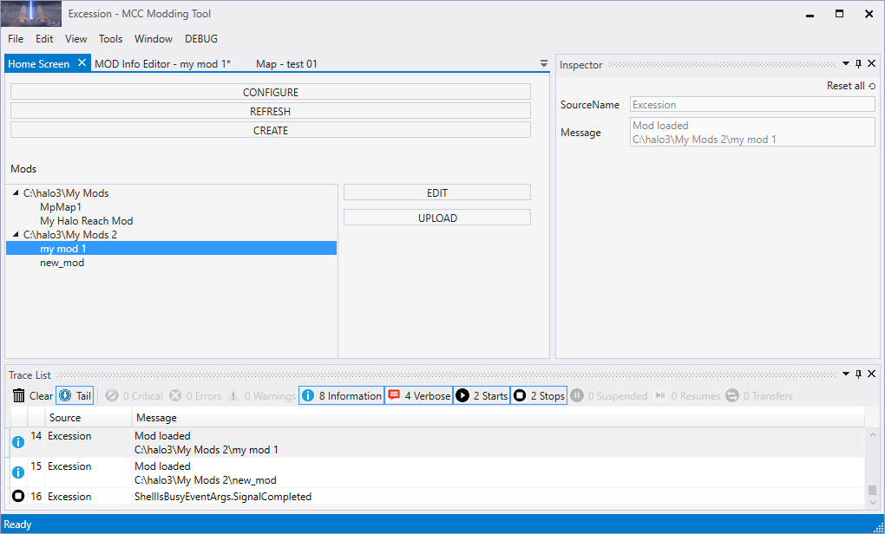
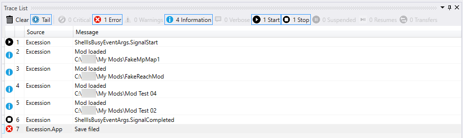
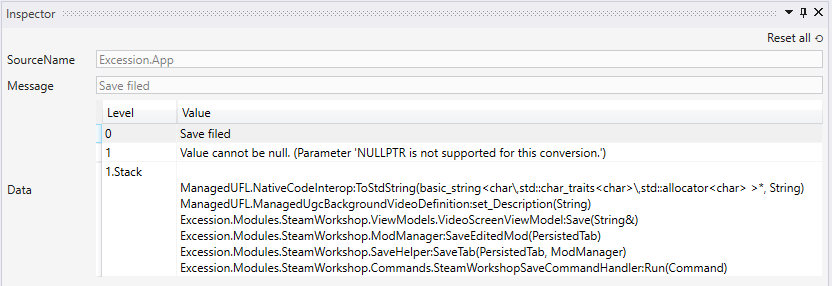

# Appendix A: UI of Excession

After the initial configuration and creation of some mods launch (see above), the UI of Excession will look similarly to the following:

Fig 1. The UI of Excession just after initial configuration and creation of some mods.

The main window of Excession displays tab that are necessary for working with mods. The main tab is a **Home Screen** that displays all your mods with the configured root folders in the **Mods** list, allows you to create new mods (**CREATE**), change existing mods (selection in the list + **EDIT**), and upload them to Steam Workshop (selection in the list + **UPLOAD**). And, also allows you to configure your root folders (**CONFIGURE**) and refresh the list of mods (**REFRESH**).

In the process creating/editing a mod, the tool will open new tabs for you that will allow you to edit properties of various entities contained by the mod (of the mod itself, of a particular map, episode, insertion point, and so on). To save your changes to these properties, select **File** > **Save** or **File** > **Save All** from the main menu of Excession after your modifications.

> [!NOTE]
> Editing of field values in these tabs has one specificity: when you change the value of the field, you need to remove the focus from this field before saving, otherwise the new value will not be saved.

The **Trace List** panel (at the bottom of the main window) displays the log of all operations performed in and by Excession. For example, new entries are added to it when you perform **REFRESH** to identify mod packages in the root folders.

If necessary you can filter this log by debug levels (by **Critical**, **Errors**, **Warnings**, and other similar filters), enable or disable auto-focus on the most recent log entries (the **Tail** switcher), and so on.

Fig 2. The Trace List filtering by log types.

The **Inspector** panel (at the right side of the main window) displays detail for log entries selected in the **Trace List** panel. This is useful for viewing details of errors.

Fig 3. The Inspector panel showing more details of an error.
