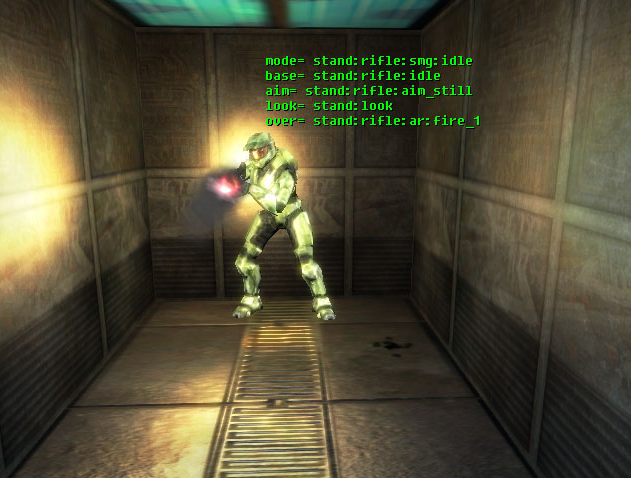
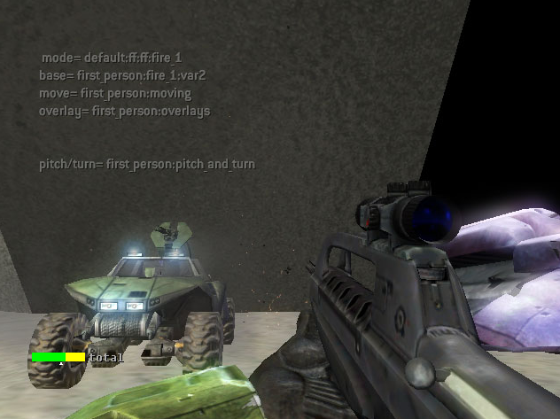

# Animations

## USEFUL TOOL COMMANDS

Tool commands useful for animators.

### Compile Model animations

A set of animation source files can be compiled into a model_animation_graph tag.

```
# model-animations <source-directory> [flags]
tool model-animations "objects\characters\masterchief"
```

- source-directory - A local data path to the root of a model source directory.

- flags

*For the example above, Tool would expect to find a set of corresponding animation source files at* data\objects\characters\masterchief\animations. *Assuming no errors, it would be compiled into* tags\objects\characters\masterchief\masterchief.model_animation_graph.

### Get Model animation count

Goes to all the animations in a directory and child directories. Once it's done it prints debug info.

```
# model-animation-count <source-directory>
tool model-animation-count "objects\characters\masterchief"
```

- source-directory - A local tag path to a directory containing model_animation_graph tags or child folders with model_animation_graph tags.

### Monitor Model animation status

Goes to all the animations in a directory and child directories. Once it's done it prints debug info.

```
# model-animation-status <source-directory>
tool model-animation-status "objects\characters\masterchief"
```

- source-directory - A local tag path to a directory containing model_animation_graph tags or child folders with model_animation_graph tags.

## USEFUL DEBUG COMMANDS

Useful debug commands for animators.

### DEBUG OBJECT UNIT STATE

Add these lines to the **init.txt** file in your Halo 2 working folder.

- debug_objects on

- debug_objects_unit_vectors off

- debug_objects_bounding_spheres off

- debug_objects_collision_models off

- debug_objects_physics_models off

- debug_objects_unit_state on

These commands turn on debug_object rendering, then turn off a bunch of output you don’t need, and finally turn on the one mode you do need (debug_object_unit_state).

|Reference Image|Notes|
|---------------|-----|
||Above the head of each unit, the following data is written out:<br /><br />mode= [seat][weapon class][weapon type][state] ← the state of the unit as far as the AI is concerned<br />base = [name of the base animation being played]<br />aim = [name of the aiming screen is use]<br />look = [name of the looking screen in use]<br />over = [name of the current overlay] ← firing, reloads, etc...|

### DEBUG FIRST PERSON ANIMATIONS

You can view which first person animations are playing by typing in the console command:

**debug_first_person_weapons on**

If the HUD is getting in the way, you can turn it off by typing in the console command:

**show_hud off** 

|Reference Image|Notes|
|---|---|
||In the upper left quadrant of the screen, the following data is written out:<br /><br />mode= [default]:[weapon class]:[weapon type]:[mode]<br />base = base animation<br />moving (if moving) = moving animation overlay = overlay animation<br />pitch/turn = pitch/turn overlay animation  |

## MODEL AND ANIMATION NAME PROCESSING

When models and animations get imported into the game, the names are first processed:

1) All uppercase letters are changed to lowercase

2) All white spaces and dashes [ - ] are replaced with underscores [ _ ]

3) Prefixes for skeletons are removed along with proceeding underscores
    - frame
    - bone
    - bip01
    - b

4) Strings are terminated at "_atr_"
    - ..._atr_... → ...\0atr...

5) Attributes are processed
    - characters following "_atr_" each identify an attribute (not including characters considered white space or [ _ ]), ie u = unused

> [!NOTE]
> All attributes should be set in Max or Maya. Properly named nodes - ie, "_atr_u" - are not imported into Game. 

> [!IMPORTANT]
> NAMED NODES ARE PREFERRED TO USER-DEFINED PROPERTIES IN MAX


## MONITORING CHANGES IN ANIMATIONS WITH ASSOCIATED SOUNDS

If you change an animation which has sounds attached to it, you will be warned by Tool and a flag will be set in the animation showing it has been changed.

The two flags found in each animation are:

"do not monitor changes" -> when set, changes in the animation are ignored, even if audio is attached
"verify sound events" -> set when the animation has been changed, and sound events are attached

The “verify sound events” flag will be set for any animation that has sounds attached whenever the duration, node list, or animation content is changed. If you are simply re-importing the graph without changing any animations, the flags will not be set.

For example, assume after re-importing the elite graph, you got the following result:

```
[WARNING] Animation 'stand:pistol:land_hard' has changed . Its sound events must be checked.
[WARNING] Animation 'stand:pistol:land_soft' has changed. Its sound events must be checked.
[WARNING] Animation 'stand:pistol:melee' has changed. Its sound events must be checked.
[WARNING] Animation 'stand:pistol:move_back' has changed. Its sound events must be checked.
[WARNING] Animation 'stand:pistol:move_front' has changed. Its sound events must be checked.
[WARNING] Animation 'stand:pistol:move_left' has changed. Its sound events must be checked.
..etc..
```

This tells you that a bunch of animations with sound events have changed, and the sound events need to be verified. Once the sound events have been checked, the “verify sound events” flag can be cleared. Whenever possible, animators should check to make sure they have not changed the animation in a way that will screw the sound events attached. If everything is ok, clear the flag. Ideally, the only reason to check in a file with the “verify sound events” flag set is if new audio has to be authored to match your changed animation.

You can monitor these flags by using the new tool command model-animation-status as in:

**tool model-animation-status objects\characters**

This will produce a list of all animations in the directory requested (and all sub-directories) which have the “verify sound events” flag set. You can also pump the output into a text file using the > symbol. As in:

**tool model-animation-status objects\characters >output.txt**

If you want to list the results of ALL animation graphs, use a set of empty quotes for the directory

**tool model-animation-status "">output.txt**

Here’s an example of the list generated:

```
objects\characters\elite\elite => stand:pistol:land_hard
objects\characters\elite\elite => stand:pistol:land_soft
objects\characters\elite\elite => stand:pistol:melee
objects\characters\elite\elite => stand:pistol:move_back
objects\characters\elite\elite => stand:pistol:move_front
objects\characters\elite\elite => stand:pistol:move_left
Finished. 6 changed animations found
```

Each entry is graph_name => animation_name

## More information on animations can be found in these additional pages.

### [Damage Animations](../Animation/AnimationDamageAnims.md)

### [First Person Animations](../Animation/AnimationsFPAnims.md)

### [Inherited Animations](../Animation/AnimationInheritedAnims.md)
