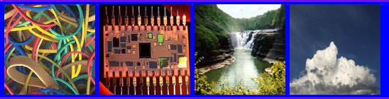

# Bitmaps - Plates

A plate is a number of images assembled in a single .tif file, that when imported creates a single .bitmap file. These can be used to create animated bitmaps or sprites. Animated bitmaps can be used in shaders for animated or random effects, or for animated images in effects. Sprites are used for decorators, effects, lens flares, light volumes and contrails.

## BITMAP PLATE BASICS

The importer uses the first three pixels in the upper left corner to set the background color, the border color and the transparent color. The background color is ignored at import, the border color separates the final images and the transparent color is used to change the registration of the images. These three defining colors are a single pixel each.


Fig 1. Basic Bitmap Plate Setup.

**The background color is ALWAYS Blue (R=0, G=0, B=255)**. Note that ANY bitmap that has a pure blue pixel in the upper left will be assumed to be a plate by the importer!

Horizontal borders are one pixel high and must stretch from edge to edge. The top border MUST be the second pixel row. Vertical borders between images must be a single pixel only and surrounded by at least a pixel width of background color.

The registration point for sprites is always the center of the image. The transparent color is used to offset the final image by filling a larger space with a transparent color.

It is very important that you don't allow any variation (aliasing, etc) of these colors. In the background, for example, ANY color other than pure blue (R=0, G=0, B=255) will NOT import as background. This is a common mistake and one you should check for if there are any problems.

### **A note on odd-size (not power of two dimensions) images:**

Sprites can be of any size. At first import, Tool will balk at the odd-size images - but just set the .bitmap type to **sprite** and re-import.

|Import|Processed|
|------|---------|
|||
|Fig 2. Odd Size Import|Fig 3. Processed import|

### EXPERT MODE - Changing the Border Width

When processing bitmaps, Tool defaults to creating a 4 pixel border around every plate - 8 pixels between plates. Generally this is fine and helps ensure that mipped plates don’t bleed into one another. However there are times when a 8 pixels between plates takes up too much too much room and bumps you up a bitmap size, resulting in wasted texture space. If you want a tighter border to keep the texture size down you do have control over that.

1. You first have to enable Expert Mode in Tool, which is an option under the Edit menu of Guerilla. (BE AWARE THIS CAN CAUSE ALL SORTS OF PROBLEMS - BE CAREFUL!)

2. In the bitmap tag look for the Sprite Spacing string under the ...more sprite processing heading. This is the number of pixels Tool draws around every plate. Notice it defaults to 0, which is equal to a 4 in the eyes of Tool. Change it to 1, 2, or 3 and rerun Tool to process the bitmap with the new setting. This reduces your plate gutter to 2, 4, or 6 pixels.

3. After you are done, disable Expert Mode.

Plates are used to create multiple images in a single .bitmap tag. The Tool command **plate** collects .tif files from a folder and creates a single plate out of them. This plate can be imported into the game as a sequence of bitmaps.

## CREATING PLATES USING TOOL

The Tool command **plate** collects .tif files from a folder and creates a single plate out of them. This plate can be imported into the game as a sequence of bitmaps.

The format for running plate is:

```
plate <source-directory>
```

**source-directory**: Complete path to output tif file, relative to the **directory you are running tool from**. Note that this is different than most other tool commands, which are relative to H2EK\data\ (or your actual working folder).

### EXAMPLE

Suppose you have four .tif bitmaps in H2EK\data\test\bitmaps\plate_test


Fig 4. Example images before turning into a Bitmap Plate.

From \H2EK\ you would run:

```
tool plate data\test\bitmaps\plate_test\
```

...which will show you:

```
H2EK>tool plate data\test\bitmaps\plate_test\
found 4 bitmaps...
0: "bands.tif" (128x128)
1: "chip.tif" (128x128)
2: "fall.tif" (128x128)
3: "sky.tif" (128x128)

plate will be #548x#140 with #1 sequences.
successfully created 'data\test\bitmaps\plate_test\.tif'.
```

...and has created H2EK\data\test\bitmaps\plate_test.tif:



Fig 5. Images now combined into Bitmap Plate.

If you import this into the game using:

```
tool bitmaps test\bitmaps
```

...you will create a single .bitmap tag that contains all four images:


Fig 6. View of the Example Images in Bitmap Tags.

## PLATES FOR ANIMATED BITMAPS

Animated bitmaps use the bitmap index to select one of a number of images in a single .bitmap tag.

The images must be in powers of two, though the plate itself can be any size. Animated bitmaps can only have a single row of images.

Here is a simple plate with three images, magnified 300% for clarity:


Fig 7. Sample Bitmap Plate.

If this is imported using the regular process for bitmaps, it creates a single .bitmap tag with three indexed images:


Fig 8.View of the Example Plate in Bitmap Tags.

No special settings are needed in the .bitmap tag.

Animated bitmaps can use different compression settings and can have alpha channels.

## PLATES FOR SPRITES

Sprite bitmaps use the **sequence** and **sprite bitmap index** to select one of a number of images in a single .bitmap tag.

The images as well as the plate can be any size. Each row (separated by a horizontal border) will be a unique sequence.

Here is a simple plate with six images (two sequences each with three images), magnified 300% for clarity:


Fig 9. Image sequences example.

If this is imported using the regular process for bitmaps, you’ll need to change the bitmap type to **Sprites:**


Fig 10. Tag Type set to "sprites".

After re-importing, this will create a single .bitmap tag with six images:


Fig 11. Single .bitmap tag with six images.

> [!NOTE]
> They will not appear “in order” when viewing the .bitmap tag in Guerilla.

These six images can be addressed by the game engine according to their sequence and sprite bitmap index. You can see this information towards the bottom of the tag:


Fig 12. Sprite sequence in Guerilla.

## USING TRANSPARENT COLOR FOR SPRITE REGISTRATION

A sprite image will always be placed in the game by its **registration point**, which is always at the center of the image:


Fig 13. The registration point is always in the center of the image.

If you want to change the relative position of the registration point, just add transparent color to center the registration point:


Fig 14. Adding transparency to adjust the registration point.

A plate that looks like this:


Fig 15. Example plate with the registration points set to the corners of each image.

...will you look like this in the tag:


Fig 16. Example Plate imported into a bitmap tag.

> [!NOTE]
> The transparent color is not imported - only the registration point is changed.
