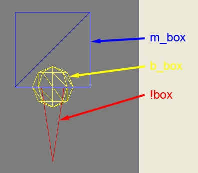
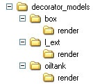
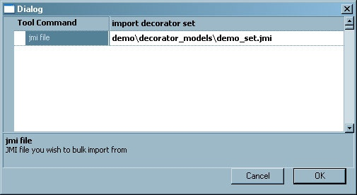
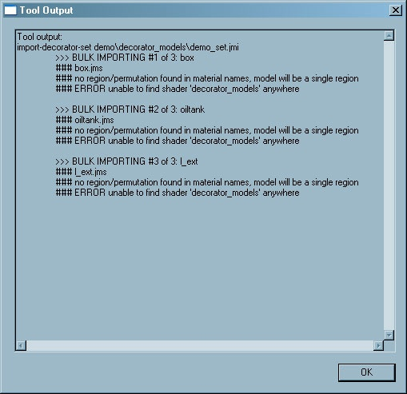
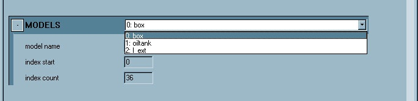
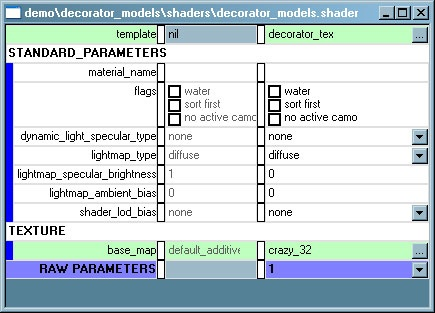
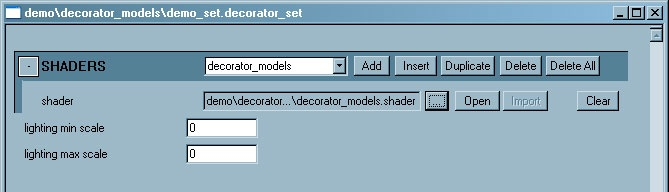
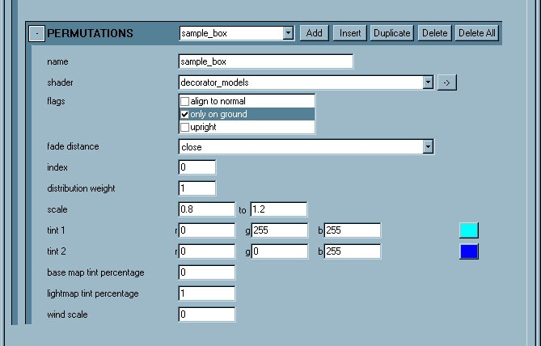

# H2 Decorators - Models

**Decorator Models** are a class of **Decorators**.

Model is the only class of decorators that you can build geometry for. Objects are created in a 3D application as a bulk file, and exported as a .jmi file. Note that all decorator models are two-sided. No parsed materials.

- Source: .jmi model file (bulk file, can have mutiple elements)

- Import: use tool: import-decorator-set

- Creates .decorator_set

- Shader: use decorator_tex.shader_template only. This is an alpha tested shader.

- Lighting: lit by lightmaps, not lit by dynamic lights

- LOD: smallify w/distance

> [!NOTE]
> No damage states, does not accept decals


## SETTING UP THE DECORATOR MODELS

Decorator Models in the same set are built in a single bulk file. The bulk file will contain render models only - no collision or physics models.

Here is a example single decorator object set up:



Fig 1. A single decorator object set up.

The **mesh** is a box named “m_box”, the **frame node** is a sphere named “b_box” and the the **origin node** is a pyramid named “!box”

Make sure that mesh has UV coordinates and a proper shader applied.

If we want to have three objects in our decorator set - a box, an L extrustion and an oil tank - it might look like this:


Fig 2. Multiple decorator objects set up.

From here you would export a **.jmi** file into the proper directory.

If the .jmi is exported into a directory called “decorator_models” it will create subdirectories like this:



Fig 3. decorator_models directory.

> [!NOTE]
> Subdirectories are named after the origin nodes. Each of these subdirectories contains a folder called “render”. Each of those render folders contains a .jms file (again named after the corresponding origin node).

## IMPORTING THE DECORATOR MODELS

After you have exported the .jmi file (which should have created the correct subfolders and .jms files), you can import this by running Tool from inside Guerilla.

The Tool Command is **import_decorator_set**.



Fig 4. import_decorator_set command in Guerrila.

When you run Tool, you’ll get an output window:



Fig 5. import_decorator_set command tool output.

Note that you will be attaching the shader separately - it doesn’t need to be associated with the model at import.

## SETTING UP THE .DECORATOR_SET TAG IN GUERILLA

When you imported the .jmi file using **import_decorator_set** it will create a **.decorator_set** tag in the analogous hierarchy as the .jmi file, so:

```
\H2EK\data\demo\decorator_models\demo_set.jmi
```

...will create:

```
\H2EK\tags\demo\decorator_models\demo_set.decorator_set
```

Initially, the tag will only contain the model data:



Fig 6. Models Data section of the decorators_set tag.

### CREATING THE SHADER

First, you’ll need to create the shader to be used by the decorator models. Create a new .shader tag in Guerilla by choosing file -> new and setting Group to shader. Select a template for the .shader by choosing the “...” icon. Navigate into the decorators folder and choose decorator_tex.shader_template. This is the ONLY template you should use with decorator models.



Fig 7. New shader with the decorator_tex.shader_template.

> [!NOTE]
> None of the standard parameters apply to decorators.

Reference the base map you want to use with the shader.

### SHADERS BLOCK

Now that you have a .shader tag you can reference it from the .decorator_set tag. In the SHADERS block, choose **Add** and then reference the new .shader tag. Note that while the .decorator_set can reference multiple shaders, you’ll want to use as few as possible.



Fig 8. Adding the new shader to the shaders block of the .decorator_set tag.

Next, you’ll need to add at least one **decorator class**. Decorator sets can contain multiple classes but for this example we’ll make just one class: **models**.

### CLASSES BLOCK

In the CLASSES block, choose **Add**. The **name** field is what this set of decorator models will be shown as in Sapien. The **this_can_be_any_name** set could contain a single model, but for this example we will put all three models in the same set. This will allow all three to be randomly distributed at the same time.


Fig 9. Add a new Class in the Classes block.

Next we’ll add one entry in the PERMUTATIONS block for each model. Let’s start with the **box** model, which is index # 0.

### PERMUTATIONS BLOCK

In the PERMUTATIONS block, choose **Add**. The **name** field is what this particular model will show as in Sapien. The **shader** field will allow you to pick any shader defined at the top of the tag in the SHADERS block. For this example, **sample_box** will only appear on the ground and will fade at a close distance. The **index** for the box can be found in the MODELS block - it’s the number that’s important - in this case it reads “0:box”, so the index for the box model is 0.



Fig 10. Permutations block in the decorator_set tag.

Repeat this process for the **l_ext** and the **oil_tank**. Remember you can use the **duplicate** function.

## READY TO PLACE!

This .decorator_set is ready to be placed in Sapien. 
