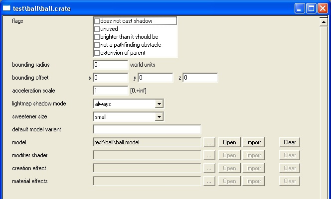
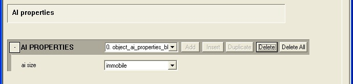
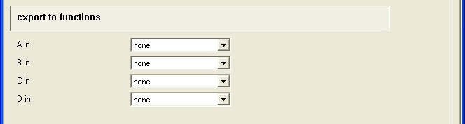
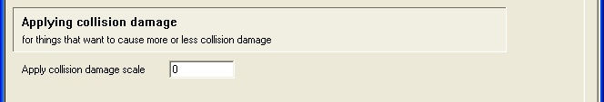
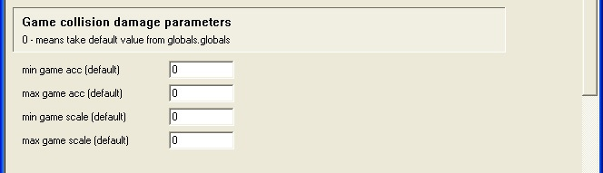
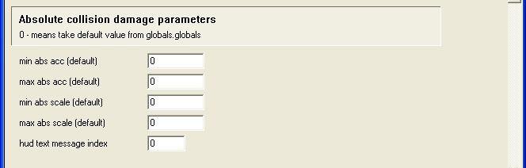
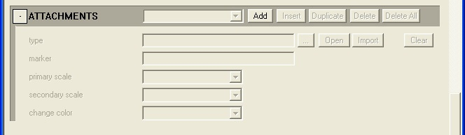
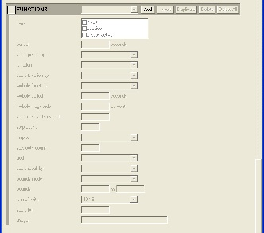
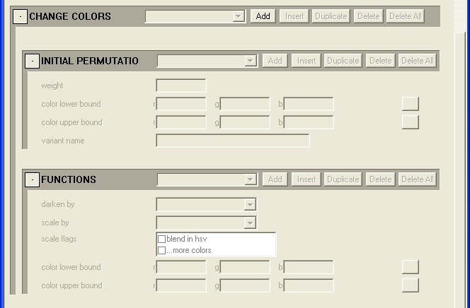
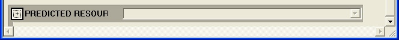

# Crates

A **.crate** tag is an **object** tag, like **.biped**, **.scenery** or **.vehicle**.

Crate tags are used for passive objects that require Havok simulation (that is, objects that can be moved in the game - like crates).

The **.crate** tag is created in Guerilla using the **File -> New** command.

## .crate TAG

The parameters in the top section of the tag are common to all object tags.

Fig 1. List of common object tag parameters.

- **flags | does not cast shadows**: N/A.

- **flags | unused**: N/A.

- **flags | brighter than it should be**: N/A.

- **flags | not a pathfinding obstacle**: N/A.

- **flags | extension of parent**: N/A.

- **bounding radius**: sphere used to calculate whether the object should be rendered.

- **bounding offset**: offset from origin point of object.

- **acceleration scale**: [marine 1.0, grunt 1.4, elite 0.9, hunter 0.5, etc].

- **lightmap shadow mode**: default | never | always.

- **sweetner size**: N/A.

- **default model variant**: default variant as set in the **.model** tag.

- **model**: link to .model tag.

- **modifier shader**: N/A.

- **creation effect**: N/A.

- **material effects**: N/A.

## AI PROPERTIES

Fig 2. AI Properties tag block.

## EXPORT TO FUNCTIONS

Links game data into the object tag.

Fig 3. Export to functions section.

**A in**: pull-down list of available game data such as body vitality, shield vitality and shield stun.

**B in**: same description as A in.

**C in**: same description as A in.

**D in**: same description as A in.

## APPLYING COLLISION DAMAGE

Zero will take default settings from **globals.global**. Nothing needs to be set here for the object to function in the game.

This section modifies how the object applies damage to other objects in a collision.

Fig 4. Applying Collision Damage section.

**Apply collision damage scale**: modifies how the object applies damage to other objects in a collision. Range: ? [O means 1. 1 is standard scale. Some things may want to apply more damage]

## GAME COLLISION DAMAGE PARAMETERS

Zero will take default settings from **globals.global**. Nothing needs to be set here for the object to function in the game.

This section determines the threshold and scale for how the object applies and receives damage in a collision with other objects.

Game damage is equal to the magnitude of the velocity of the object being run into divided by the maximum of the magnitude of the velocity of the object or the magnitude of the velocity of the object being run into.

Fig 5. Game Collision Damage Parameters.

**min game acc (default)**: minimum threshold for game damage to occur. Range: zero to infinity.

**max game acc (default)**: maximum threshold for game damage to occur. Range: zero to infinity.

**min game scale (default)**: minimum scale factor for game damage when it does occur. Range: zero to one.

**max game scale (default)**: maximum scale factor for game damage when it does occur. Range: zero to one.

## ABSOLUTE COLLISION DAMAGE PARAMETERS

Zero will default to settings in **globals.global**. Nothing needs to be set here for the object to function in the game.

This section determines the threshold and scale for how the object receives damage in a collision with other objects.

Fig 6. Absolute Collision Damage Parameters.

**min abs acc (default)**: minimum threshold for absolute damage to occur. Range: zero to infinity.

**max abs acc (default)**: maximum threshold for absolute damage to occur. Range: zero to infinity.

**min abs scale (default)**: minimum scale factor for absolute damage when it does occur. Range: zero to one.

**max abs scale (default)**: maximum scale factor for absolute damage when it does occur. Range: zero to one.

**hud text message index**: N/A.

## ATTACHMENTS

Fig 7. Attachments Section.

## FUNCTIONS

Fig 8. Functions Section.

## CHANGE COLORS

Colors generated in the object tag can be used to color the render model. These can be used for random variation, color permutations or team colors.

Fig 9. Change Colors Section.

**weight**: determines the relative chance of a permutation being chosen.

**color lower bound**: one end of the color range.

**color upper bound**: the other end of the color range.

**variant name**: Permutations can be named in the variant name. That permutation will only show up in a variant of the same name (set up in the .model tag, in the VARIANT: name field - the names must match).

## PREDICTED RESOURCES

Fig 10. Predicted Resources Section.
