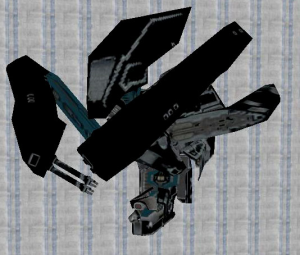

# Activities

Below, you'll find a list of the activities AI can perform while not in combat. Each activity includes a description, screenshots of each character performing it, and a list of which characters can perform it.

## **Patrol**

- **Description** — Character walks between pre-designated patrolling points.

- **Who can use it** — Brute, Bugger, Elite, Floodcombat_elite, Floodcombat_human, Grunt, Hunter, Jackal, Marine, Monitor, Sentinel_aggressor.

||||
|---|---|---|
||||
||||
||||

## **Sleep**

- **Description** — Character sleeps.
- **Who can use it** — Grunt.

## **Kneel**

- **Description** — Character kneels.
- **Who can use it** — Brute, Bugger, Elite, Grunt, Jackal, Marine.

||||
|---|---|---|
||||

## **Guard**

- **Description** — Character stands guard.
- **Who can use it** — Brute.

## **Corner**

- **Description** — Character corners.
- **Who can use it** — Brute, Elite.

|||
|--|--|
|||

## **Injured**

- **Description** — Character acts badly wounded.
- **Who can use it** — Marine.

## **At Ease**

- **Description** — Character is at ease.
- **Who can use it** — Marine.

## **Cower**

- **Description** — Character cowers in fear.
- **Who can use it** — Marine.

## **Tai Chi**

- **Description** — Character performs a type of covenant martial art which looks similar to Tai Chi.
- **Who can use it** — Brute, Grunt, Jackal.

||||
|--|--|--|
|||
