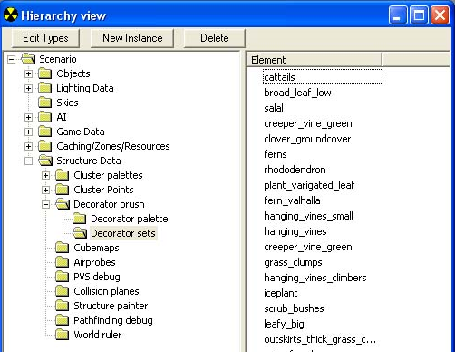
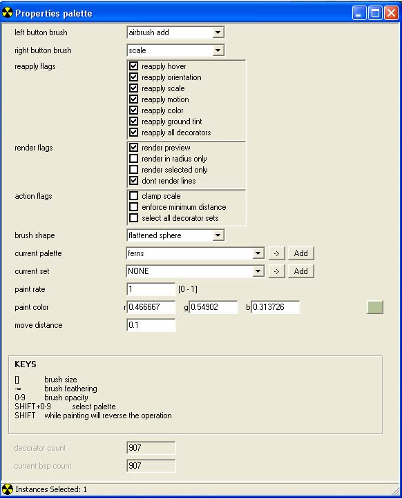
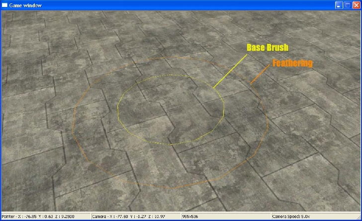
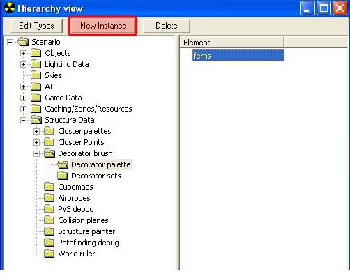
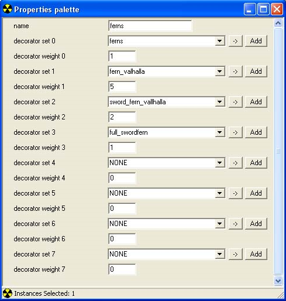

# Painting

Painting decorators involves using [Sapien](../../Tools/Sapien/SapienHome.md) to place the decorators in a map and requires the decorators resource for forked scenarios. Adding decorator sets is slightly different from the typical means of adding objects to a scenario.

## Adding Decorator Sets in Saipien

For each decorator set you want to use in your scenario, you will have to create a new instance in the Scenario\Structure Data\Decorator brush\Decorator sets folder (see Figure 1).

Figure 1 - Decorator Sets Path.

## Decorator Brush Tool

The Decorator Brush tool is used to place and edit individual decorators on the map. To use the tool you will first need to select a decorator set, a decorator palette, or choose the select all decorator sets option. After you have selected decorators to edit you can then use the actions available to be bound to the left and right mouse buttons (see Figure 2).

Figure 2 - Decorator Brush Tool.

When you go to paint down the decorators in the game window, two circles should appear and follow your mouse (see Figure 3).

Figure 3 - Brush Example.

The outer orange circle represents the end of the feathering, the inner yellow circle represents the core brush.

## Brush key commands

- ]— Increase brush size

- [— Decrease brush size

- =— Increase feather size

- -— Decreases feather size

- 0-9— Brush opacity

- shift— Reverse operation (while painting)

- shift+0-9— Select palette

> [!NOTE]
> If you see only one circle the brush and feather might be the same size— increase or decrease the size of the feather to see both circles

## Tool list and uses

- airbrush add — Allows you to paint down decorators from the current set (or the current palette if the current set is none)

- airbursh color— Shifts the color tint for the decorators based upon the color and paint rate, will paint on the current set and current palette

- airbrush erase— Erases the decorators in the current set and current palette and use the paint rate and the brush size/feather

- density smooth— Currently unable to find a function

- precision place— Places a single decorator at the brush center from the current set or, if the current set is set to none, will choose a decorator from the current palette

- precision delete— Deletes a single decorator near to the brush center from the current set or the current palette

- scale — Scales the decorators in current set and current palette to a maximum of 2.0 using the paint rate. Press shift to scale the decorators smaller.

> [!CAUTION]
> It's possible to shrink a decorator untill it is no longer visible, so use this tool with care

- scale additive— Does the same thing as scale but the longer it is held down the quicker the scale will happen

- rotate random— Applies a random rotation around the normal of the surface under the decorator to the decorators in the current set and the current palette

- rotate normal— Rotates decorators based on the normal of the surface counter-clockwise (press shift to rotate them clockwise). Rotates both decorators in the current palette and the current set

- rotate local— Rotates decorators counter-clockwise based on their up axis and clockwise when holding shift. Rotates both decorators in the current palette and the current set

- eraser— Erases the decorators in the current set and current palette if they fall anywhere in the brush boundaries

- reapply type settings — Based upon the reapply flags will "reset" the decorators, see the reapply flags section for more information. This will apply to both the current set and current palette

- drop to ground — Causes the decorators in the current set and palette to drop straight down. This will also use all the reapply flags

- comb— This feature is currently not fully implemented

- thin— Removes decorators that are closer than the minimum distance, affects both the current set and current palette

The following is a list of the other options available and how to use them:

- reapply flags— These are settings used for the reapply type settings and the drop to ground brush tools. If you make any changes to the type settings in a decorator set you will need to use the reapply tool and flag just the areas that you have changed or want changed

    - reapply hover— When checked will reapply the hover setting from the decorator set tag

    - reapply orientation— When checked will reapply the orientation from the decorator set tag

    - reapply scale— When checked will reapply the scale setting from the decorator set tag

    - reapply motion— When checked will reapply the wind/wave settings from the decorator set tag

    - reapply color— When checked will reapply the color settings from the decorator set tag

    - reapply ground tint— When checked will reapply the ground tint settings from the decorator set tag

    - reapply all decorators— When checked will ensure the reapply happens to all decorators in the current set and current palette

- render flags— Flags used to control the rendering of decorators mostly used to improve performance

    - render preview— Renders the actual decorator

    - render in radius only— Renders decorators only in the brush radius (good for very decorator-heavy areas)

    - render selected only— Renders only the decorator types in the current set and current palette

    - dont render lines— Stops the decorator lines from rendering, should always be checked unless debugging or looking for particular decorators

- action flags— Flags that affect the painting of decorators universally

    - clamp scale— Ensures that decorators may only be scaled in the 0.5 to 1.5 range (this function is not yet fully verified)

    - enforce minimum distance— Makes it so that two decorators of the same type cannot be in the minimum radius for that set

    - select all decorator sets— Instead of selecting a current set and current palette will select all decorators

- brush shape— Options to change the shape of the brush

    - flattened sphere— The base setting of the brush is a flattened sphere

    - spherical— A proper sphere, good for reaching some floating decorators

    - tall sphere— A taller sphere, ideal for reaching floating decorators

- current palette — The currently selected palette — see Decorator Palettes for more information about palettes

- current set— The currently selected decorator set

- paint rate— The rate at which the paint brushes operate. If anything is happening too fast you can reduce this number to slow the rate at which the brushes affect decorators.

- paint color— The color used for airbrush color

- move distance

## Decorator Palettes

Decorator palettes can be extremely useful for both streamlining performance and editing multiple decorator types at once. To create a decorator palette you will need to select the "Decorator Palette" in the hierarchy view and, like adding decorator sets, you will need to create a new instance to make a palette. Click New Instance (see Figure 4) to create a new instance.

Figure 4 - Decorator Palettes.

When your palette is created you can then add different decorator types to it and weight them to allow you to paint down multiple decorator types at once. It also allows you to filter multiple decorator types to render for a performance boost.

Figure 5 - Decorator Brush Properties.

## Tips for painting decorators

- Unlike the rest of Sapien, you can undo and redo when painting decorators. There are multiple levels of undo and they are very helpful when trying to get just the right decorator to appear.

- If you are having performance issues but want to be able to still see multiple decorator sets, use the decorator palette to limit the number of decorator types rendered to just the ones you must see.
