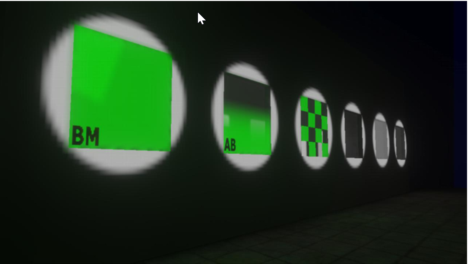
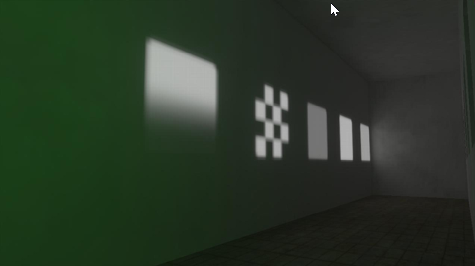
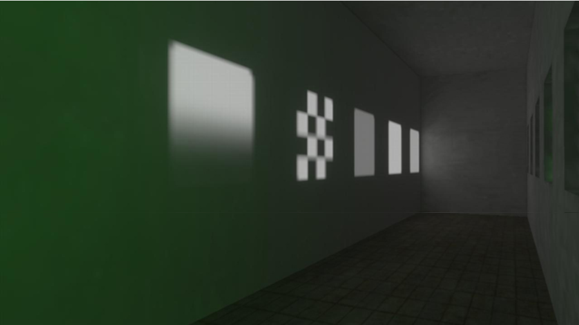

# Lightmap Translucency

Below is a brief explanation of the way that transparency interacts with the lightmapper in the Halo 3 engine.

In order, from left to right (see Figure 1), direct lights were shined through the following materials:

- Shader with green 255 bitmap, two-sided, lightmap transparency color set to green 255
- Shader with green 255 bitmap, using alpha blended gradient
- Shader with green 255 bitmap, using alpha tested checker pattern
- Default shader using multiply blend mode
- Default shader using additive blend mode
- Default shader using double multiply blend mode

See figures two and three for other examples.

Figure 1 - The set of test shaders with direct lights on them.

Figure 2 - The original lightmaps run on high.

Figure 3 - A re-lightmapped version (on high) without changing settings.
