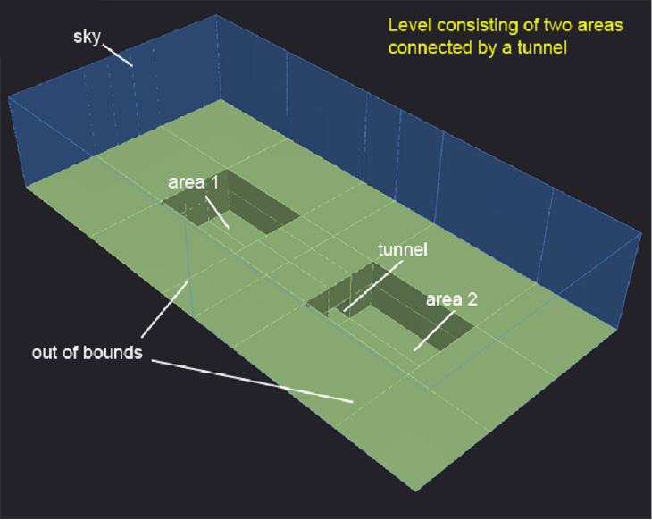
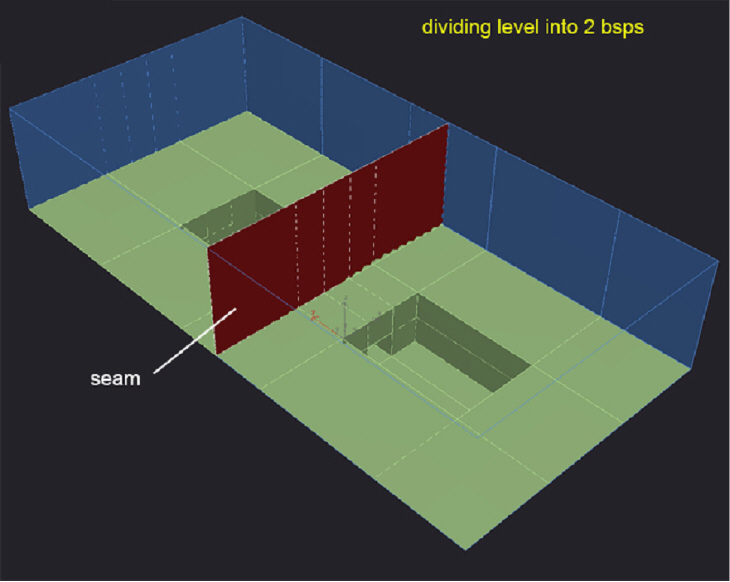
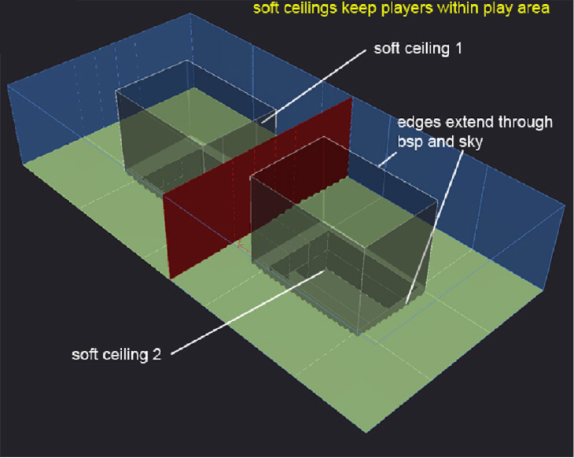
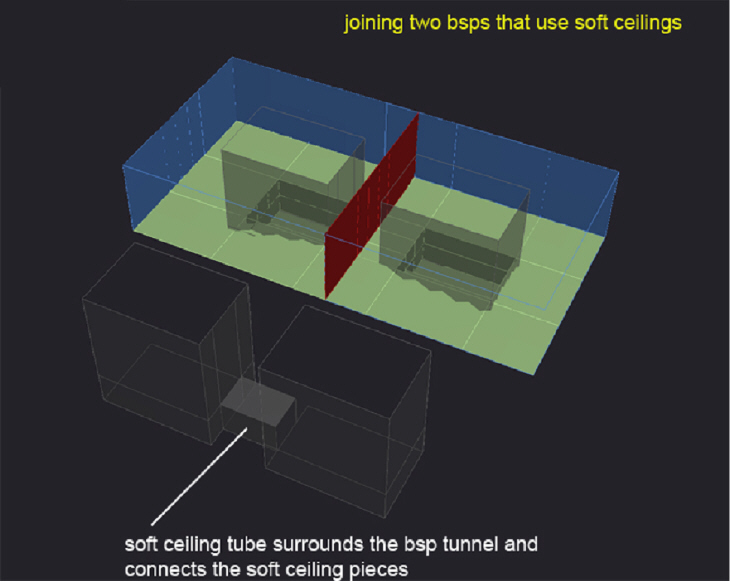
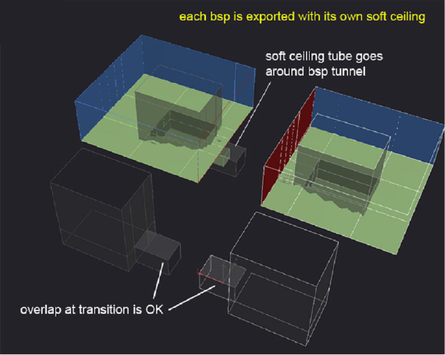
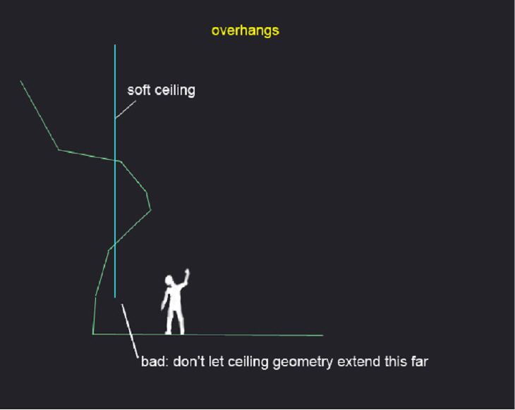
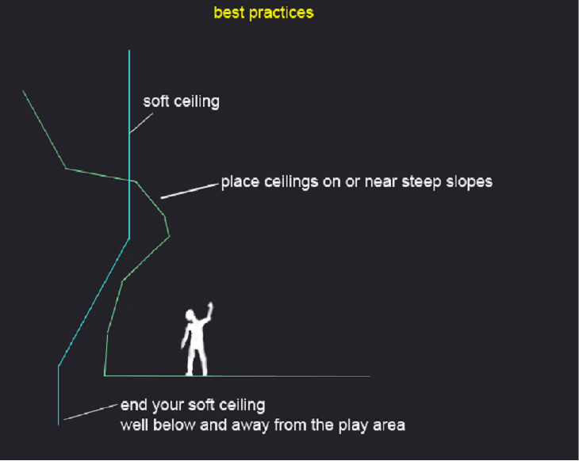

# Create Soft Ceilings

Soft ceilings are barriers of any type, not just ceilings, that will force the player (but not AIs and vehicles) in the direction of the normal of the triangle if they get past it, soft bouncing them back instead of stopping them cold like a wall. In this way you can foil players' efforts to get into an area of the map you don't want them to enter. Basically it's just like a vehicle ceiling from Halo 2 except it can be any arbitrary geometry and will also work on bipeds.

**Defining Soft Ceiling**

Name a material +soft_ceiling:name and it will form a soft ceiling in the game

> [!Note]
> - You can turn off a set of these surfaces in the game with the 2 argument hs function (soft_ceiling_enable name boolean).
> - However before you turn off one you must create an entry in the soft_surface tag block of the scenario. This will also enable you to disable it for bipeds and/or vehicles.
> - Also these surfaces need not be manifold or connected, basically you can build them out of any arbitrary triangle soup.

## Soft Ceilings in Depth

**Where they live**

Soft ceilings are now kept in the Structure Design file. The Structure Design file is a 3ds Max file which contains soft ceilings, slip surfaces, and soft kill surfaces. The Structure Design 3ds Max file and ASS file are stored in the /structure_design directory off the level_name directory.

Example

Here is our typical starting point: encounter spaces connected with a transitional zone, in this case, a tunnel. Unfortunately, these walls are low enough that a player can grenade-jump out of bounds (see Figure 1). Fortunately, we can use soft ceilings to keep the player in bounds. Soft ceilings bounce a player back rather than stopping him dead like sphere collision only surfaces. Plus they don't generate a collision sound or effect when hit.



Figure 1 - Connecting Tunnel

Soft ceilings are pretty simple to use, but they must obey special rules when used in multiple bsps, so let's divide this level into two, for the sake of example (see Figure 2).



Figure 2 - Divided level

Here we've placed soft ceiling geometry. The face normals point **into** the play area (they're shown double-sided here). Like portals, an edge must connect to another soft ceiling edge, embed into the bsp, or extend through the sky. Also note, although called "ceilings" there is no geometry in this example that acts as a literal ceiling or cap. Instead we have "soft walls." This is because overhead soft ceilings tend to throw the player around when he jumps or explodes into them.

In 3ds Max, create a material sub-object with the following naming convention and apply it to the soft ceiling:
```
+soft_ceiling:<name>
```
The *name* used is the handle the designer can use to turn the soft ceiling on and off. If you need several soft ceilings, simply create more sub-objects with different names. You use this feature in situations where the player needs to be limited during game play, but goes through the soft ceiling during a cut scene.

Since we're going to be exporting 2 bsps, we need to make the soft ceilings in 2 pieces. This is important because, unlike bsp geometry, soft ceilings are not automatically truncated at the bsp seams (see Figure 3).



Figure 3 - Soft Ceilings

In Figure 4 you can see what the soft ceiling geometry looks like by itself. Note that we connected the two main volumes of soft ceiling space with a tube of additional soft ceiling material. We have to do this in caves and tunnels because without a continuous connection between the edges near the tunnel, the engine would become confused when you walked "behind" one or both of the embedded soft ceiling edges in that area. None of this tunnel ceiling will be exposed, it will be completely hidden behind the bsp tunnel. Figure 4 shows this more clearly.



Figure 4 - Two BSPs that use soft ceilings

Figure 5 shows how the connecting soft ceiling surrounds the tunnel geometry. Also note that it's acceptable for soft ceilings to overlap a bit. Once exported, there will be two coincident soft ceilings here, but so long as they're similar and relatively small, you should be fine.

A situation you want to avoid is accidentally exporting all of the soft ceilings into some or all of the bsps. This will create duplicate soft ceilings (which are not reported as errors) that can complicate bug-fixing. You will know you made this mistake if you change a soft ceiling, export/import/sync, and see no changes. This is because there is a duplicate soft ceiling loaded into an adjacent bsp, which you haven't reimported yet. Until you eliminate the duplicate soft ceiling from all the loaded bsps you may not see the correct results.

You can examine your soft ceilings with the command debug_structure_soft_ceilings 1 in Sapien (the recommended way) or use the debug menu on your dev kit: debug -> environment -> debug_structure_soft_ceilings. Blue faces are pointing toward you, red faces are pointing away (see Figure 5).



Figure 5 - Each BSP with its own soft ceiling

Examine ceilings near overhangs carefully— once they're embedded into the bsp they shouldn't re-emerge inside the play area (see Figure 6).



Figure 6 - Overhangs

Instead, soft ceilings should continue well below and away from the intended play area. This prevents players from getting too close or behind a ceiling edge.

Also, soft ceilings should be placed near a steep part of the overhang. If the player ever gets up there, he'd be pushed onto a steep or slippery surface and continue to fall back into the play area (see Figure 7).



Figure 7 - Best Practices
