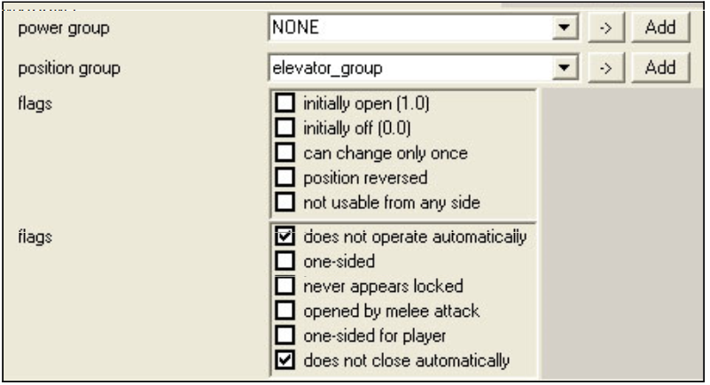
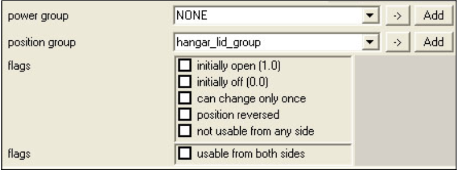

# Device Machines and Controls

Device Machines are motorized, animated, objects placed in the game that either react to the player, or that the player can interact with. Below, you can find detailed information on all of the properties of device machines, as well as step by step setup instructions to get you going quickly.

## **Things you should know**

- The animation file for your device machine needs to be exported as a **.jmo**. None of the other animation formats will work.
- When creating the animation for your device machine, do not leave any static frames at the beginning or end! This causes problems later when adding sound effects.
- If you want the object's bounding sphere to move with it when it animates in game (and thus retain physics and collision), you need to animate the root node for the object (not any of the lower frame nodes).
- When you export your animation, it needs to be named **device position.jmo**. If the file is not named this way, it will not function!
- For position animations (which are what most device machine animations will be), our engine animates frame #0, but drops the last frame of the animation. For overlay animations, our engine doesn't play frame #0.

## **Step-by-step setup**

- Create and import the geometry and animation files for your device machine. You will need render, collision, physics, and animations. Also, make sure you name the animation file **device position.jmo**. If you don't, the animation will not play.

When creating the animation for your device machine, do not leave groups of static frames at the beginning or end! This causes problems later when adding sound effects.

- eate any .shader tags for the materials you assigned to your model in Max. Re-import.
- Create a new .model tag. Link all of the other tags for your object to your new .model tag. Make sure you set the material types in your .model tag as well. Save it.
- In the Model tag block of the .model tag, click the Browse (...) button next to the **Animation** text box and link the .model_animation_graph tag for your device machine to your .model tag.
- Create a new .device_machine tag. Save it to a location of your choosing.
- Link your .device_machine tag to the .model tag for your object. This field is in the topmost section of your .device_machine tag (labeled Model) — simply click on the ... button and browse to the .model tag for your object.
- Scroll down to the bottom of the .device_machine tag to a block labeled Device. There are many different properties to check depending on the type of device machine you're trying to build (see below for detail on each property). To get your device machine up and running, the most important field to enter a number in is **Position Transition Time**. This is the amount of time it will take your device machine to go from closed to open (or off to on). Enter a number (in seconds) here now.
- Next, find the **Automatic Activation Radius** field. This is the distance (in world units) the player needs to be from the object for it to activate automatically. Think of this in the context of an automatic door — when the player gets close, it opens. Enter a number here now. Also, if your device is a door, and you don't want it to activate automatically, you'll need to check the Does not operate automatically flag in Sapien (See below for more info).
- Now move down to the Machines tag block. For **Type**, select Gear. Even if you want to make a door, gear is the most useful for initial debugging of your machine because the gear type is always on - so you'll instantly know if your object is working. You can go back and reset the type to door at any time once you know the device itself (and particularly its animation) works.
- Open your scenario in Sapien.
- Add your new device machine to the Palette, and then place one (by right-clicking on the game window) in the scenario.
- Select the device you just placed (by clicking on its name in the Hierarchy View) and then select the type for it in the Properties Palette. You can find more information on properties set in Sapien in the Properties Set in Sapien section below.
- That should be everything you need to set up your basic device machine. Save and Xsync. If you already had your map running, you will need to reset the map before the device machine will begin to function. See below for more details on individual properties or flags you can set for your device.

## **Device Tag Block**

- **Flags**
    - **Position Loops** — This flag allows the device to change its position to any value at will, but it will always choose the shortest circular path. When the position goes below zero or above one, it wraps around. For example, if you were at position 0.2 and wanted to to to 0.9, the shortest circular distance is to run backwards (.2, .1, 0, .9). This is different from the Gear machine type in that the Gear type always loops continuously in the direction of the animation you set up (it never goes backwards).
    - **Allow Interpolation** — Allows the device machine to interpolate animations (they don't do this automatically). Using this flag, you can set a series of positions (without animating them in 3ds Max) and the game engine will animate the device's movements. However, this will cause the animation to lag behind the device's actual position. For an example, think of the Scarab in Halo 2 (which didn't have animations, but was interpolated by the game engine). You should not use this for for things like doors or elevators.
- **Power Transition Time** — When a power group is set up for the device (with other devices, or with a device control), this controls the amount of time it takes for the device to go from its off state to its on state.
- **Power Acceleration Time**— The amount of time it takes for the speed of the power transition to accelerate from 0 to 1— or decelerate to 0— when powering up.
- **Position Transition Time**— The amount of time (in seconds) it takes for the device machine to go from a completely closed (off) to a completely open (on) state.
- **Position Acceleration Time**— The amount of time (in seconds) it takes for the device machine to reach it's top speed (or slow down to zero if it is in closing mode).
- **Depowered Position Transition Time** — The time it takes for the device to enter its depowered state (from a powered state). This only matters when the device is part of a power group (set up in Sapien) with other devices or device controls.
- **Depowered Position Acceleration Time** — The amount of time it takes for the device to accelerate from stopped to top speed on its way into the depowered state. This only matters when the device is part of a power group (set up in Sapien) with other devices or device controls.
- **Lightmap Flags**
    - **Don't use in Lightmap** — When this flag is checked, the device will not be considered when lightmaps are run. So, for example, if the device is covering an area (or blocking light), the lightmapper will run as if the device did not exist and the area will be lit by lights that might otherwise be blocked.
    - **Don't use in Lightprobe** — When this flag is checked, the lightprobes will not consider the way a device machine is affecting lighting in the area and, therefore, how the player is lit when standing on/around/near the device.
- **Open (up)**— The effect that is played while the device is opening (or moving up in the case of a lift).
- **Close (down)**— The effect that is played while the device is closing (or moving down in the case of a lift).
- **Opened**— The effect that plays while the device is opened/on.
- **Closed**— The effect that plays while the device is closed/off.
- **Depowered**— The effect that plays when power to the device is shut off.
- **Repowered**— The effect that plays when power to the device is turned on.
- **Delay Time**— The time (in seconds) between when the device is activated and when it actually begins to move.
- **Delay Effect**— The effect that plays during the time between when the device has been activated and when it actually begins to move.
- **Automatic Activation Radius**— The size of the radius (in world units) within which the player needs to stand to activate the device.

## **Machine tag block**

- **Type—** Select the type of device machine you want to create from the drop down list:
    - Door — The device will behave as a door — opening and closing depending on the settings you choose. Doors are set to open automatically when the player comes within their activation radius unless they are part of a position group with a device control (and you set the Does Not Operate Automatically flag in Sapien).
    - Platform — A platform behaves the same as a door device except that it will not activate automatically. For platforms to function, they need to be part of a position group with a device control (a button, for example).
    - Gear— The device will work like a gear— constantly performing it's animations in a single direction— never going backwards and only having the ability (via setup in the tag) to speed up or slow down. In this state, the player doesn't need to turn it on or off, or activate it in any way.
- **Flags**
    - Pathfinding Obstacle — Checking this flag prevents AI from pathing onto the device— they will consider it an obstacle and path around it.
    - ... But not when Open — Checking this flag in conjunction with Pathfinding Obstacle will allow AI to path onto or through the device (or space created by the device) when it is open (on) but not when it is closed (off).
    - Elevator — Allows the device to stop and start at multiple points along the way from completely closed to completely open. For example, the silo elevator in 04b_floodlab (Halo 2). The stopping and starting can be accomplished using scripting (see Tyson or Rob for more info on how to do this). For the elevator to work, you also need to enter an Elevator Node below (in the Machine properties). However, contact Petar to see whether option is disabled in code (elevators may not work at the moment).
- **Door Open Time**— The amount of time (in seconds) a door will remain open before closing (unless it has an automatic activation radius which the player is standing within, or if the door is controlled by a device control— in either of those cases, this property is ignored).
- **Door Occlusion Bounds**— This flag activates and de-activates visibility portals within the distance of the door that you specify (in world units). This is used so that things don't render when the door is closed (or render if we need them to so that they don't pop in when the door is opened by the player).
- **Collision Response**— How the device responds when it collides with another object.
    - **Pause Until Crushed — The device will continue to its normal open or closed position, crushing anything in its path.
    - **Reverse Directions — The device will stop and reverse directions when it collides with an object.
- **Elevator Node** — Used in combination with the Elevator flag (see above) to create device machines which can stop at various points between their fully open or fully closed states.
- **Pathfinding Policy**— Sets the way AI will path on, through, or around the device.
    - Discs — Pathfinding for this device will be generated using a disc-type style.
    - Sectors — Pathfinding for this device will be generated using sectors.
    - Cut_Out — Pathfinding for this device will be generated using cut outs.
    - None — No set pathfinding policy. The engine will decide.

## **Properties Set in Sapien**

The special properties for Device Machines in Sapien are found in the Properties Palette (after you've placed your device machine in the game window).

Figure 1 - Device Machine Properties Set in Sapien

- **Power Group**— Power groups are set up to link device machines and device controls together when the machine has a depowered and powered state.
- **Position Group**— Position groups are links between device controls and device machines. This group controls the animation/movement of the machine. If you want to set up any device machine which is controlled by a button (or any other device control), you must group it in a position group with a device control.
- **Flags**
    - Initially Open (1,0) — The device will appear in its open/on state when the game/level starts.
    - Initially Off (0,0) — The device will be in its depowered/deactivated state when the game/level starts.
    - Can Change Only Once — Allows the device machine to change position (open or close, for example) only one time. Once it has moved, it cannot be moved again.
    - Position Reversed — Reverses the position values for the device. So, a door that would normally start out in its open state would start out in its closed position when this flag is checked.
    - Not usable from any side: Prevents the player from being able to use the device.
- **Flags**
    - Does Not Operate Automatically — the device will not operate automatically. If this flag is set, the automatic activation radius property in Guerilla will be ignored, and you will need to set up a position group with a device control in order to operate the machine.
    - One-Sided — the device will only operate from one side. The side can be set as the positive x-axis of a marker named one_way or the x-axis of the door (or other device) itself if no marker exists.
    - Never Appears Locked — For door objects. The device will never report itself as locked to object function callers. In other words, it will never appear locked to the player (appearance-wise).
    - Opened By Melee Attack — when this flag is set, the player will need to melee the device machine for it to enter its opened state.
    - One-sided For Player — The device will only be accessible to the player from one side. AI can access it from either side. See "One-Sided" flag description for more information.
    - Does Not Close Automatically — prevents a device machine from closing automatically. You will need to set up a position group with a device control (such as a button) to get the device to close. 

Device Controls are used to activate or deactivate device machines.

## **Things You Should Know**

- Device Controls need to be linked to Device Machines using a **Position Group** in Sapien. Position groups are set up so that the position animation will play. Controls and machines can also be linked in a **Power Group** in order to power on or off device machines (power groups will not play position animations).
- Device Controls can not have physics (although they can have collision), so they need to either be placed on a piece of geometry, or linked to an object to give the appearance of having physics.
- Device Controls can not have position animations. If you want to animate your device control, you need to attach it to an object using the objects_attach script command.

## **Setup Instructions**

1. Create and import the geometry (render and collision) for your Device Control.
1. Create a new .model tag. Link your render and collision tags to it.
1. At some point, don't forget to create .shader tags for the materials you set in Max and then re-import your model.
1. Create a new **.device_control** tag. Link it to the .model tag you created previously. This field is in the topmost section of your .device_control tag (labeled Model) — simply click on the ... button and browse to the .model tag for your object.
1. Scroll down to the very bottom of your device_control tag to the block labeled **Control**.
1. In the Type drop down list, select **Toggle Switch**. You can always come back and change this later if you're not intending to build a toggled device.
1. In the Triggers When drop down list, select **Touched By Player**.
1. In the Action String text box, you can enter any text you'd like to appear when the player gets near the object. This is the text that appears on-screen and tells the player what to do to activate the device. See below for detailed information on how this string works (and how to set it up with a button icon).
1. Now is a good time to save all the tags you just created. Please do so.
1. Open a scenario in Sapien (the one where you'd like to place this control— and a device machine if one is not already present).
1. Add your new device control to the Palette, and then place one (by right-clicking on the game window) in the scenario.
1. Select the device you just placed (by clicking on its name in the Hierarchy View) and then select the type for it in the Properties Palette.
1. In order for your device control to work with a device machine, you need to link them together in a **Position Group**. Click on the Device Groups folder in the Hierarchy View and choose **New Instance**. Choose a fitting name for the group.
1. Now go back to the Controls folder in the Hierarchy View. Select your Device Control in the Pane on the right. In the Properties Palette, assign your control to the new group you just created (Select the name of the group from the **Position Group** drop-down list).
1. If you haven't placed/created a device machine yet, do so now.
1. In Sapien, make sure your device machine has the **Does Not Operate Automatically** flag checked (otherwise it will ignore your new device control).
1. Assign your Device Machine to the same **Position Group** as the one your device control is assigned to.
1. Save and reset the map. You should now be able to activate/de-activate your device with the device control.

## **Control Tag Block**

- **Type**
    - Toggle Switch— If the current position of the device (grouped with the control) is greater than 0.5, then the device is told to go to zero (off or closed). Otherwise, it is told to go to 1 (on or open). Switches the device to the opposite of its current state.
    - On Button— This sets the control so that whenever it's pressed, it tells the device to go to 1.0 (fully on).
    - Off Button— This sets the control so that whenever it's pressed, it tells the device to go to 0.0 (fully off).
    - Call Button — Whenever hit, this tells the target machine to go to the position listed in the control definition (this is the Call Value field - enter any number between 0 and 1).
- **Triggers When**
    - Touched by Player— The control will activate when the player presses and holds the "X" button when standing within the activation radius (getting the activation message).
    - Destroyed**— The control will only activate when it has been destroyed.
- **Call Value** — Any value between 0 and 1 (0 being off/closed, 1 being on/open). This value is used in conjunction with setting the control type as a Call Button.
- **Action String**— The string that will appear on-screen in the player's HUD telling them how to activate the device. You can type any string you want here, but if you want button icons (or other pictures) to appear, you have to place a special string in the HUD_messages (\main\data\UI\hud_messages) text file and then call the string here.
- **On**— The effect that plays while the control is in its on state.
- **Off**— The effect that plays while the control is in its off state.
- **deny**— The effect that plays when the player is denied activation of the control.

## **Properties set in Sapien**

Figure 1 - Sapien Properties for Device Controls

- **Power Group**— Power groups are set up to link device machines and device controls together when the machine has a depowered and powered state.
- **Position Group**— Position groups are links between device controls and device machines. If you want to use a device control (such as a button) to control a device machine, you need to make a new position group and add both the device control and the device machine to it.
- **Flags**
    - initially open — The control will appear in it's open/on state when the game/level starts.
    - initially off — The control will be in it's depowered/deactivated state when the game/level starts.
    - can change only once — Allows the control to be used only one time (thus preventing the device machine from being used more than once as well).
    - position reversed — Reverses the position values for the control. So, a button that would normally start out in its on state would start out in its off state when this flag is checked.
    - not usable from any side — This flag sets the control as unusable by the player (although the AI could still use it).
    - usable from both sides — The player will be able to access the control from any side. 
