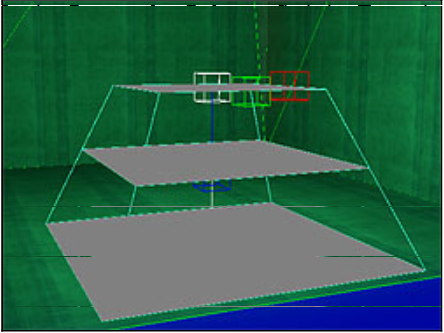
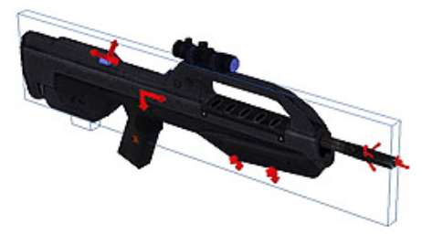
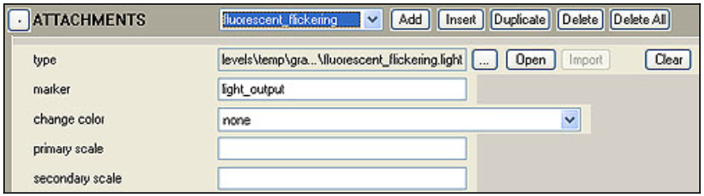
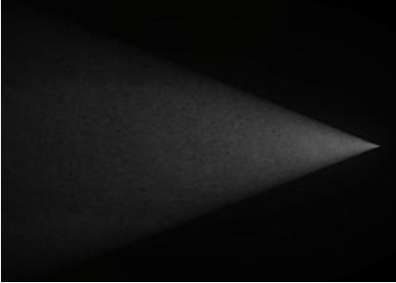
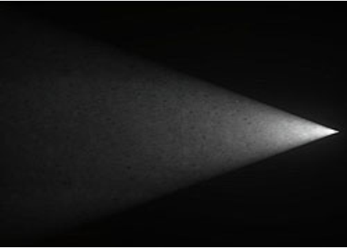
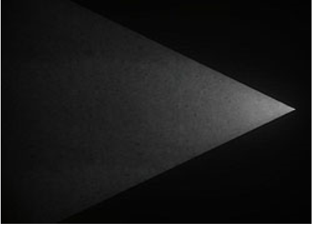
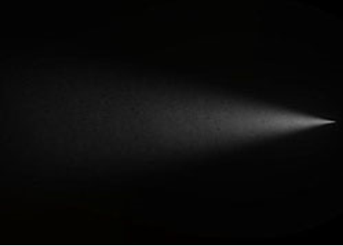
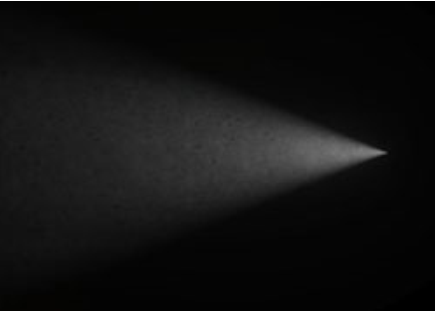
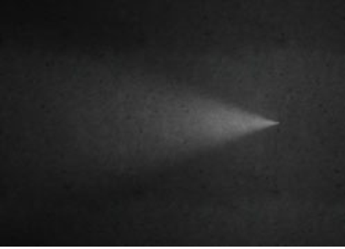

# Dynamic Lights

Dynamic lights use a .light tag and can be set up for use in the game by placing them in 3ds Max (with a marker), placing them in Sapien, or by attaching them to an object via a marker (in 3ds Max). They work independently of the lightmap (so lightmaps are not necessary for dynamic lights to function correctly).

## **Placing Dynamic Lights in 3ds Max**

Dynamic lights can be placed in a scenario using a Marker in 3ds Max which then gets picked up by the importer and hooked up to a .light tag within a subdirectory of your scenario. The marker names used in Max need to use one of the following formats:

|**Name Format**   |**Example**   |
|----------|-----------|
|#\<name>_light\<numbers>|#green_light27|
|#\<name>_light\<numbers>|#green_light27|
|#light_\<name>\<numbers>|light_red42|
|#light_\<name>\<numbers>|light_red42|

The importer searches through all subdirectories within your level directory, so you can place your light tag anywhere within that folder (not just in a "lights" directory). If the importer fails to find the .light tag you named in Max, it looks in levels\shared\lights and if it doesn't find it there, it assigns it a default name and location (even though it doesn't exist) of levels\\\<levelname>\lights\\\<name>.light.

Step-by-step instructions:

1. Open your level in 3ds Max.
2. Place a marker at the location you'd like the dynamic light to show up in game.

> [!NOTE]
> The dynamic light will point in the direction of the x-axis (local axis) on the marker.

3. Name the marker geometry using the format listed above.
4. Save and Export.
5. If it doesn't already exist, create the .light tag for the dynamic light you want to use (see below for more information on creating .light tags).
6. Import your Level using Tool (from within Guerilla).
7. Xsync and Launch on the 360.

## **Placing Dynamic Lights in Sapien**

There is currently a bug which doesn't allow Sapien to edit the properties of the .light tag. Until it is fixed, you'll have to use Guerilla to edit the properties of your light and use Sapien only for positioning and placement.

Here's how to place dynamic lights in your scenario using Sapien:

1. Open your scenario in Sapien (make sure it's checked out or writable)
1. In the *Hierarchy View*, click the **Edit Types** button.
1. From the *Object Class* drop down menu, select **Light** and click the **Add** button.
1. In the *Open* dialog that appears, navigate to the .light tag you want to place in the scenario. Once you've found it, click it to select it and then click the **Add Tags** button.
1. Click **Done** to close the dialog, then click **OK** to close the *Edit Types* dialog.
1. Go back to the *Hierarchy View*. Expand the *Scenario* folder and then expand the *Lighting Data* folder.
1. Click the **Lights** folder.
1. Right click in your scenario to place an instance of a light. You can move or rotate it to the exact place you want it using the move gizmo.
1. In the *Properties Palette*, find the Type drop down list and select the name of the light tag you added to the scenario. Your light should appear in the game window.
1. You can also name your light, if you want, but that is all you need to do to get one set up (see Figure 1)

Figure 1 - A Dynamic Light placed in Sapien

## **Attach a Dynamic Light to an Object**

Here are the steps for attaching a dynamic light to an object:

1. In 3ds Max, open the object you want to attach your light to (make sure it is checked out or writable).
2. Create a marker which is in the location and points to the direction you want your light to appear. For example, if you're trying to create muzzle flash, you would place a marker at the barrel of the gun pointing outwards. To create a marker, do the following:
    - Create some simple geometry to act as your marker (a nice little arrow pointing in the direction you want the light to display would be good).
    - Place a # at the start of the name of the marker geometry/node. So it would be called #marker. See Figure 2 for an example.

Figure 2 - The battle rifle model with markers (small red arrows) for locations where lights or effects will play.

3. Export and import your object.
4. Create a .light tag that you want to use for your dynamic light (see the .light tag reference below for more information on creating a .light tag).
5. Check out and open the object type tag for your object (either .scenery, .crate, .vehicle, .weapon, etc.).
6. Find the tag block labeled Attachments. Click the Add button to add a new attachment (your .light tag).
7. Click the Browse Button next to the Type box. Find your .light tag and click OK to link it to the object tag.
8. In the Marker text box, type the name of the marker you set up in 3ds Max (without the # sign).
9. Save your object tag and Xsync. Your light should shine from the marker you specified.

Figure 3 - The Attachments tag block of an object tag correctly set up for a .light attachment.

## **.light Tag Reference**

### **Cheap Dynamic Lights vs. Expensive Dynamic Lights**

|           |**Shadows?**|**Frustrum Type**|**Configurable Frustrum Widge and Height?**|**Light Gels?**|**Passes to Render**|
|-------------|-----------|----------|-----------|----------|-----------|
|**Cheap**    |No         |Cone  |No  |No  |1|
|**Expensive**|Yes|Square|Yes |Yes |3|

- **Flags**
    - **Expensive Light**— Expensive dynamic lights can cast shadows, have square frustums (which can be re-sized), and can have gels applied to them. They also take 3 passes to render so they're very expensive compared to the cheap lights (which render on the same pass as the lightmap). See the table above which compares cheap and expensive lights.
    - **Shadow Casting**— Light will cast shadows on objects that come within range and will be blocked by environment geometry. This flag can only be enabled when the Expensive Light flag is checked. Otherwise, it will not be available.
    - **Render First Person Only**— Only renders the light in first-person view. Hasn't been implemented yet for Halo 3. Article will be updated when it is working.
    - **Render Third Person Only**— Only renders the light in third-person view. Hasn't been implemented yet for Halo 3. Article will be updated when it is working.
    - **Render Splitscreen**— Will render the dynamic light while splitscreen is on. Hasn't been implemented yet for Halo 3. Article will be updated when it is working.
    - **Render While Active Camo**— Will render the light while the player is wearing active camo. Hasn't been implemented yet for Halo 3. Article will be updated when it is working.
    - **Render in Multiplayer Override**— Will render the light while in multiplayer mode (dynamic lights default to "Off" otherwise). Hasn't been implemented yet for Halo 3. Article will be updated when it is working.
    - **Move to Camera in First Person**— Places the light as if it were coming from the camera when in first person view— no matter where the light is actually placed in third person. A good example of how this is used is the flashlight. It has a different location in third person than what the player sees in first person.
- **Shape**
    - **Type**— Select either Frustum or Sphere. A sphere casts light (up to the maximum distance set) outward in all directions (like a standard incandescent lightbulb). A frustum light can be constrained to a particular direction and field of view.
    - **Maximum Distance**— The farthest distance that the light will travel.
    - **Frustum Near Width** — The Width of the beam for a frustum light (in world units). A large number creates a wider beam while a small number creates a narrow beam. This flag is only enabled when the Expensive flag is checked above.
    - **Frustum Height Scale** — Controls the aspect ratio (or shape) of a frustum light. Only available for editing with expensive lights (Expensive flag must be checked (see above)).
    - **Frustum Field of View**— The angle (in degrees) which light will be allowed to be cast from the source of a frustum light. Light is cast along the X-axis of the marker by which the light was placed.
- **Color** — Set the color to a basic single color, or you can set up a function which changes between up to four different colors.
- **Intensity** — Set the intensity or strength of the light. It can have a constant intensity, or can use functions, or be connected to an object via a function.
- **Falloff**
    - **Distance Diffusion** — The "size" of the light source. Pick a large number for a pinpoint source of light, or a small number for a wider light source.

> [!NOTE]
> A larger light source will also increase the power of the light, so you may have to adjust intensity as well. See Figure 4 for examples.

|Distance Diffusion = 1|Distance Diffusion = 0.1|
|-------------|-----------|
|||

Figure 4 - The figure on the left has distance diffusion set to 1, the one on the right has distance diffusion set to 0.1. All other properties are the same.

- **Angular Smoothness**— The amount of smoothing done to the edge of the light beam to fade it in or out. A small number will give the light a harder edge, while a large number will give the light a soft edge. See Figure 5 below.

> [!NOTE]
> When the light type is set to sphere, this setting is ignored.

|Angular Smoothness = 0.2|Angular Smoothness = 8|
|-------------|-----------|
|||

Figure 5 - The figure on the left has angular smoothness set to 0.2, the one on the right has angular smoothness set to 8. All other properties are the same.

- **Percent Spherical** — This number controls the amount (and thereby intensity) of light that will be emitted in all directions — not just the direction you have your frustum light aimed. Setting your light type to Sphere will negate any settings you place here. See Figure 6 below.

|Distance Diffusion = 1|Distance Diffusion = 0.1|
|-------------|-----------|
|||

Figure 6 - The figure on the left has percent spherical set to 0, the one on the right has percent spherical set to 0.2. All other properties are the same.

- **Lifetime**
    - **Destroy Light After**— The time a light will be rendered (in seconds) before being destroyed, removed, and no longer rendered.
- **Distance to Fading Parameters**
    - **Illumination Fade Distance**— The general distance from the light at which the player needs to be before it fades out. Settings are: Fade very far, fade far, fade medium, fade close, fade very close.
    - **Shadow Fade Distance**— The general distance from the light at which the player needs to be before the light stops rendering shadows. Settings are: Fade very far, fade far, fade medium, fade close, fade very close. Shadows aren't currently functioning for dynamic lights, so this doesn't have any effect.
