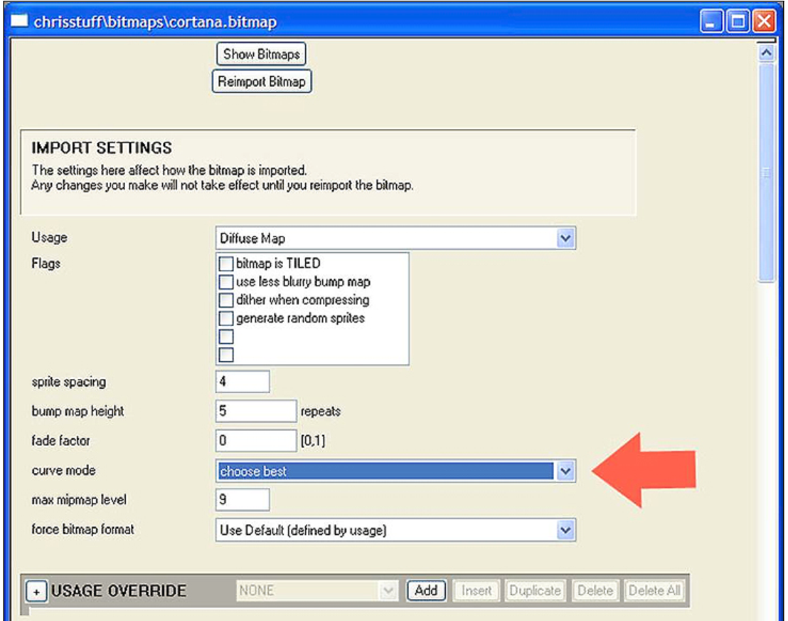

# Bitmap Curve

In each .bitmap tag is a setting which can allow your bitmaps to render up to twice as fast in the game: Bitmap Curve Mode. It's not a freebie though— the fast mode can look worse if the texture is very dark or very smooth. For the most part, however, they will be indistinguishable. The bitmap importer will automatically choose the fast mode if your bitmap is bright and will revert to the slow high-quality mode if the bitmap is dark.

You can manually control the bitmap curve setting within your .bitmap tag (see Figure 1)

- **Choose Best**: The importer chooses for you based on how bright your bitmap is.
- **Choose Fast**: Always uses the fast (but possibly ugly) mode.
- **Choose Pretty**: Always uses the slower, high-quality, mode.

Figure 1 - .bitmap tag and the Bitmap Curve Mode setting.

> [!NOTE]
> You need to re-import your bitmap after adjusting this setting for the changes to take effect!
