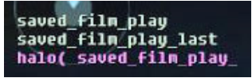
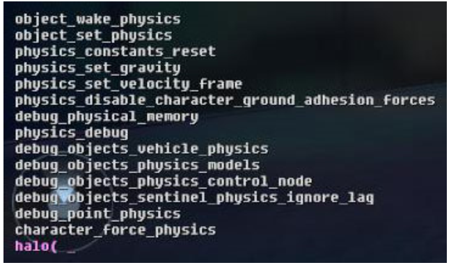
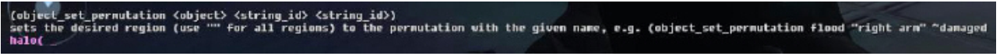
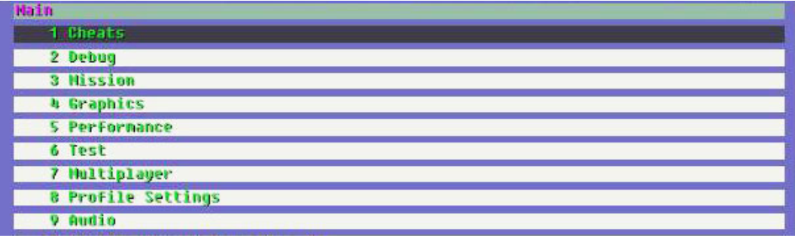

# Console Commands

Console commands allow you to access the game via a command prompt, allowing you to view and set scripts and functions.

There are four types of console commands:

- **hs_function** — defines behavior, such as object_set_permutation

- **hs_global** — defines data, such as debug_objects

- **scripts** < from .hsc file

- **globals** < from .hsc file

## **Entering Console Commands**

### ** Access the Console**

Press tilde (~) key to access the in-game command prompt. Use \~ for Sapien. This will allow you to type in console commands.

### **Autocomplete Commands**

You can autocomplete any string you type in by just hitting the tab key. This will list all of the commands that start with the given string.

For example, if you type sa and press tab, you will see Figure 1.



Figure 1 - Autocompleted Command.

### **Find**

Type find and any string will list all of the commands that include the given string.

For example, if you type find physic, you will see Figure 2.



Figure 2 - Find Command Output.

### **Help**

Type in help and a console command will list the command and the required parameters plus a description of the console command. Find is available for hs_functions only— other command types are not supported.

For example, if you type help object_set_permutation, you will see Figure 3:



Figure 3 - Help Command Output.

### **Debug Menu**

The most common console commands have been wrapped in a GUI known as the Debug Menu. Press the back and start keys simultaneously to bring up the debug menu.

> [!NOTE]
> Press the back key first then hold it then press the start key to avoid bringing up the game ui.



Figure 4 - The Debug Menu.

Creating Text List of All Halo Script Commands (script_doc)

You can export a list of the current hs_functions by typing in script_doc on the PC console (inside Sapien). This will create \halo3\main\hs_doc.txt.

Example:

```
(object_set_permutation \<object> \<string_id> \<string_id>)
```
