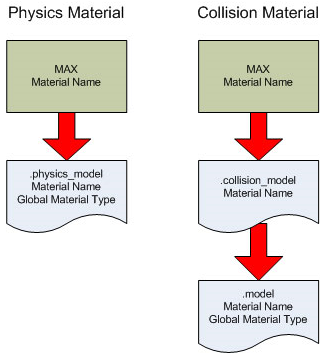
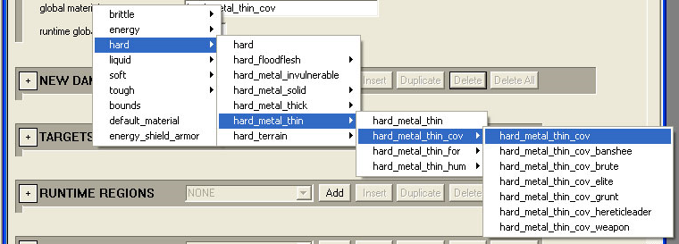

# Setting Global Material Types

Global Material Types for objects can be set in 3ds Max, but sometimes it's useful to use the collision material name to identify damage sections. If you do, it's important to set the global material type correctly in the tags.

Figure 1 - Physics and Collision Materials.

## Setting global material types: collision vs. physics

**.physics_model**

After import, the .physics_model tag will pick up the material name as set in 3ds Max. You can override this in the .physics_model tag by setting the Global Material Type. Right-click global material name in the tag and a hierarchal menu will appear (see Figure 2).

Figure 2 - Setting the global material type in the .model tag.

**.collision_model**

After import, the .collision_model tag will pick up the material name as set in 3ds Max. **You cannot override this in the .collision_model tag**. The .model tag will pick up the material name from the .collision_model tag. You can override this in the .model tag by setting the Global Material Type.
