# Quick Start Process Step 1 - Modelling Level Geometry in 3D Tool

As a sample level, we will create a simple hollow box (room) with a sky above and a single source of light.

> [!NOTE]
> The description below corresponds to a freshly installed Blender 2.93 with a default layout of panels. If you have intentionally modified the default layout, then you probably know where to find the necessary panels or, if you occasionally modified the layout, you can reset it: https://blender.stackexchange.com/questions/48687/how-do-i-restore-the-original-window-configuration.

To create this level, do the following:

1. Launch Blender.

2. If necessary, in Blender, select **General** in the **New File** section of the startup dialog.

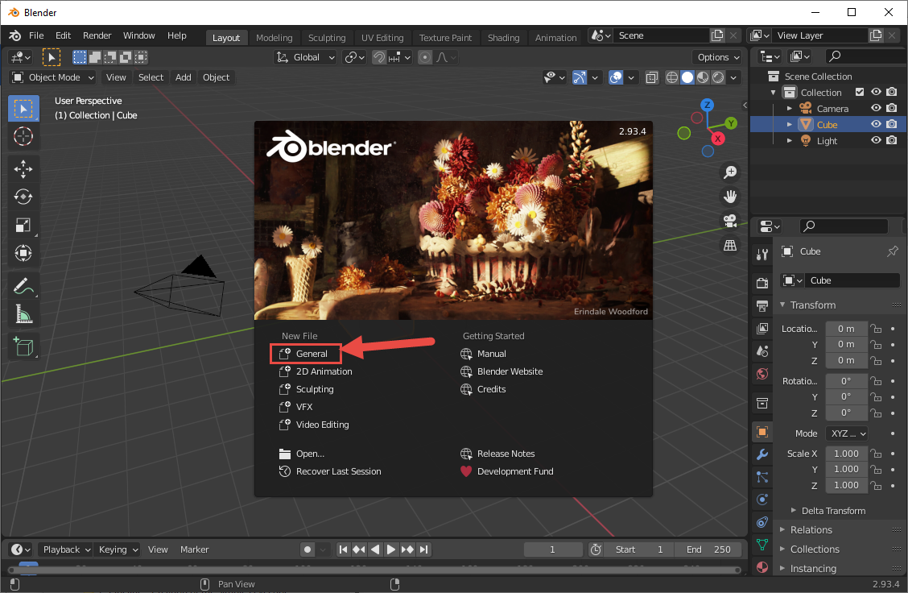

Fig 1. View of the the initial Blender start screen and the General New File option.

3. In the **Outliner** in the upper right corner of the screen, select all default contents of the scene (**Collection, Camera, Cube, Light nodes**) and delete them by pressing DEL. Now, you have an empty scene in your Blender.

4. First of all, we need to create a ***frame node***. This node will be the origin of your level and it will contain all objects that will belong to the level. This node is necessary for the creation of the FBX file that will be appropriate for the game engine. We will create a frame node in the form of the sphere (any shape is actually valid for that, but a sphere is easier to distinguish from the other shapes that will eventually be in the level).

    To create a frame node:

    - In the left upper corner of the **3D Viewport**, click on the **Add menu** and select **Add > Mesh > UV Sphere** to add a sphere to your scene.

    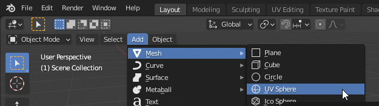

    Fig 2. View of the UV Sphere option in the Add menu.

    - Double-click the node of this sphere and change its name to **b_levelroot**.

    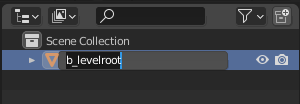

    Fig 3. The UV Sphere with its node name changed to b_levelroot.

    > [!WARNING]
    > It is important that you follow this naming convention, since these names of nodes will be the same in the FBX file and, then, in the ASS file, and, finally, the game engine will use them to identify the types of nodes and their properties. If you do not name the frame node correctly, the environment will not be oriented correctly in the game. Object and material names are important to Halo 3 modding, so get used to paying attention to this and understanding what the different keys are.

    > [!NOTE]
    > The **b_levelroot** name is the most typical name for the frame node. However, only the **b_** prefix from it is mandatory for the identification of the frame node in the Halo 3 tools and engine. The list of all such prefixes is the following:
    > - **b_*** (e.g. **b_node**)
    > - **b **** (e.g. ***b node**)
    > - **bone_*** (e.g. **bone_node**)
    > - **bone **** (e.g. ***bone node**)
    > - **frame*** (e.g. **frame node**)
    > - **bip01*** (e.g. **bip01node**)

    - Ensure that your frame node is located at the origin of the scene. If it is not so, change its **Location** to (**0, 0, 0**) in the **Transform** panel at the right side of the Blender window.

    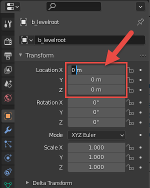

    Fig 4. Location transforms set to (0, 0, 0).

    > [!NOTE]
    > Мost levels have their frame node at **(0,0,0)** for simplicity. But you can also place it somewhere off to the side, out of the way, if necessary. However, it is very important not to move it later on, or you might discover all your player and weapon spawns moving along with it.

5. Now, you can start to create a level environment itself. Particularly, you can create a box (cube) those faces will be the floor, walls, and the sky. The box will be hollow – i.e., the player will be placed inside it and will see the internal faces of it (not the external ones).

    To create such a cube:

    - In the left upper corner of the **3D Viewport**, click on the **Add menu** and select **Add > Mesh > Cube** to add a cube to your scene.

    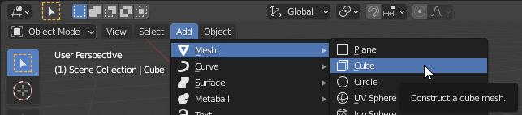

    Fig 5. View of the Cube option in the Add menu.

    - For simplicity, let's keep the created box centered on all axes first. If your cube is not located in the origin, change its location to **(0, 0, 0)** in the **Transform** panel at the right side of the Blender window, as you did for the frame node above.

    - Now you need to scale your cube to make dimensions of your box appropriate for game characters to move within.

    If you switch to the 2-axes (orthographic) view by clicking one of the axes displayed at the **Navigation Gizmo** (located at the top right of the window, see the [official help](https://docs.blender.org/manual/en/latest/editors/3dview/navigate/introduction.html); you can switch back by holding the middle button of the mouse and moving the mouse to move the view), you will see that the default cube appears on the grid as a centered object of the **2 x 2 x 2** default units in size.

    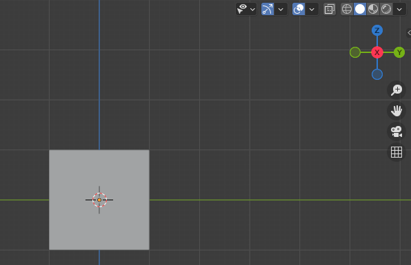

    Fig 6. Orthographic view in Blender.

    If metric units are selected, 1 blender unit (wide/height of the large cell in the picture above) corresponds to 1 meter. In Halo 3, the height of Cortana in these units is approximately 1.5 (i.e. she is ∼1.5 meters high).

    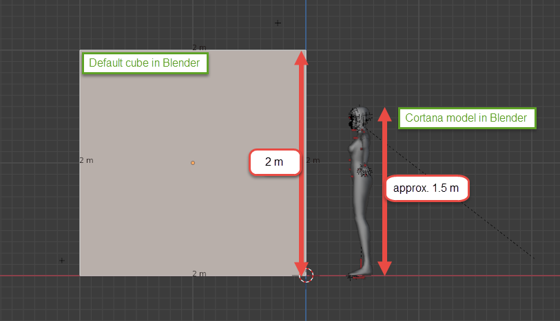

    Fig 7. Cortana model height compared to the newly created cube.

    > [!NOTE]
    > Yes, we do agree that Cortana is, in fact, a projection and has no height at all, but her model is her model.

    And, the height of Master Chief is approximately 2.1 (i.e. he is ∼2.1 meters high) in these units.

    So, let's scale the level to make it appropriate for at least minimal moving of characters. For example, let's make it **40** times larger, which will make it **40\*2 x 40\*2 x 40\*2 = 80 x 80 x 80** default units in size (i.e. the overall width/height/depth of the cube will be 80 meters in Blender).

    > [!NOTE]
    > Regardless of the units and unit system you select in Blender for modeling, you should take special care of units selected during export to FBX (see the next section for details). Particularly, in this tutorial, we are using the Metric unit system and Meters for length while modeling and we will convert them to Halo 3 units at [Step #2](../Process/Step2.md).

    - To scale your cube:

        - If the cube is not selected, select it (by clicking).

        - Change its **Scale** to **(40, 40, 40)** in the **Transform** panel at the right side of the Blender window. (After that you will probably need to zoom out using the mouse wheel.)

        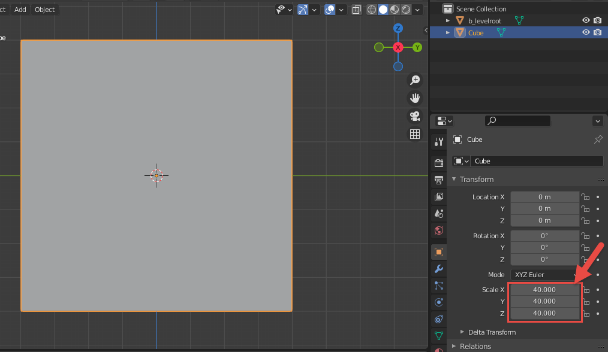

        Fig 8. Cube scale is set to 40 on each axis.

    - And, it's a good idea to move the "floor" of your box to the 0 too, for convenience. The mapping of Blender axes to the directions in the game is the following: Z-axis in Blender corresponds to the Up direction in Halo 3, X-axis – corresponds to the Forward direction, and Y-axis – to the Leftwards direction. So, let's move the floor of your cube to 0 by Z-axis:

        - Click the Y-axis in the **Navigation Gizmo**. Blender will show you the ZX-view, with the Z-axis pointing upwards. Keep the cube selected, if it is not selected – click it to select.

        

        Fig 9. Orthographic view in Blender on the Y axis.

        - In the Toolbar (on the left side of the editor area), select the **Move** tool.

        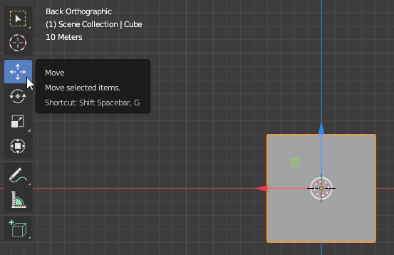

        Fig 10. The Move Tool in the Blender toolbar.

        - By dragging the blue arrow (corresponding to the Z-axis pointer of the cube) move the cube upwards for 40 blender units.

        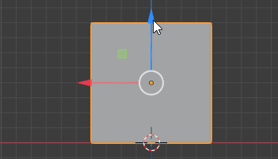

        Fig 11. Moving the cube up 40 units on the y-axis.

        If necessary, specify the exact location of the cube in the **Location** section of in the **Transform** panel to **(0, 0, 40)**.

        - If you have not switched back still from the 2-axes view, you can do it by holding the middle button of the mouse and moving the mouse to move the view.

        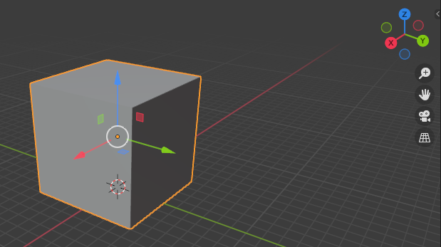

        Fig 12. Two Axis view.

6. Now that both of our objects (frame node and the box) are positioned correctly, we need to link them together. Since all scene objects should be below the frame root node in the hierarchy, we need to place the cube under the frame node (i.e. to specify frame node as the parent bone for the cube).

    To do so:

    - In the **Outliner** (at the top right of the screen), select the node of the **Cube**.

    - Then, while holding CTRL to enable multi-select, select the future parent node – the frame node (**b_levelroot**). It is very important to select the future parent object *last*.

    

    Fig 13. Object hierarchy with the cube and b_levelroot selected.

    - In the **3D Viewport**, right-click the selected objects and select **Parent > Object**.

    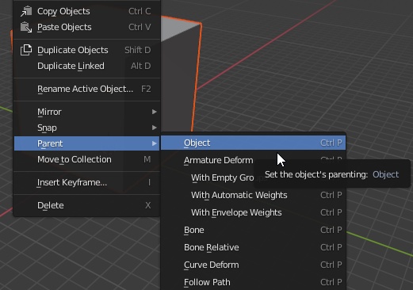

    Fig 14. Parent > Object option within the right-click menu.

    - In the **Outliner**, after you expand the frame node (**b_levelroot**), you will see that the Cube is now under it in the hierarchy.

    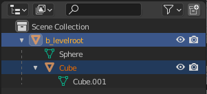
 
    Fig 15. Expanded hierarchy with the Cube now parented to the b_levelroot.

7. Until now, we have done all the work to our environment on its outside. When we launch the map in the game engine, we want to be inside the box (cube). However, there is one important aspect here for the level to be rendered correctly – Normals. Normals tell Blender (and our game engine) which direction a piece of data is "facing". If you look at that data from the opposite side of the Normals, the data will not be rendered (visible) on the screen. I.e. the direction of the Normals sets the direction the object will be visible from. By default, for your cube, Normals are perpendicular to the face of each face of the cube and look in the outwards direction of every face. That's the opposite direction, since we need to be inside the cube and need Normals to look inside of the cube.

    So, let's flip the direction of Normals.

    To do so:

    - In the **Outliner**, select the **Cube** node.

    - In the **3D Viewport**, switch from the **Object Mode** to the **Edit Mode** (at the drop-down at the top left of the **3D Viewport**).

    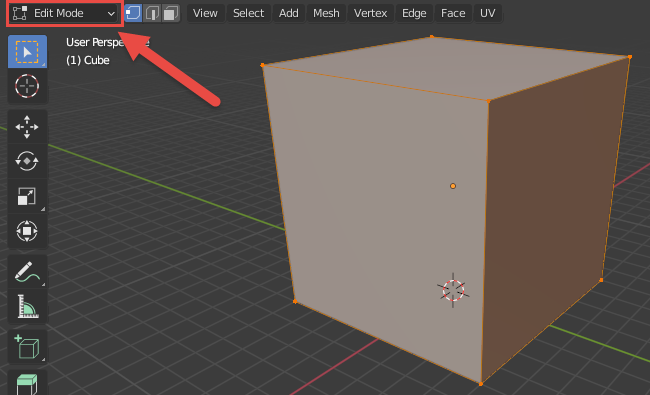
 
    Fig 16. Edit Mode option in the UI.

    - Click the **Mesh** menu (at the top of the **3D Viewport**) and select **Mesh > Normals > Flip**. Alternatively, you can press CTRL + N to access the **Normals** context menu and select **Flip** in it.

    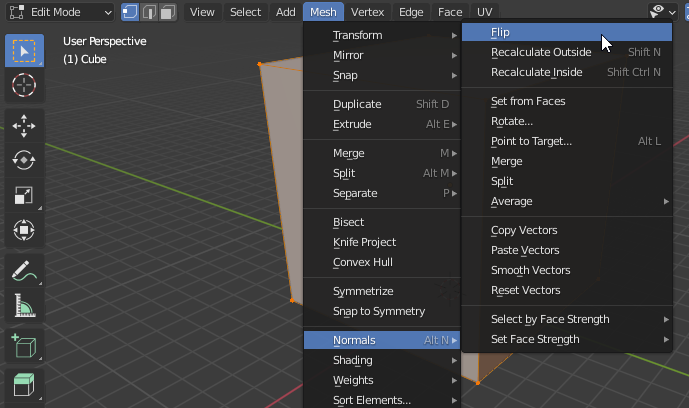
 
    Fig 17. Normals > Flip option in the Mesh menu.

    - To ensure that you have done it correctly, you can enable the **Backface Culling** option to distinguish the invisible back sides of the faces from their visible front sides.

        To enable this option:

        - Open the **Viewport shading** menu (by clicking the drop-down arrow at the top right corner of the **3D Viewport**, see the screenshot below).

        - Enable the **Backface Culling** option.

        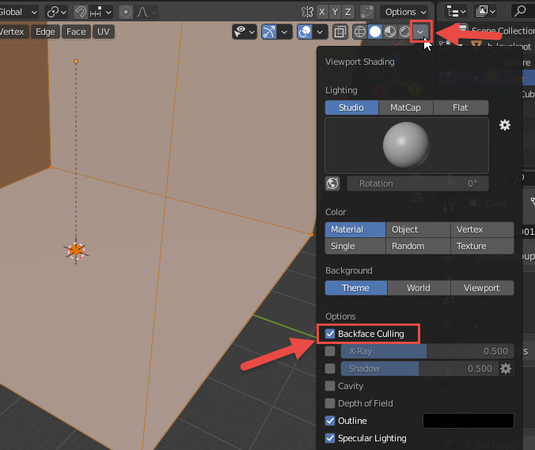
 
        Fig 18. Backface Culling option in the Viewport Shading.

        - After doing this, if you inverted normals correctly, only the inside sides of cube faces should be rendered with color in the viewport.

8. Now your cube will be looking like an empty "room" with walls. If you want to practice, you can add another small cube to the interior of this room, be repeating the previously described operations. However, for this small cube, the Normals step should be omitted, since you will be looking at this small cube from the outside, so the default direction of normals will do just fine. Don't forget to place this small cube under the frame node too.

    To add a small cube:

    - Switch back to **Object Mode**.

    - **Add > Mesh > Cube**.

    - If necessary, move this small cube somewhere inside the large cube (e.g. by **Move** tool or by setting **Location** in the **Transform** panel).

    - If necessary, scale this small cube (e.g. by changing **Scale** in the **Transform** panel).

    - Parent this small cube to the frame node (select the small cube; while keeping it selected, select frame node; right-click any point of the viewport and select **Parent > Object**).

    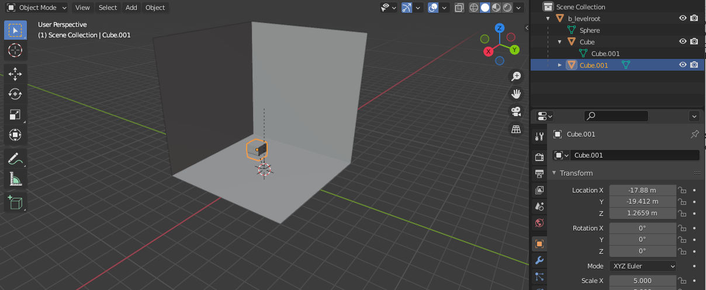
 
    Fig 19. New cube in the center of the room.

    > [!NOTE]
    > In this tutorial, we have changed the **Scale** of the small cube to **5** (i.e. it is 10m x 10m x 10m) and put its bottom slightly below the "floor" of the large cube to make it look a little bit prettier.

9. Now it is time to assign materials to these objects.
Materials assigned to objects in Blender will define the properties of a surface in Halo 3. This will be done with the help of shaders that will be assigned to these materials later on. 

> [!NOTE]
> Note #1: In Halo 3, shaders are created and modified not in Blender, but in Guerilla, in the form of shader tags files. (However, assignment of textures for some specific materials, like **+sky**, is performed differently, not via shader tags, see Step #5 below for details). The properties of material defined by this shader tag will not only include the basic texture image to render on the surface but include any special rendering effects as well as other data such as the type of material it is in regards to physics and projectile impact particle effects. Some materials use individual shader tags that are created for them (with names exactly the same as the name of the source material), other materials use shared shader tags that are used for multiple materials. In general, shaders and shader tags are a rather complex topic and are out of the scope of this guide. However, since you will still need to assign a texture to one of the Blender materials of your level, you will create a very simple shader tag at Step #5 below. 

> [!NOTE]
> Note #2: In this tutorial, to keep things as simple as possible, we will not modify the UV maps of created Blender objects that will help to wrap these objects with your textures correctly. However, when you will be creating a highly detailed and professional level, you will probably need to work with these UV maps. As a very brief starting info on this topic, you can use Blender's official help: https://docs.blender.org/manual/en/latest/editors/uv/introduction.html. 

In Blender, Materials are assigned to objects via *material slots* (see [official help](https://docs.blender.org/manual/en/latest/render/materials/assignment.html)). I.e., at first, you create a material, then you select it in one of the material slots of the object, and this links this material to this object. If you want to assign a material to the whole object, you will need only one material slot with this material selected (in fact, if you are creating material from the object properties, it will become selected in this material slot automatically). However, if you want your object to use multiple materials (e.g. you want to assign one material to one part of the object and another material to another part), you will need multiple material slots, one slot per material.In our case, we will need two materials for our large cube: one for the "**+sky**" of it and one for the "**ground**" of it.

So, let's create and assign them:

- First of all, let's create and set up a **+sky** material. This is a special material that is applied to surfaces to render the skybox or sky model. Please note that the name of this material must be "**+sky**" (with a plus), it is a reserved name, and using this name the game will identify that this is the sky surface.

    We will use the **+sky** material for the "ceiling" and "walls" of the large cube.

    To create and set up this material, do the following:

    - Create the material:

        - Select the large **Cube** node and switch to the **Material Properties** tab in its **Properties** panel (in the lower-left corner of the window).

        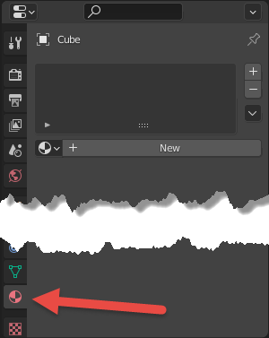
 
       Fig 19. Material Properties option.

       - Click **New** to create a new material.

       - After that, you will see the new material appearing in the list of available materials to be linked to the object (), the properties of this material displayed in the **Material Properties** tab, and this material added to the material slot.

       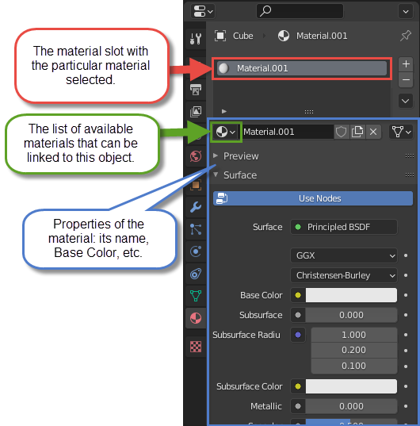
 
       Fig 20. Material Properties tab.

    - Change the properties of the material:

        - Double click its name and change it to "**+sky**". As we stated above, the exact spelling of this name (with plus) is very important.

        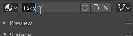
 
       Fig 21. Name the material "+sky".

       - Since you probably want to distinguish this material visually in Blender, change the **Base Color** of this material by clicking this field and using the standard color selector afterwards.

       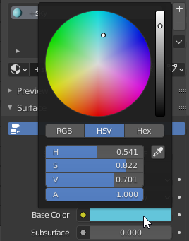
 
       Fig 22. Setting the Base Color of the +sky material.

       > [!NOTE]
       > Colors of materials in Blender do not affect the final colors in the game, they are used for your convenience only. E.g. in the engine, the color of the **+sky** material will be defined by the specific skybox you assign to it (if you do not assign it, it will be of the default blue color).

    - Now, let's create and set up the material for the "floor" of the large cube. Let's call this material "**ground**". This name is not so strictly defined as "**+sky**".

    > [!NOTE]
    > We are creating a *static geometry* of the level (i.e. the geometry that will not change during the gameplay: the ground, sky, hills, rocks, etc.), and, since we will export it to the ASS file from the resulting FBX, our modding tools and engine will know that this is the static geometry. Due to that, this geometry will have the collision properties by default, and the player will not be able to fall through the ground for example. In fact, the player will not be able to leave the limiting static geometry of the level in any case, even when there is a **+sky** material assigned to it.

    > [!WARNING]
    > To maintain the existing naming convention of materials (and their shaders, see Step #5), we recommend you to name your materials in Blender in snake_case (e.g. "**ground**", not "**Ground**"; and "**my_material**", not "**my material**").

    So, let's create the **ground** material:

    - While keeping the **Cube** node selected, click the plus button in the material slots panel. After that, the second material slot will appear.

    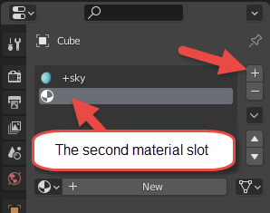
 
    Fig 22. Add a new material below the +sky material.

    - Click **New** to create a new material.

    - When the new material appears, change its name to "**ground**" and its **Base Color** to green, similarly to the steps above. As before, the new material will automatically appear in the second material slot.

    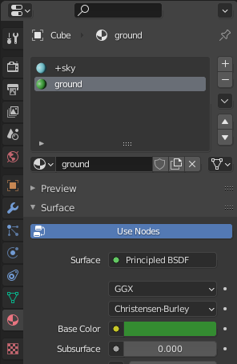
 
    Fig 23. Setting the Base Color of the ground material.

- Now the materials are ready and we can assign them to different parts of the large cube. In the large cube, we will assign **+sky** to the faces of "ceiling" and "walls" and **ground** to its "floor" face.

    To do this:

    - Switch to the **Edit Mode**.

    
 
    Fig 24. The edit more drop down in the Blender UI.

    - In the **Edit Mode**, next to the mode selection drop-down, 3 small buttons allow you to switch between the selection of vertices, edges, and faces. Select the selection of faces there (**Face select**).

    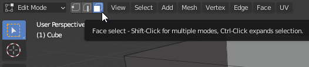
 
    Fig 25. Face Select option.

    - Now, by clicking the particular face, you can select it (see below). And, by holding CTRL while clicking, you can select multiple faces.

    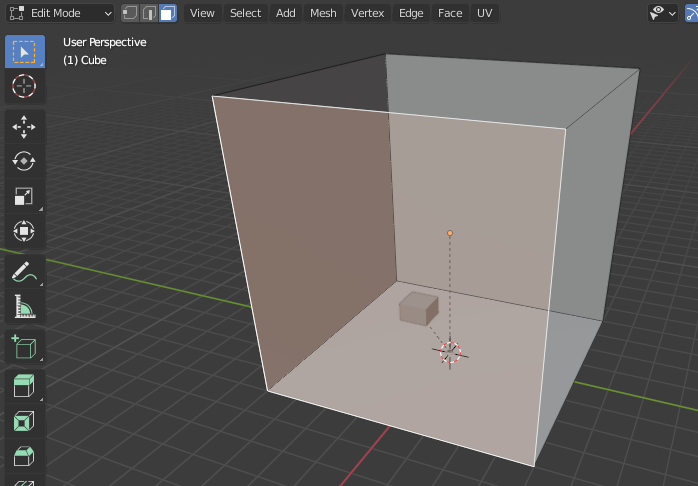
 
    Fig 26. View of multiple faces selected.

    - However, by default, you *cannot* select the faces that are behind the other geometry, i.e. the two back walls of our cube.

    Of course, you can select them by constantly rotating the cube, but doing this can make a person a bit dizzy. Instead, you can use the **X-Ray** feature of Blender to select them:

    - In the top right corner of the 3D Viewport, locate the **Toggle X-Ray** button () and click it to enable the X-Ray mode.

    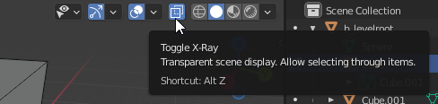
 
    Fig 27. Toggle X-Ray button.

    - With enabled X-Ray, you can select faces that are behind other geometry. So, now you can select the two back walls of our cube by clicking them while holding CTRL for multi-select.

    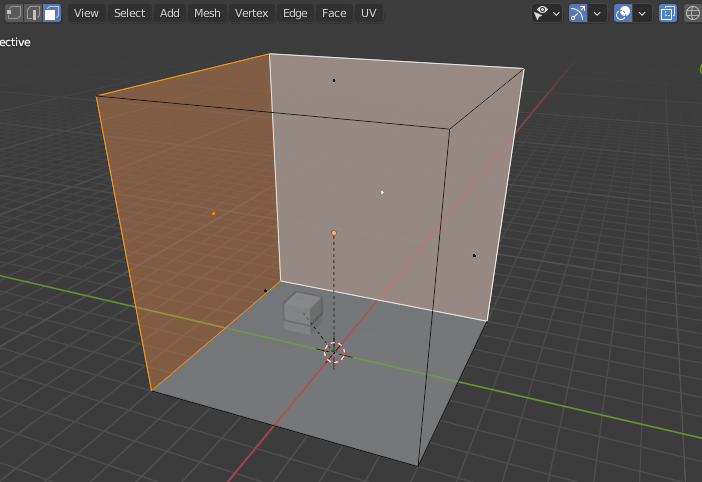
 
    Fig 28. Back walls are selected with x-ray.

    - Now, select the front "walls" and "ceiling":

        - While keeping the back "walls" selected, click **Toggle X-Ray** one more time to disable X-Ray.

        - Then, while holding CTRL, select the faces of the front "walls" and "ceiling":
    
    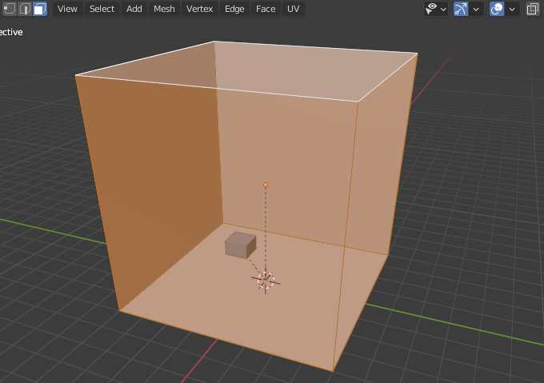
 
    Fig 29. Front "wall" and "ceiling" selected.

    - Time to assign the **+sky** material to these faces:

        - While keeping the target faces selected, in the **Properties** panel (with the **Material Properties** tab still opened), select the material slot with the **+sky** material (see below).

        - Click **Assign** in this panel.

        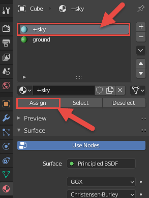
 
        Fig 30. View of the Assign button with the +sky material selected.

        - To ensure that this material has been assigned, switch to the **Material Preview** method () of **Viewport Shading** in the top right corner of the **3D Viewport** (see below). After that, your large cube will be displayed in blue.

    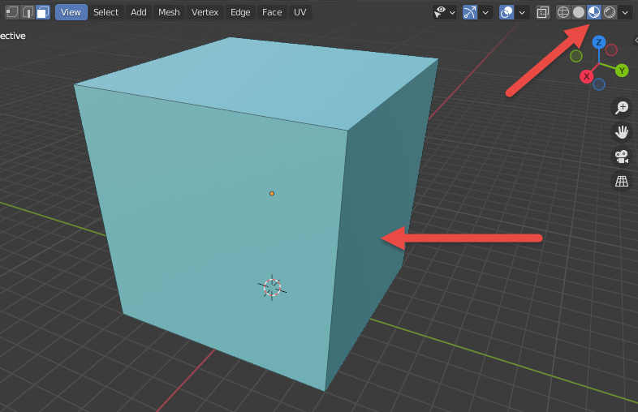
 
    Fig 31. The large Cube with the +sky material assigned.

    - Using the same technique, you can assign the **ground** material too:

        - Enable the X-Ray mode.

        - Select the "floor" face of the larger cube.

        - While keeping this face selected, in the **Properties** panel, select the material slot with the **ground** material and click **Assign**.

        - To ensure that this material was assigned correctly, zoom in to get inside the large cube (use the mouse wheel for zooming). Inside, you should see that the walls and the ceiling are of the **+sky** color, and the floor is of the **ground** color (to rotate the view, hold the mouse wheel while moving the mouse). The small cube and the sphere of the frame node will be grey since we have not assigned our materials to them.

        
 
        Fig 32. ground and +sky materials assigned to the correct faces.

    > [!NOTE]
    > If you forget to assign materials to some part of the scene, objects without them will still be static geometry (with collisions), but will cause the **invalid_material** errors.

    - Now, assign the materials to the small cube. The frame node can live without the material since it will be just a node in the hierarchy and will not be visible as a part of the level. Since we have already created our materials, this can be done simply:

        - Switch to the **Object Mode**.

        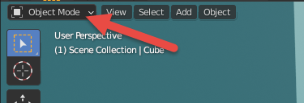
 
        Fig 33. The Object Mode drop down.

        - Select the small cube.

        - In the **Properties** panel (with the **Material Properties** tab still opened), in the list of available materials to be linked to object (), select necessary material (**ground**). There is no need to select faces and click **Assign** in this case, since we are assigning a single material to the whole object.

    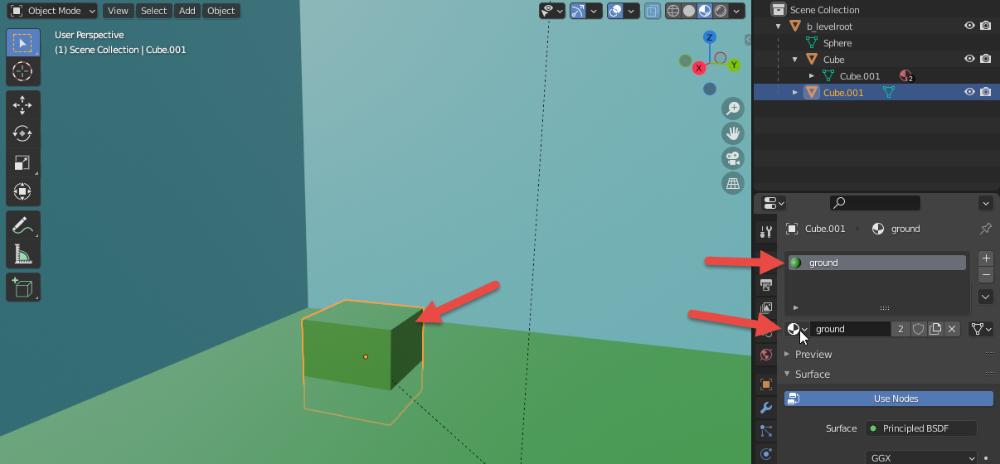
 
    Fig 34. Assigning the ground material to the small Cube.

10. Materials are assigned, time to add some lighting to the scene.

    For illustrative purposes, let's add a single light spot located above the small cube we have added within the large one:

    - In the **Object Mode**, enable the **Cursor** tool by clicking it in the Tools panel located at the left side of the **3D Viewport**.

    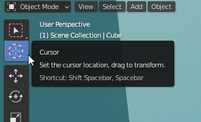
 
    Fig 35. The Cursor Tool.

    Using this tool, you will be able to change the location of the cursor in **3D Viewport** by clicking on any part of the screen (see [official help](https://docs.blender.org/manual/en/latest/editors/3dview/3d_cursor.html) for details). However, by default, when you use this tool without orthogonal views, the cursor is placed on the geometry you click (i.e. the *depth* of the location of the cursor is defined by it).

    - While you are inside of the large cube (if not, zoom in into it), click any point on the small cube to place a cursor on it.

    > [!NOTE]
    > To select the target point, you may want to rotate or move your view. To rotate, hold the mouse wheel while moving the mouse. To move, hold both SHIFT and mouse wheel while moving the mouse.

    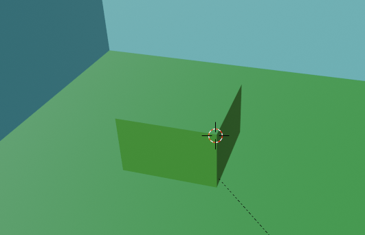
 
    Fig 36. View of the small cube with a cursor on it.

    - Now, add the light spot to the cursor location by selecting **Add > Light > Spot** in the **Add** menu.

    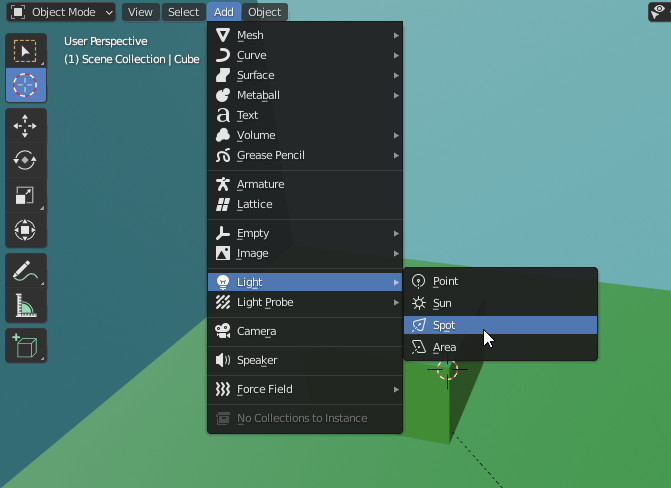
 
    Fig 37. Light > Spot option within the Add menu.

    - After that, the new light node will appear in the **Outliner** and the corresponding light object in the **3D Viewport** (in the location of the cursor).

    - Select the **Move** tool (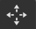) to move it where necessary (using arrows, as we did before) or, alternatively, press **G** to activate "Move" transformation mode and select the exact location for the spot. For example, you can place the light spot just above the small cube.

    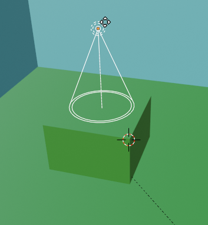
 
    Fig 38. New spot light placed above the small cub.

    - As with other objects, you also need to parent it to the frame node.To do this: in the **Outliner**, select the light spot node, then, while keeping it selected, select the frame node, then, in the **3D Viewport**, right-click any point of the screen and select **Parent > Object**. For details, see step 6 above.

    After doing this, the light spot will be also below the **b_levelroot** in the hierarchy.

    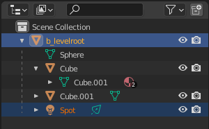
 
    Fig 39. Hierarchy with the Spot light parented to the b_levelroot.

    - In the process of working with lights, it is useful to preview them in the scene. To do that, you can switch to the **Rendered** mode of the **Viewport Shading** in the top right corner of the viewport.

    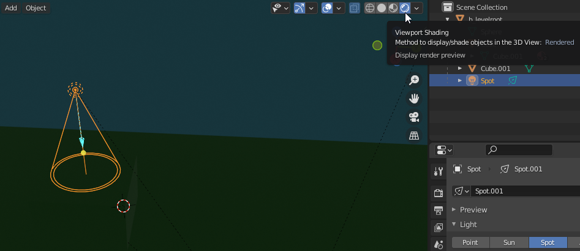
 
    Fig 40. Viewport Shading option.

    - As you can see in the preview, the scene is dark and the light source is not visible.

    > [!NOTE]
    > The power of lighting in the viewport of Blender and the game engine is different, you should take this into account.

    - However, let's adjust some of its properties to make it visible (with other options you can play on your own):

        - If not already selected, select the light spot node.

        - In the **Properties** panel, in the **Object Data Properties** tab, modify the following properties of the light spot:

            - **Power** – the power of the light source. By default, it is **10** Watt, which is very low. Let's set **300** Watt here.

            > [!NOTE]
            > 300 Watt will still look a little bit dark in Blender, but in the game engine it will look different.

            - **Size** – as you can see, the light spot is producing a cone of light. The **Size** parameter controls the angle of this cone, in degrees. By default, it is **45** degrees, which is a bit narrow for us. Let's make it **90** degrees.

            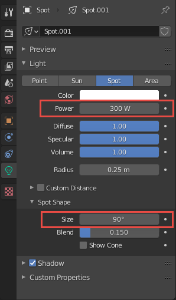
 
            Fig 41. Power and Size options within the Spot Light Properties.

            - As you can see in the **Rendered** mode of the **Viewport Shading**, now the light from the light spot is visible at least. Please don't mind that it still looks dark now.

    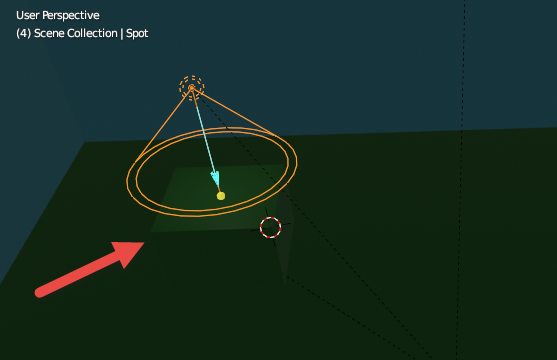
 
    Fig 42. View of the spot light properties within the Blender viewport.

11. Now it is a good idea to save the final version of your source Blender scene. The saving itself is done absolutely in a standard way (**File > Save/Save as** in the main menu of Blender). However, the location where you will save the scene is important. Actually, it is most important not for the Blender scene file, but for the FBX file exported from it (see the next section). But, it is a good practice to store the initial source file of the scene and FBX in one folder anyway.

So, let's save your source scene to the folder of your future FBX.

To do this:

- Open Windows Explorer, and, in the Halo 3 Editing Kit root folder, open **\data\levels** subfolder in it.

- In **…\data\levels**, create a subfolder for mods of your levels, e.g. **mod_levels**

- In this folder, create a separate folder for your level, e.g. **my_level_1**

- In **…\data\levels\mod_levels\my_level_1** folder, create a **structure** subfolder.

- In Blender, save your source scene in the **…\data\levels\mod_levels\my_level_1\structure** folder with the same name as the name of the level. E.g. as **my_level_1.blend**.

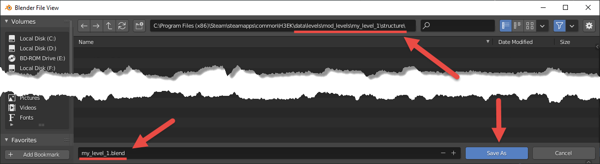
 
Fig 43. Folder Location and File Name for saving.

> [!NOTE]
> Actually, the name of the initial **.blend** file is not important, but it is convenient to have it named similarly to the FBX file for easier identification.

12. Now, you saved your work and can proceed to the next step – [Exporting Geometry to FBX](../Process/Step2.md).
