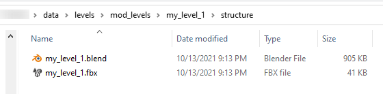
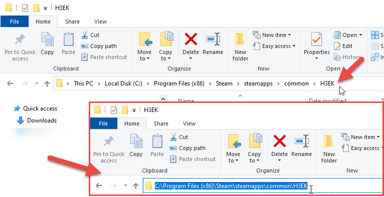
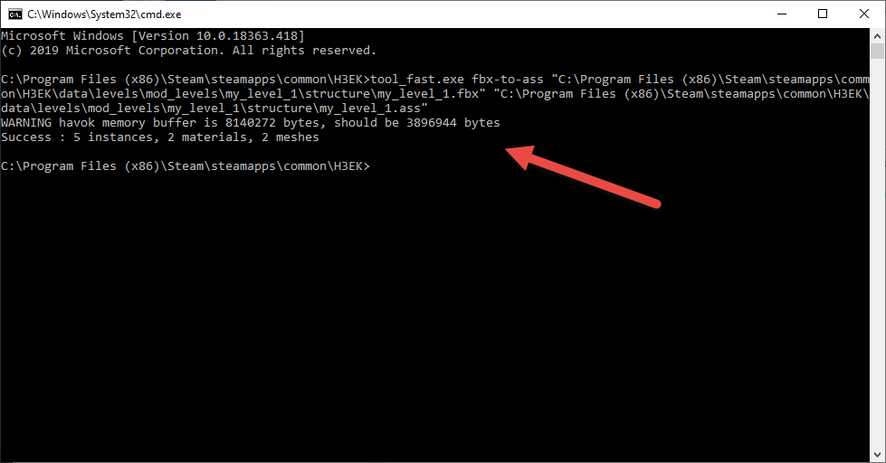
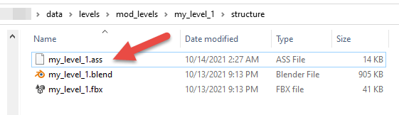

# Quick Start Process Step 3 - Conversion from FBX to ASS

If you have followed [Step #1](../Process/Step1.md) and [Step #2](../Process/Step2.md) of this guide, you should now have two files in the …\data\levels\mod_levels\my_level_1\structure directory (or at a similar path): the .blend file of the source Blender scene and the .fbx file that you have exported from it.



Fig 1. Initial files created in the previous tutorial steps.

Now, you will need to convert the FBX file to the ASS format (static geometry of the level).

This can be done using the **tool_fast.exe** tool.

> [!NOTE]
> For general info on this tool, see the [Quick Start Overview](../QuickStartOverview.md) doc.

Particularly you will need to execute the **fbx-to-ass** command using **tool_fast.exe:**

```
tool_fast.exe fbx-to-ass <source fbx file> <target ass file>
```

For example: 

```
tool_fast.exe fbx-to-ass "C:\Program Files (x86)\Steam\steamapps\common\H3EK\data\levels\mod_levels\my_level_1\structure\my_level_1.fbx" "C:\Program Files (x86)\Steam\steamapps\common\H3EK\data\levels\mod_levels\my_level_1\structure\my_level_1.ass"
```

> [!WARNING]
> When the paths to your files within commands contain spaces in the name(s) of the directory(ies), you need to put them in double quotes (e.g. "the path\to\file"), like in the example above. This is necessary for the correct execution of the command.   

You will need to execute this command in the command line of the **Command Prompt** from the root directory of Halo 3 Editing Kit (where the **tool_fast.exe** executable is located).

To open the Command Prompt in this directory, you can do the following:

1. Open the the root directory of Halo 3 Editing Kit.

2. Click the path to the directory (displayed at the upper bar, above the folders) to make it editable.



Fig 2. Highlight the folder path to change the text.

3. Replace this text with the **cmd.exe** command and press ENTER to execute it.

[View of the folder path field now populated with cmd.exe with a text box prompting to press enter.](./media/H3_QuickStart_ProcessStep3_CMDEnter.png)

Fig 3. Enter cmd.exe and then press Enter

4.  After that, the new command prompt window will open and will wait for your input. Moreover, it will be opened exactly in the the root directory of Halo 3 Editing Kit, as you can see in the sceenshot below.

[View of the command prompt window open with the directory set to the folder where you Halo 3 Editing Kit is installed.](./media/H3_QuickStart_ProcessStep3_CMDRoot.png)

Fig 4. Command Prompt with the root directory set to the H3EK.

After that, you will be able to execute the **fbx-to-ass** command of **tool_fast.exe** as mentioned above.

After execution of this command, the tool may display a warning or two, but you can ignore them.



Fig 5. Output in tool_fast.exe after executing the fbx-to-ass command.

After successful execution of this command, the new **.ass** file will appear at the **structure** folder of your level. In our case, it will be **my_level_1.ass** file:



Fig 6. File output once the fbx-to-ass command is completed.

After that, you can proceed to the [Creation of Initial Tag Files](../Process/Step4.md) step.
