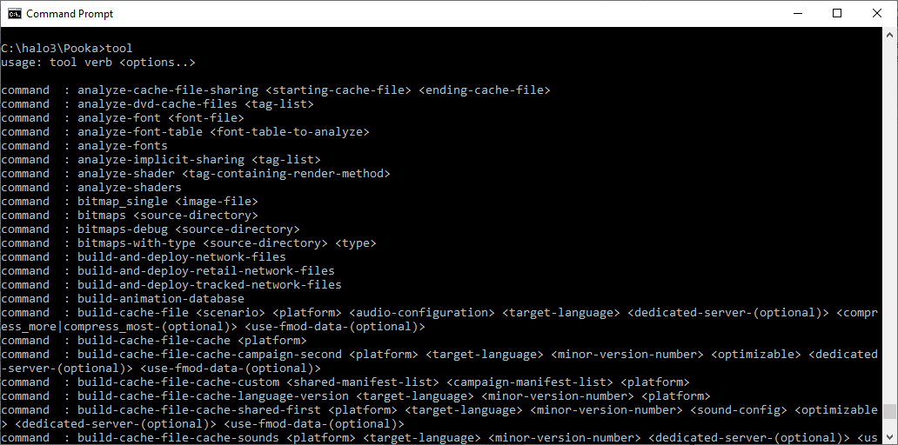
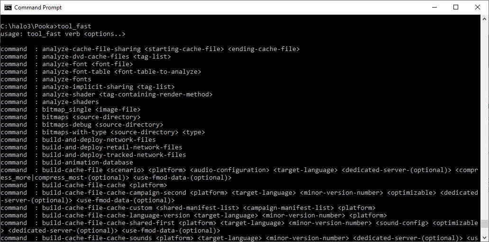
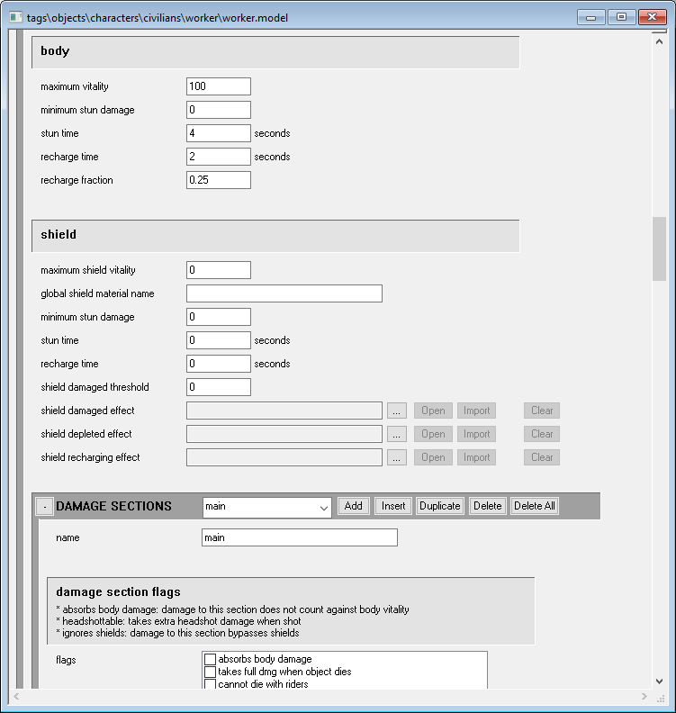
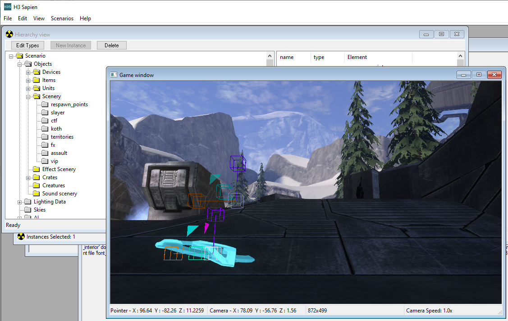
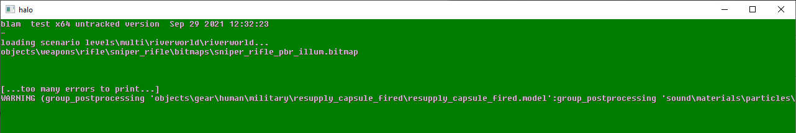
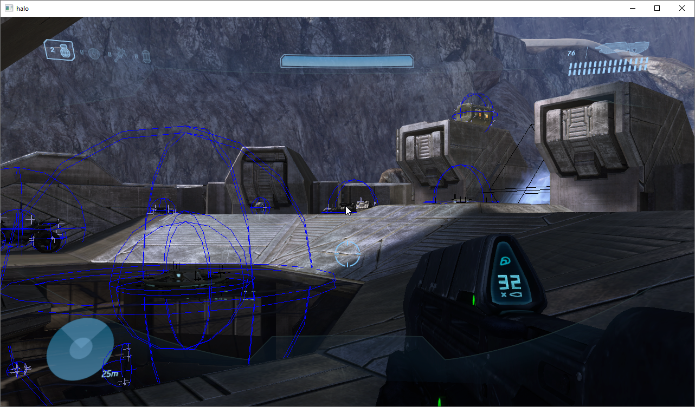
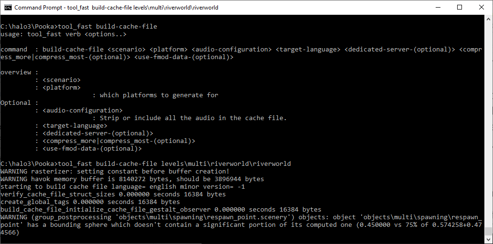
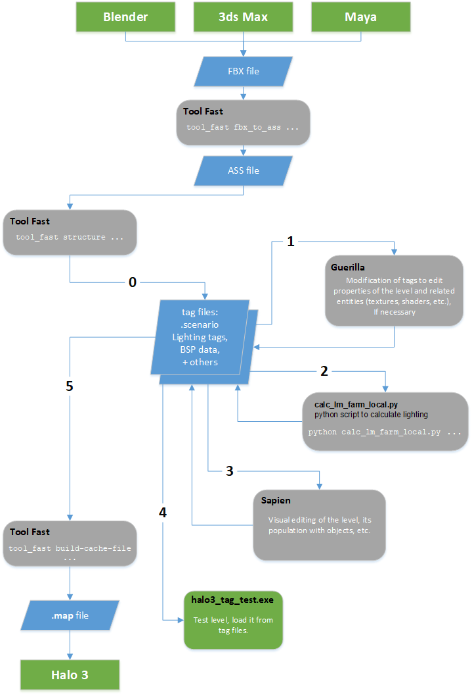

# Quick Start Overview

This article provides an overview of Halo 3 modding tools and the structure of folders used during modding. In addition, it contains the diagram of the general modding pipeline for the creation of a level. For the full description of this pipeline, please refer to the [Creation of Simple Level](../QuickStart/Process/ProcessHome.md) doc.

## Halo 3 Modding Tools
This section contains brief descriptions of the modding tools that are included in the **Halo 3 Editing Kit (H3EK)**.

In the root folder of this package, you will find executables of all these tools, except the 3D modelling package (such as Blender, 3DSMax, or Maya) that needs to be installed separately.

Once downloaded, Halo 3 modding tools do not require any extra installation steps. You can simply launch them from the appropriate folder.

### Tool and Tool_Fast: "Aggregators" for Commands

The **tool** and **tool_fast** apps (**tool.exe** and **tool_fast.exe**) are command-line programs that are very important in the world of Halo 3 modding. Roughly speaking, we can say that these two apps are slightly different implementations of the same concept – the necessity to have some central point for launching various commands. Both of these apps aggregate a large set of sub-commands that are necessary for the different parts of the modding pipeline.

The most important ability of **tool** (tool.exe) is to transform source data (level geometry and models in the format of **FBX** files, images, text, etc.) to the format used by the engine. For example, you can generate an asset file (**ASS**) with the static geometry of the level from an FBX file using the **fbx-to-ass** command of tool in the following format:

```
tool fbx-to-ass <fbx_file> <ass_file>
```

> [!NOTE]
> However, the tool app is used not only for that. You can list all of the sub-commands available in tool by launching tool.exe in the command line prompt without parameters.

The **tool_fast** app (**tool.exe**) is an optimized version of **tool** that supports multi-threading, which allows it to perform the same operations faster. Some commands of **tool_fast** duplicate the commands of **tool**, and we recommend you to use **tool_fast** commands in this case. Commands inside **tool_fast** should be sufficient for most popular modding tasks. However, tool_fast displays fewer errors and warnings, so if you need to do debugging or have some issues, switch back to **tool**.

Sets of sub-commands within **tool** and **tool_fast** are slightly different and some commands exist only in one tool or the other. For example, the **structure** sub-command exists only in the tool_fast. This command allows you to build a **.scenario** tag file of the level for Sapien from the **ASS** file. The format of this command is the following:

```
tool_fast structure <ass-file>
```

> [!NOTE]
> Similar to the tool app, you can list all sub-commands of tool_fast by launching tool_fast.exe in the command line prompt without parameters.



Fig 1. Sub-commands of tool (part of the full list).



Fig 2. Sub-commands of tool_fast (part of the full list).

### Guerilla and the concept of "Tags"

Guerilla (guerilla.exe) is used to edit the "tags" of modding entities. The concept of "tags" is a cornerstone of Halo 3 modding.

A single Tag can be described as a set of properties that describe the game entity of a particular kind to the game engine. Please note that these properties can link to some resources (textures, files, etc.) called tag's resource references. There are tags for levels (scenarios), game objects, AI, shaders, sounds, textures, network properties, effects, global variables, UI, cinematics, and so on. Almost every source object of the game is transformed into a single or multiple tags in the modding pipeline. However, not all game properties are editable as tags, and not all properties of individual tags are editable. This is done intentionally since modification of some aspects of the game can lead to incorrect behavior and crashes.

Every data tag in the game can be opened and viewed in Guerilla.



Fig 3. A window in the UI of Guerilla with a particular tag opened.

### Sapien: Visual Level Editing

Sapien (sapien.exe) is a visual editor for Halo 3 levels (they are called "scenarios" in Halo 3 modding). It allows you to fill your scenario with objects, set up lighting, spawn points, AI used on the level, etc.



Fig 4. Editing a level in Sapien, part of the UI.

> [!NOTE]
> Modding tools for some previous versions of Halo used photon mapping (direct simulation of real-life light particles) to calculate lighting of the level. It was done in **tool** by the specific **lightmaps** sub-command, currently obsolete. Now, lighting is calculated using the **calc_lm_farm_local.py** python script, see [below](#calc_lm_farm_localpy-script-that-calculates-lighting).

### halo3_tag_test.exe: Game Version Loaded from Tags

**halo3_tag_test.exe** is a specifically modified version of the Halo 3 game that is able to load itself not from regular game files, but from tags (see 2.2 above for a definition of tags).

Please note that this version of the Halo 3 game can load itself only this way.

The main purpose of this application is local testing of the tags you have created from the source files, tags' resource references, and so on, without doing a final build of the level/model.

To be able to launch **halo3_tag_test.exe** you will need to create its configuration file – **init.txt**, in the same directory. The app will execute Halo Script commands specified in this file and load settings from it. So, in this file, you will need to specify such parameters as the starting level, necessary debug parameters and cheats, and so on.

In its most basic setup, the **init.txt** file must contain only the staring level as a parameter, which is specified by the **game_start \<path_to_level_from_the_"tags"_folder>** command.

For example:

```
game_start levels\multi\riverworld\riverworld
```

The full list of commands that can be used in this file can be obtained by opening the Halo 3 console in the game (type "~" to open it) and executing the **script_doc** command in this console. This will generate the **hs_doc.txt** file with the command descriptions in the folder of **halo3_tag_test.exe**.

Along with commands, in this file, you can set values of various game settings, such as cheats and debug options. For example, **cheat_deathless_player on** – will enable invulnerability, **cheat_infinite_ammo on** – will give infinite ammo, **debug_objects on** – will enable the debug visualization of the game objects, models, and collision models.

> [!NOTE]
> For details on this, see [Console Commands](../Misc/ConsoleCommands.md).

When launching **halo3_tag_test.exe** you may want to change the resolution of the game. It can be changed by the **-width** and **-height** parameters of the executable that can be specified in the command prompt. You can omit one of these parameters (the default 16x9 ratio will be used in this case).

For example

```
halo3_tag_test.exe -width 1280 -height 720
```

During its launch, **halo3_tag_test.exe** will display errors, warnings, and other debug info.



Fig 5. halo3_tag_test.exe loading a level.



Fig 6. Loaded level in halo3_tag_test.exe (with some debug visualization enabled).

### calc_lm_farm_local.py: Script that Calculates Lighting

The **calc_lm_farm_local.py** file is a Python script that is used for the calculation of lighting of the level.

This script simply executes appropriate commands from **tool_fast**, so you can calculate lighting without it, if necessary. However, the script simplifies this process for you.

As any other script in Python, **calc_lm_farm_local.py** requires Python to be installed for the execution. You can install Python from https://wiki.python.org/moin/BeginnersGuide/Download.

> [!NOTE]
> Versions greater than Python 3.6 should be used for launching this script.

After Python is installed, you will be able to launch the script and calculate lighting by the command in the following format:

```
python calc_lm_farm_local.py <scenario tag file, w/o .ext> <bsp name> <quality> (<light_group>)
```

For example:

```
python calc_lm_farm_local.py levels\multi\s3d_turf\s3d_turf s3d_turf high
```

> [!NOTE]
> A level can be divided into multiple BSPs (Binary Space Partitions) during its creation in the 3D modelling program. However, most of the custom levels have a single BSP only. Large campaign levels may have multiple BSPs.

> [!NOTE]
> \<light_group> can be omitted since **all** light groups are calculated by default.

### 3D Modelling Program of Your Choice

Along with these tools, you will probably need the 3D modelling program for modding.
The following popular 3D programs can be used for that:

- 3ds Max (https://www.autodesk.com/products/3ds-max/overview)

- Maya (https://www.autodesk.com/products/maya/overview)

- Blender (https://www.blender.org/)

All of these tools support FBX (.fbx) files as an export format. These FBX files can be used as the source files for the creation of levels and models.

> [!NOTE]
> Support of the **FBX** format as a data source is a new part of the Halo 3 modding pipeline. Due to this feature, you can perform modelling not only in 3ds Max as before, but, also, in Maya, or even in an open-source and free 3D modelling tool – Blender.

## Main Folders Used for Modding

In the root folder of the modding package for Halo 3, you will find executables of all modding tools mentioned above.

During modding with these tools you will use the following main folders:

- **data**

- **tags**

- **maps**

The **data** and **tags** folders are initially provided in the form of **.zip** archives, so you will need to extract them to create the **data** and **tags** folders used by the modding tools.

### "data": Source Folder

The **data** folder is intended for source data.

In the modding package itself, this folder is almost empty since we do not provide all initial source files of game data, only their tags (see below). However, you will probably gradually fill this folder during your modding activities.

> [!WARNING]
> Please do not delete the initial contents of the **data** folder. They are necessary for the game engine to be able to start the game and load all of the provided maps. Particularly, the initial contents of **data** include some game scripts and XML descriptions of levels.

During the process of modding, the **data** folder should contain the source files of the levels and models, various resource files (textures, sounds, etc.), and so on.

For contents of this folder, you must follow the same folder structure as exists in the **tags** folder (except **temp_scenario**):

- **ai**

- **camera**

- **cinematics**

- **effects**

- **fx**

- **globals**

- **levels** – this folder will contain source data for your levels. Please note that if you want to make some resources common for multiple levels, we recommend you to put them into the **shared** subfolder.

- **multiplayer**

- **objects** – this folder will contain source data for your objects (models, their animations, etc.)

- **rasterizer**

- **shaders**

- **sound**

- **ui**

> [!NOTE]
> For descriptions of all folders in this folder structure, please refer to the description of the tags folder (see [tags](#tags-folder-with-all-tags) below).

File formats that are stored in subfolders of **data** include the following:

- Source files of modelling scenes (from 3ds Max, Maya, or Blender) – these are exported to FBX (see below) by the means of the used 3D modelling program.

- **FBX** files – act as source files for ASS, JMS, and JMA (see below).

- **ASS** files – static geometry of the level.

- **JMS** files – files of the model. Please note that each model has three JMS files (or two, if a model has no constraints). These are located in the objects folder, in the sub folder of the model in the objects hierarchy and these JMS files must be put into the separate subfolders (see below). For example, the path to the "render" JMS for Cortana will look like this: data\objects\characters\cortana\render\cortana.jms.

    - **render** – in this folder, you should put the JMS file with visible geometry and the skeleton of the model.

    - **collision** – in this folder, you should put the JMS file with collision objects of the model.

    - **physics** – in this folder, you should put the JMS file with constraints (i.e. physical joints) of the model. This folder/JMS is optional since not all models have constraints.

- **JMA** files – animation files.

- **TIFF/TIF** files – source files of textures/images.

- **WAV** files – source sound files.

> [!NOTE]
> One source file from the data folder can correspond to multiple tag files in the **tags** folder. And, vice versa, multiple source files can be used to generate a single tag file.

### "tags": Folder with All Tags

The **tags** folder is used for tag files of various types. Roughly speaking, tag files correspond to the particular game entities in the format of the Halo 3 engine. Please note that a single source file can correspond to multiple tag files generated on its basis. For example, the conversion of a JMS file (of a model) will result in multiple tag files.

> [!WARNING]
> Please do not delete the initial contents of the **tags** folder. They are necessary for the game engine to be able to start the game and load all of the provided maps.

The folder structure within the **tags** folder is the following:

- **ai** – This folder contains tag files related to default behavior that is common for some types of AI encounters (both with friendly and enemy NPCs). Please note that the AI encounters themselves are described in the scenario tag files in **levels** (and these encounters should be edited in Sapien, not in Guerilla).

- **camera** – This folder contains tag files related to vehicle camera movement only.

- **cinematics** – This folder contains tag files related to cinematics.

- **effects** – This folder contains a few legacy tag files related to particle effects. Please use the **fx** folder for your effects, but do not delete the old legacy effects from the **effects** folder since they are still used by the game engine.

- **fx** – This folder contains tag files related to various special effects.

- **globals** – This folder contains tag files related to the global parameters of the game and all its subsystems.

- **levels** – This folder contains tag files related to levels. Please note that it contains the **shared** subfolder, which contains tags for resources that are shared between all levels of the game.

- **multiplayer** – This folder contains tag files related to the setup of the multiplayer in the game. Please note that this folder does not contain the multiplayer levels. Multiplayer levels are in **levels\multi**.

- **objects** – This folder contains tag files related to various objects: characters, vehicles, weapons, skies of the levels, objects' physics, and so on. Please note that objects related to particular levels are in **objects\levels**.

- **rasterizer** – This folder contains tag files related to global shaders that are *not dependent on materials*.

- **shaders** – This folder contains tag files related to shaders that are *dependent on the materials*.

- **sound** – This folder contains tag files related to various sounds.

- **temp_scenario** – a temporary folder of Sapien. If you have closed Sapien without saving your changes, it will restore them from the temporary files in this folder.

- **ui** – This folder contains tag files related to UI used by the game.

> [!NOTE]
> Except for the minor changes described above, the folder structures of **tags** and **data** *must* be similar for your custom files. This is necessary for the correct operation of modding tools. Along with it, this will allow you to found your source files easily when you know their tag files and vice versa.

There are a lot of different types of tag files in the game. Most of them have extension names that speak for themselves. For example, **.scenario** tag files correspond to the main tag files of the level, **.bitmap** tag files correspond to textures and images, and so on.

### "maps": Folder with Compiled Maps

At first, there is no **maps** folder in the root folder of the modding package for Halo 3. It will appear as soon as you build the cache files for your first level.

During your work with the level, the **maps** folder may contain the following:

- **.map** files – the cache files for the scenarios. These files contain all contents of the level.

The **.map** files are generated by the **build-cache-file** command of **tool_fast** based on **.scenario** tag files.

To display possible parameters for this command, you can execute the **tool_fast build-cache-file** command in the command prompt. In its simplest form the command requires only the name of the **.scenario** file (without the extension) and the type of the target platform (e.g. **x64**):

```
tool_fast build-cache-file <scenario> <platform>
```

For example:

```
tool_fast build-cache-file levels\multi\riverworld\riverworld x64
```

After the execution of this command, the tool app will start to build the .map file.



Fig 7. Building .map file.

## Level modding Pipeline: Basic Diagram



Fig 8. General pipeline for the creation of a level.

For full details of this workflow, please refer to the [creation process](../QuickStart/Process/ProcessHome.md).
