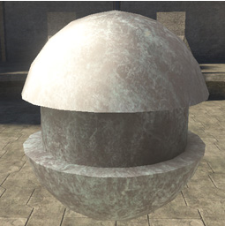
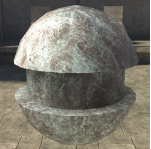

# Albedo Blend Properties

Blends between albedo base_map color and the specular tint and fresnel colors defined in the shader.

- 0 = more specular tint (see Figure1).

- 1 = more albedo/less specular tint (see Figure 2).

> [!NOTE]
> This can be used as a cheap alternative to a real specular mask.

Figure 1 - Albedo 0.

Figure 2 - Albedo 1.
