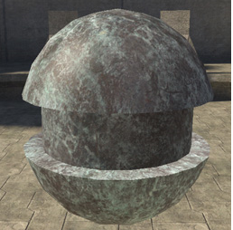
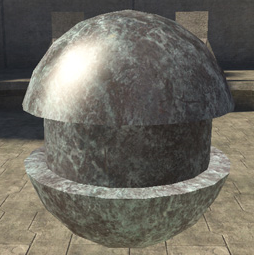
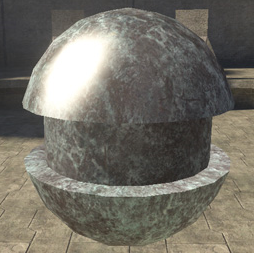
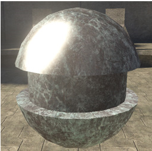
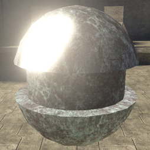

# Analytical Specular Contribution Properties

What you normally think of as a "specular highlight." Controls the amount of light cast onto the surface from the single brightest light source nearby. Can be focused or spread into different sizes using the roughness parameter.

Defined by a value from 0-1, but higher numbers can be entered for special effects. A value of zero will result in no specular at all.

Figure 1 -  analytical_specular_contribution: 0.1.

Figure 2 -  analytical_specular_contribution: 0.5.

Figure 3 -  analytical_specular_contribution: 1.

Figure 4 -  analytical_specular_contribution: 2.

Figure 5 -  analytical_specular_contribution: 5.
