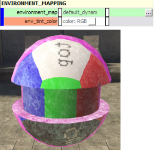
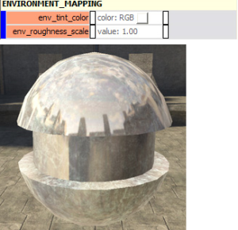
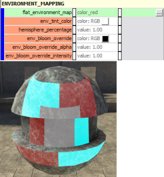

# Environment Mapping

Environment Mapping defines what source is used for the environment map contribution to the specular properties.

> [!NOTE]
> Any environment map is controlled by the **environment_map_specular_contribution** in the Material Model. You can apply an environment map to your surface without specifying a material model (diffuse only), but you won't have a great deal of control over it.

There are four options for environment mapping parameters:

## **none**

- **[no parameters]**— No environment mapping. This is the default setting.

## **per_pixel**

- **environment_map**— [bitmap] selected bitmap is painted as a cubemap onto the surface.

- **env_tint_color**— [color] The color of light reflected by the environment map.

Figure 1 - per_pixel.

## **dynamic**

Uses the cubemap generated automatically by Tool for the cluster the shader is closest to. To generate cubemaps for a scenario, run **tool cubemaps**. One cubemap is generated per cluster.

- **env_tint_color**— [color] The color of light reflected by the environment map.

- **env_roughness_scale**— [value] Defines the roughness of the surface. A higher value results in light being spread out across the environment map. A small value results in small, pinpoint light on the surface (as if it was a smooth, shiny surface).

Figure 2 - dynamic.

## **from_flat_texture**

Stretches any flat bitmap around a sphere and uses that as an environment map (the bitmap doesn't need to be set as a cubemap).

- **flat_environment_map**— The bitmap to use as an environment map.

- **env_tint_color**— The color of light reflected by the environment map.

- **hemisphere_percentage**— The percentage of the hemisphere that the texture will be stretched around. Higher values will make the bitmap larger, lower values will shrink the bitmap down.

Figure 3 - from_flat_texture.
