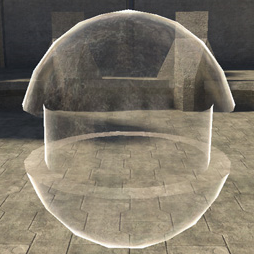
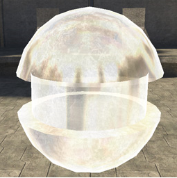
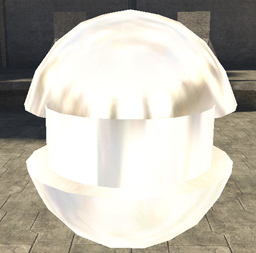

# Fresnel Coefficient

The "strength" of the environment map.  Basically replaces the environment_map_specular_contribution found in other material_model types.

Figure 1 - fresnel_coefficient: .01 (default).

Figure 2 - fresnel_coefficient: 0.25.

Figure 3 - fresnel_coefficient: 0.5.

Figure 4 - fresnel_coefficient: 1.
