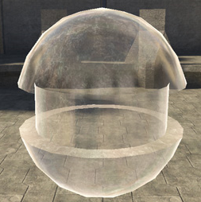

# Glancing Specular Power

The strength of the specular lighting on mesh faces with normals pointing at 90 degrees to the camera.

Figure 1 - glancing_specular_power: 1.

Figure 2 - glancing_specular_power: 10 (default).
