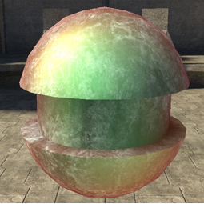
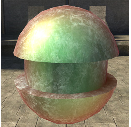

# Normal Specular Power

The strength of the specular lighting on mesh faces with normals pointing at the camera.

Figure 1 - normal_specular_power: 1

Figure 2 - normal_specular_power: 10 (default)
