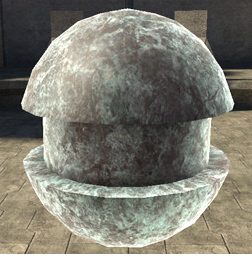
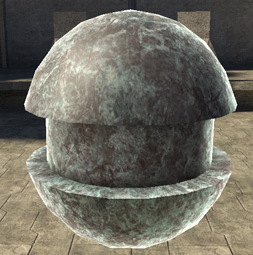
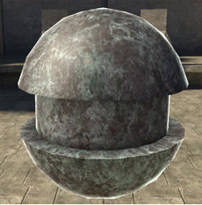
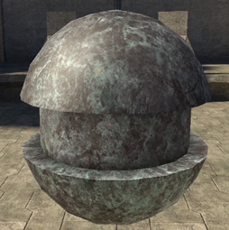

# Rim Start

Controls how far the rim specular highlight wraps around the edge of the model. High values restrict highlight to very close to the edge, low values make broader highlights.

Figure 1 - rim_start: 0.1

Figure 2 - rim_start: 0.4

Figure 3 - rim_start: 0.7 (default)

Figure 4 - rim_start: 1
