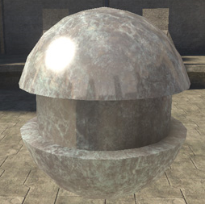
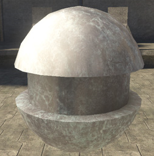
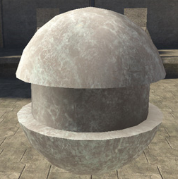
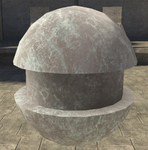

# Roughness Properties

Controls the size of the specular highlight, including the area and environment specular. A higher value results in light being spread out across the surface. A small value results in small, pinpoint light on the surface. For environment reflection, roughness controls the sharpness of the reflection map, so the higher the number, the blurrier the reflections.

Defined by a value from 0-1, but higher numbers can be entered for special effects.

Figure 1 - roughness: 0.1

Figure 2 - roughness: 0.5

Figure 3 - roughness: 1

Figure 4 - roughness: 2
