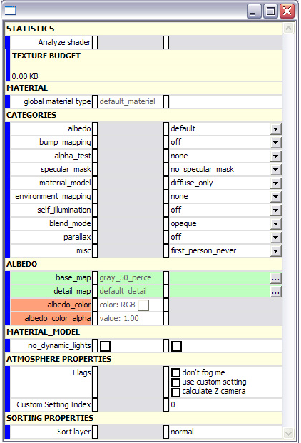

# Standard Propterties

Shaders are added on a per-material basis to 3D objects.

Sections of the shader are revealed or hidden based on the category options you choose.

Figure 1 - Shader Shader

## Statistics

- Analyze shader— Currently not used.  Meant to give you a total cost for the shader so that you can see the effect of changes without having to load it in the game.

- Texture Budget (not used)

## Material

- global material type [string, enter manually] — default: default_material

Defines which sounds and effects to use with this shader in the game.

## Categories

- albedo [drop down list] — default: default
(pronounced Al-Bee-Doh) Defines the surface color. Also known as diffuse.

- bump_mapping [drop down list] — default: default
Defines variations in how lighting affects the surface.

- alpha_test [drop down list] — default: none
Defines whether a pixel should be rendered or ignored.

- specular_mask [drop down list] — default: no_specular_mask
Defines how specular properties are controlled on a per-pixel basis.

- material_model [drop down list] — default: diffuse_only
Specify the type of shader.

- environment_mapping [drop down list] — default: none
Define the source used for the reflective environment mapping.

- self_illumination [drop down list] — default: off
Defines which pixels over-ride object lighting, also known as glow.

- blend_mode [drop down list] — default: opaque
Defines how the shader blends with the objects behind it.

- parallax [drop down list] default: off
Defines a special kind of bump mapping where pixels may occlude other pixels in the same map.  Simulates the effect of displacement in a 2D shader.

## Albedo

- See the [albedo](/Albedo.md) page.

## Material_Model

- See the [material_model](/MaterialModel.md) page.

## Atmosphere Properties

- Flags [on/off checkboxes]— default: all off

- calculate Z camera:

- Custom Setting Inde [number]— default: 0

## Sorting Properties

- Sort layer [drop down list]— default: normal
