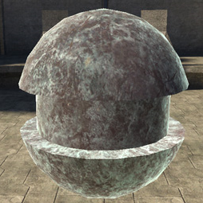
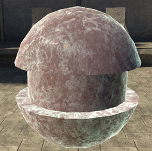
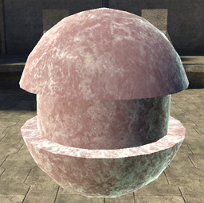
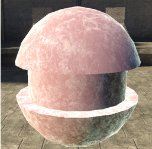

# Subsurface Coefficient

Turns the subsurface lighting on and off.

- 0 = No subsurface lighting.

- .75 = Typical values.

- 1.0 = Subsurface lighting as strong as normal diffuse lighting.

Figure 1 - subsurface_coefficient: 0.1

Figure 2 - subsurface_coefficient: 0.5

Figure 3 - subsurface_coefficient: 1

Figure 4 - subsurface_coefficient: 2
