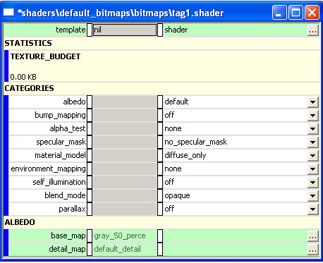

# Terrain

## **Categories**

- [albedo](../Shaders/Albedo.md)
- [bump_mapping](../Shaders/BumpMapping.md)
- [alpha_test](../Shaders/AlphaTest.md)
- [specular_mask](../Shaders/SpecularMask.md)
- [material_model](../Shaders/MaterialModel.md)
- [environment_mapping](../Shaders/EnvironmentMapping.md)
- [self_illumination](../Shaders/SelfIllumination.md)
- [blend_mode](../Shaders/BlendMode.md)
- [parallax](../Shaders/Parallax.md)

Figure 1 - A sample .shader tag with default settings

## **Template**

It's not necessary to select a specific template for shaders in Halo 3— there is a single template (format for a shader tag) that covers all types of shaders.

## **Statistics**

- **Texture_budget** — Lists how many kilobytes of memory the current configuration of the shader would use up in-game.
