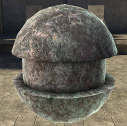
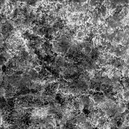
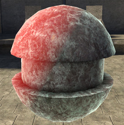

# Transparence Map Properties

Gives you per-pixel control over both transparence strength.

Figure 1 - With transparence map

Figure 2 - Transparence map used

Figure 3 - Without transparence map
