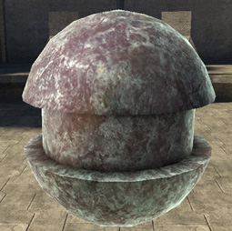
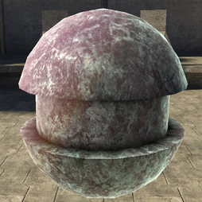
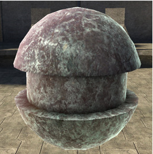

# Transparence Normal Bias

Forces transparence lighting to the edges or center of the model.

- -1.0 adds transparence lighting to the inside of the model

- 1.0 adds to the rims only

- 0 does the whole model.

Figure 1 - transparence_normal_bias: -1

Figure 2 - transparence_normal_bias: 0

Figure 3 - transparence_normal_bias: 1
