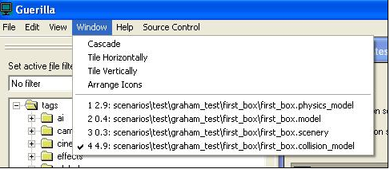

# Window Menu

The Window menu (see Figure 1) controls the way your open tags are displayed and gives you direct access to bringing focus to a specific open tag.

Figure 1 - View of the Window Menu

- **Cascade**— Arranges any open tag windows in a diagonally cascading fashion.
- **Tile Horizontally**— Any open tag windows are tiled in rows down the screen (does not work when you have 1, 4, or 5 open tags).
- **Tile Vertically**— Any open tag windows are tiled in columns down the screen (does not work when you have 1, 4, or 5 open tags).
- **Arrange Icons**— Arranges all minimized tag windows.
- **Window Selection**— The lower area of the menu lists all of the tags that are currently opened for editing/viewing. You can select any of the names on the list (or type the hotkey number) to bring that window into focus.
