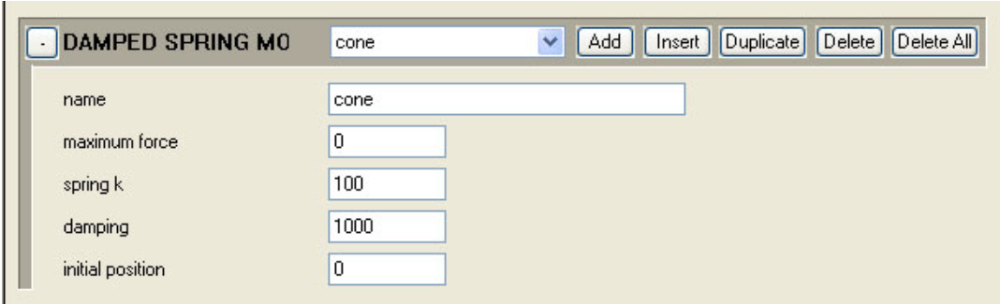
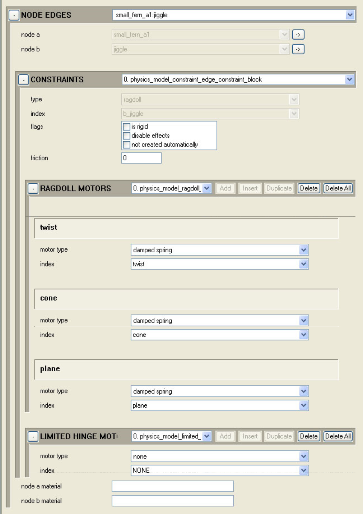

# Contraints Damped Spring and Position Motors

Havok constraints can have a preference for position like the spring on a swinging door. Springs and motors will work on either hinge or ragdoll constraints.

## **Defining the Damped Spring Motor**

A damped spring motor adds force to keep a constraint in place, like a spring.

Once a motor has been defined, it can be added to any of the node edge constraints under nodes edges: constraints: ragdoll motors. There are separate entries for cone, plane and twist. Defined motors can be used multiple times.

Figure 1 - Damped spring motor settings

- Name— \<name>

- Maximum Force— 0 = no limit (0 defaults to REAL_MAX), > 0 = cap forces

- Spring K— Spring

- Damping— (0 means default damping of 1.0f)

### **Steps**

1. The first step is to balance the k value of the spring against the weight and inertia of the object. At this step, all damping values are near 0 and you're just tweaking spring k, mass, and inertia tensor scale.

1. When it's oscillating at the desired frequency it's time to move on. The frequency should be equivalent to a pendulum of the same length. So at this point the Jiggle node and leaves are moving at frequencies you like. Also, the jiggle node is responding to the player in a way you like (very responsive). At this point you should see all the secondary motion including twist and sway of the leaves. If you don't have it at this point keep tweaking. Also it's worth noting that you shouldn't worry about most incidences of spazing at this point, you should just be concerned with getting the range of motion you want at the frequency you like.

1. The last step is to clamp down damping. Do this both with the constraint motor and the rigid body.

> [!NOTE]
> For something like this it will end up being more stable to put most of the damping on the rigid body.

Done!

## **Defining the Position Motor**

If you want a more linear motion to your motor, you can use the position motor instead of the damped spring motor (it's also useful if one were to use motors to keyframe bodies).

Use a value of 1 or 2 in the damping value (se Figure 1 above).

## **Adding the Motors to Edge Constraints**

Figure 2 - Edge contraints settings
