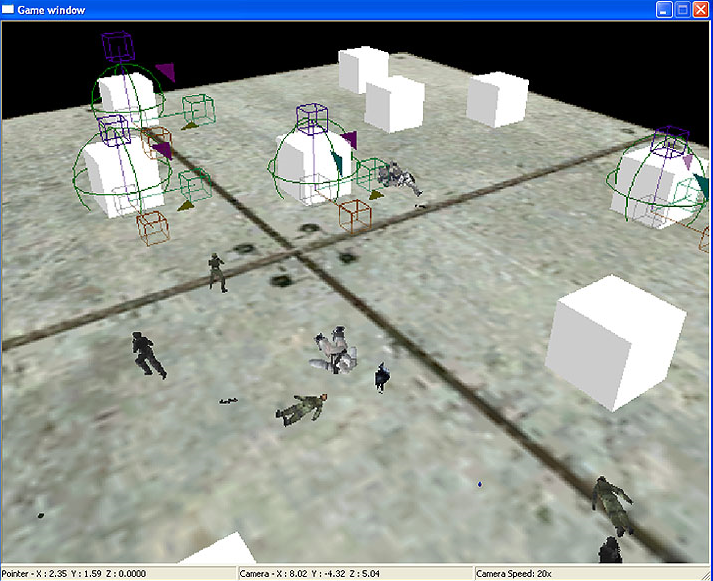

# Game Window

The Game Window in Sapien (see Figure 1) is where you can see all of the changes you make to your scenario. It provides a visual way for you to place and position assets, as well as preview scripts and AI interactions. There are pointers (the location of the mouse pointer) and camera coordinates in the status bar (along the bottom) of the window.

Figure 1 - The Game Window in Sapien

## Controls

Here's how to get around within the game window:

- **Turn/Rotate Camera**— Middle Mouse Button + Mouse in direction to turn
- **Move Camera Left/Right/Forward/Back**— Middle Mouse Button + W,A,S,D keys
- **Move Camera Up**— Middle Mouse Button + R key
- **Move Camera Down**— Middle Mouse Button + F key
- **Change Camera Speed**— Middle Mouse Button + Shift (or alternately, you can scroll the mouse wheel)
- **Debug Menu**— Middle Mouse Button + Home
- **Quick Zoom**— Double-click left mouse button

Most of the interaction available via the Game Window is very contextual. In general, left-clicking on an asset will select it (once that type is selected in the hierarchy view) and right-clicking in the game window will place an asset of the type that is currently selected in the hierarchy view. For more information about positioning and re-sizing assets, see the [*Sapien Asset Manipulation Gizmo*](AssetManipulation.md) article.
