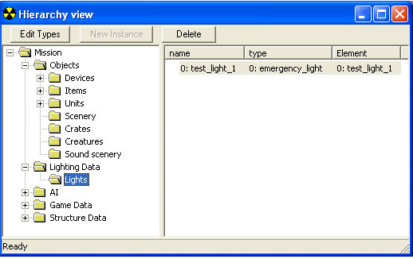
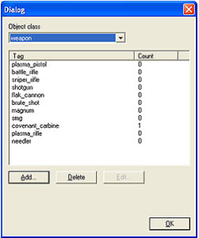

# Hierarchy View

Sapien's Hierarchy view (see Figure 1) is the main interface for placing and selecting assets in your scenario. It looks similar to a windows explorer window with an asset type tree in the left pane and individual asset information in the right pane. Keep in mind that the folders are not actually file folders which reside on your hard drive— they are merely visual representations of the assets which are contained within your scenario (either within your .scenario tag, or within the resource tags if you've split your mission resources). Also contained in the hierarchy view are three buttons: Edit types, New Instance, and Delete.

Figure 1 - The Hierarchy View window in Sapien

## The Asset Type Palette

Sapien (and the Halo engine) only loads those game assets for each scenario that it needs, so in order to place a specific asset, you first need to add it to the set of assets that Sapien loads for your scenario. That's where the Asset Type Palette (see Figure 2) comes in. Basically, it's the list that Sapien looks at to know which assets to load into memory when you launch your scenario. So, if you want to use something in your scenario, you have to add it to the palette first.

Figure 1 - The Asset Type Palette

To access the Asset Type Palette (and add an asset type to your scenario), do the following:

1. In the Hierarchy View window, click the **Edit Types** button.
1. A dialog similar to Figure 2 should appear. Select the category of object you want to add to your scenario from the Object Class drop down list.
1. Click the **Add** button.
1. Browse to the location of the correct tag and click the **Add Tags** button. When you're finished adding tags, click **Done**.
1. Back in the Asset Type Palette, you should see the name of the asset you just added to your scenario. When you're finished adding assets, click **OK**. You won't have any sort of visual representation of the asset you added to your scenario in the Hierarchy View, but you can always go back to the Asset Type Palette and use the drop-down list to check which assets you've added for each category.

> [!IMPORTANT]
> Once you've added an asset to the palette, it will always be loaded when you launch your scenario— even if you never actually place an instance of that asset!

## Assets and Instances

Once you have added assets to the palette for your scenario, you need to place instances of those assets where you want them. There are a couple of different ways to place instances. For objects, you can place an instance simply by selecting the category in the Hierarchy View window (say, objects\scenery for example) and then right-clicking in the Game Window. This will place an instance of a scenery object. Of course, after placing it you'll have to use the Properties Palette to set the type (and only asset types you've added to your palette will be available). For Assets that aren't objects — such as AI squads — you need to select the category in the Hierarchy View window (ai\squads, for example) and then click the **New Instance** button.

For more information on placing objects, see the [*Placing Objects*](PlacingObjects.md) in Sapien article.
