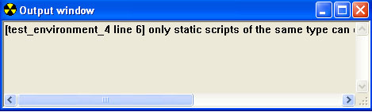

# Output Window

The Output Window in Sapien spills out script compiling debug information. Specifically, if there are any errors when compiling your scripts, it provides information about the problem. See Figure 1 for an example.

Figure 1 - The Output Window in Sapien
