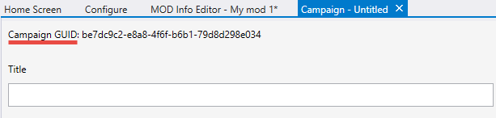

# Creating a Campaign Mod Package

During the creation of the mod package, you can add a campaign with multiple maps to it by clicking **CREATE** in the **Campaign** section.

> [!NOTE]
> The mod package can contain only one campaign.

To create a "Campaign" mod, you need to do the following

1. In the **MOD Info Editor** tab of the mod package, click **CREATE** in the **Campaign** section.

2. This will open the new **Campaign** tab where you can specify properties of the campaign. The **Campaign GUID** field in this tab will display the automatically generated identifier of the campaign

    

    Fig 1. View of the Campaign GUID.

3. To specify properties of the campaign, fill in other fields on the **Campaign** tab:

    - **Title** – The title of the campaign.

    - **Description** – The description of the campaign.

    - **Campaign Missions** section – This section allows you to add maps to the created campaign. You can add as many maps as necessary. Adding a map is performed in a unified way, using a new **Map** tab, see [Specifying Properties of a Map](../CreatingModPackage/SpecifyingProperties.md) for details. Along with regular properties that are the same for maps of all types, your **Map** tab will also contain additional properties actual for campaign maps only, see [Campaign Mission (Map) properties](../CreatingModPackage/SpecifyingProperties.md\#campaign-mission-map-properties). After the properties of the map are saved in the **\<name_of_scenario>.json** file within the **campaign** subfolder, this map will appear in the list the **Campaign** tab:

    

    Fig 2. View of the current campaign missions.

    > [!NOTE]
    > If you add multiple maps to the list, you can change their order using up and down arrows displayed next to the list. (Currently, they are in development and can be displayed not for all lists.)

    - After adding a map, if necessary, you can edit its properties. To do that, select it in the list and click **EDIT**. Or, you can remove the map from the campaign (select it and click **REMOVE**).

4. To save your changes, select **File** > **Save** or **File** > **Save All** from the main menu of Excession.

If necessary, you can remove the campaign from the mod package. To do that, click **CLEAR** next to the **Campaign** section (in the **MOD Info Editor** tab of your mod).
