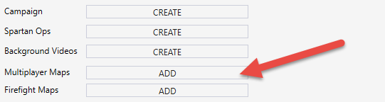
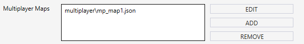

# Creating a Multiplayer Maps Mod Package

You can add a single or multiple multiplayer maps to your mod package.

> [!NOTE]
> The number of multiplayer maps that you can add to a mod package is not limited.

To do this:

1. In the **MOD Info Editor** tab of the mod package, click **CREATE** in the **Multiplayer Maps** section.

    

    Fig 1. View of the Multiplayer Maps button in the Mod Info Editor.

2. This will open the new **Map** tab where you can specify properties of the multiplayer map that will be added to your mod package. Adding a map is performed in a unified way, see [Specifying Properties of a Map](../CreatingModPackage/SpecifyingProperties.md). Along with regular properties that are the same for maps of all types, your **Map** tab will also contain additional properties actually for multiplayer maps only, see [Multiplayer Map properties](../CreatingModPackage/SpecifyingProperties.md\#multiplayer-map-properties). After the properties of the map are saved in the **\<name_of_scenario>.json** file within the **multiplayer** subfolder, this map will appear in the list within the **Multiplayer Maps** section.

    

    Fig 2. View of the Multiplayer Maps currently included.

    > [!NOTE]
    > If you add multiple maps to the list, you can change their order using up and down arrows displayed next to the list. (Currently, they are in development and can be displayed not for all lists.)

    After a multiplayer map, if necessary, you can edit its properties. To do that, select it in the list and click **EDIT**. Or, you can remove the map from the mod package by selecting it and clicking **REMOVE**. To add another map to the mod package, click **ADD** again and repeat the procedure for it.

3. To save your changes, select **File** > **Save** or **File** > **Save All** from the main menu of Excession.
