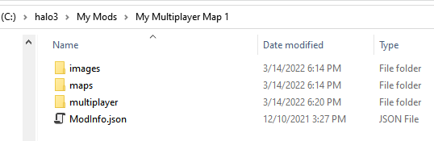

# Folder Structure, Creating Root Folders, and ModInfo.json

First of all, we recommend you to put your mods to a single or multiple root folders.

For example, every root folder can correspond to a certain target Halo title your mods correspond to (e.g. "**Halo3**", "**Halo3 ODST**"). Or, they can correspond to multiple mod types (e.g. "**Campaigns**", "**Multiplayer Maps**"). Or, you can simply put all your mods to a certain single root folder (e.g. "**My Mods**").

Within these root folders, every mod will have a separate mod folder. For example: **…\My Mods\My Multiplayer Map 1**.

Within this mod folder, you will gather all the content of this particular mod. The subfolders and files within the mod folder may vary depending on the mod package and its content.

You can either create a mod folder beforehand and then select it in the **Mod Folder** field of your mod while [creating it](../CreatingModPackage/CreatingHome.md), or create a mod folder directly when creating a mod. However, you will not be able to change the mod folder after the creation of the mod. After the creation of the mod, the **Mod Folder** field will become read-only. So, please, choose the location for your mod carefully.

> [!NOTE] > **NOTE #1**: When the tool identifies and displays mods, it searches for them within the [configured](MapFolders.md) root folders. During this process, it assumes that all mod folders are contained directly within the root folder (i.e. not below the 1st level of folders within the root folder). If they located deeper in the folder hierarchy, the tool will not find them.

> [!NOTE] > **NOTE #2**: If you select a mod folder that is outside the root folder, its parent directory will be automatically added to the system as a new root folder, for the system to be able to find your mod.

All **.map** files of the mod package need to be manually placed to the **maps** subfolder of the mod folder.

> [!NOTE] > **NOTE #1**: When you will be specifying the properties of any map within your mod package, you will need to specify the **Scenario File Name** for it. Please note that in this field you need to specify **_neither_** the name of the **.map** file _nor_ the path to it, **_but_** the path and name of the **.scenario** tag file that was used as a source for your **.map** file at the stage of its creation (e.g. by **tool.exe** or **tool_fast.exe**). This path needs to be specified relative to the **tags** folder and without the file extension of the **.scenario** tag file.
> For example, if you were compiling **…/tags/levels/my_campaign/my_campaign_map1.scenario** by **tool.exe** to obtain the **my_campaign_map1.map** file, then you will need to specify **levels/my_campaign/my_campaign_map1** as the value of the **Scenario File Name** field. See [3.6. Specifying Properties of a Map](../CreatingModPackage/SpecifyingProperties.md) for details.

> [!NOTE] > **NOTE #2**: The current version of Excession does not check the existence of **.map** file or correctness of the **Scenario File Name** value. During the upload, Excession simply uploads all contents of the mod folder to Steam Workshop, without any validation of these aspects. So, please check the existence of all **.map** files and correctness of **Scenario File Name** values manually.

Moreover, it is convenient to store all images related to the mod package within the **images** subfolder. Along with that, some files within the mod folder will be created by Excession.

Particularly, for every mod package, Excession always creates the **ModInfo.json** file that stores all general info about the mod and is used for its identification by the tool. Other files within the folder depend on the type of the mod, e.g. for "multiplayer map" mods, the tool will create the **multiplayer** folder with a **.json** files containing the settings of added maps.

Fig.1. Mod folder with files of the mod of the "multiplayer map" type (after the creation of the mod)
