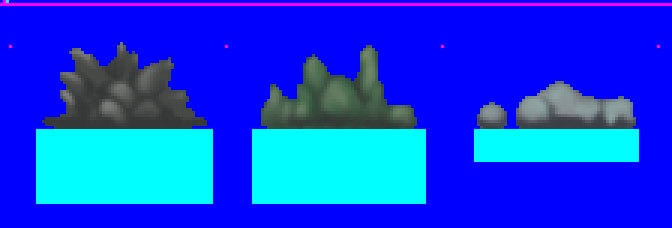
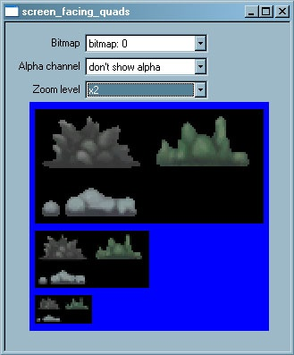
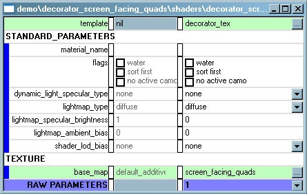
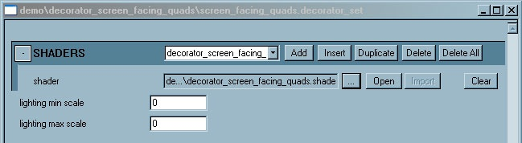
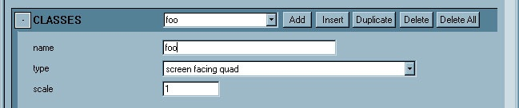
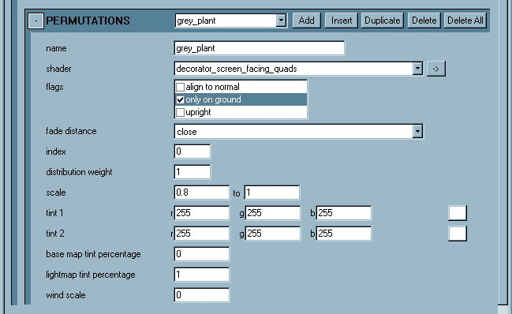
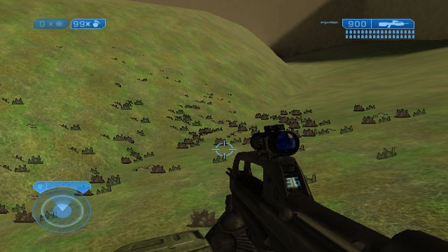

# H2 Decorators - Screen Facing Quads

A **Screen Facing Quad** is a free-standing sprite that always faces the camera.

- Source: .tif bitmap file (sequenced sprite plate)

- Import: use tool: bitmaps (set .bitmap = sprite, sprite_usage for blend function)

- Creates: .bitmap tag (.decorator_set must be created or edited seperately)

- Shader: use decorator_tex.shader_template only. This is an alpha tested shader.

- Lighting: lit by lightmaps, not lit by dynamic lights

- LOD: smallify w/distance

> [!NOTE]
> No damage states, does not accept decals

## SETTING UP THE SPRITE PLATE

A plate is a specially set up .tif file which creates a single .bitmap tag that can contain multiple images. These images are in a single sprite sequence and can be accessed from the .decorator_set tag by using the **sprite index**.

Sprites can be any size - dimensions do not have to be in powers of two. Remember, the default size of the final sprite in game is 256 pixels per world unit.

For this example, we're going to use a plate which includes three images (magnified 300% for clarity):

Fig 1. Example bitmap plate.

> [!NOTE]
> The blue background is essentially one-bit alpha. You can use this for your alpha channel **IF** you use DXT2/3 compression. This is a bug - it should work with DXT1 (WAC!). You can use DXT1 but you must specify an alpha channel in your .tif file. Note the use of transparent registration color.

The .tif file can be imported using the regular process for .bitmap tags. Once the .bitmap tag has been created, open the tag and set **type = “sprites”**. Re-import, and the .bitmap tag will look like this:

Fig 2. Example imported bitmap tag.

You can view the **sprite index** near the bottom of the .bitmap tag. The only way to relate the index to the image is to count them - there is no visual feedback for which one is which.

Fig 3. Sprite index in the new bitmap tag.

In this case, the sprite index is in the same order as the original .tif plate. This is not always true!

## SETTING UP THE .SHADER TAG

To create the .shader tag: in Guerilla select **File -> New** and set **Group = “shader’**. This will create an empty .shader tag.

For decorator templates, use only those tags in *shaders\shader_templates\decorators*. For floating decals, use *decorator_tex.shader_template* **only**. This is an alpha tested shader.

Once you have set up the .shader tag, add the reference to the .bitmap tag set up in the previous step. Then it will look like this:

Fig 4. Newly created .shader tag with a reference to the .bitmap tag from the previous step.

> [!NOTE]
> None of the standard parameters apply to decorators.

## SETTING UP THE .DECORATOR_SET TAG

To create the .decorator_set tag: in Guerilla select **File -> New** and set **Group = “decorator_set’**. This will create an empty .decorator_set tag.

### SHADERS BLOCK

In the SHADERS block, choose **Add** and then reference the .shader tag.

Fig 5. Add a reference to the new .shader tag in the Shaders block of the .bitmap tag.

Next, you’ll need to add at least one **decorator class**. Decorator sets can contain multiple classes but for this example we’ll make just one class: **screen facing quad**.

### CLASSES BLOCK

In the CLASSES block, choose **Add**. The **name** field is what this set of decorator models will be shown as in Sapien.

Fig 6. Add a new class and set the type to Screen Facing Quad.

Next we’ll add one entry in the PERMUTATIONS block for each sign. Let’s start with the **grey plant** image, which is index # 0.

### PERMUTATIONS BLOCK

In the PERMUTATIONS block, choose **Add**. The **name** field is what this particular instance will show as in Sapien. Note that the flags “align to normal” and “upright” do not apply to screen facing quads. The **shader** field will allow you to pick any shader defined at the top of the tag in the SHADERS block. For this example, **grey_plant** will fade at a close distance. It is referenced by index #0. It has a distribution weight = 1; this will be compared to the weight of the other permutations when we are putting down the **foo** decorator set in a random application.

Fig 7. Add the grey_plant to the Permutations block.

Repeat this process for **green plant** (index #1) and **gray rocks** (index #2). Remember that you can use the “Duplicate” button to make this process easier.

## READY TO GO!

This decorator set is now ready to be placed in Sapien.

Fig 8. See your decorator set in game.
