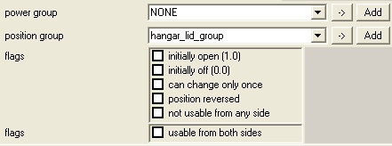

# Device Controls

Device Controls are used to activate or deactivate device machines.

## THE BASICS

- Device Controls need to be linked to Device Machines using a **Position Group** in Sapien. Position groups are set up so that the position animation will play. Controls and machines can also be linked in a **Power Group** in order to power on or off device machines (power groups will not play position animations).

- Device Controls can not have physics (although they can have collision), so they need to either be placed on a piece of geometry, or linked to an object to give the appearance of having physics.

- Device Controls can not have position animations. If you want to animate your device control, you need to attach it to an object using the objects_attach script command.

## STEP-BY-STEP SETUP INSTRUCTIONS
1. Create and import the geometry (render and collision) for your Device Control.

1. Create a new .model tag. Link your render and collision tags to it.

1. At some point, don't forget to create .shader tags for the materials you set in Max and then re-import your model.

1. Create a new **.device_control** tag. Link it to the .model tag you created previously. This field is in the topmost section of your .device_control tag (labeled *Model*) - simply click on the ... button and browse to the .model tag for your object.

1. Scroll down to the very bottom of your device_control tag to the block labeled **Control**.

1. In the *Type* drop down list, select **Toggle Switch**. You can always come back and change this later if you're not intending to build a toggled device.

1. In the *Triggers* When drop down list, select **Touched By Player**.

1. In the *Action String* text box, you can enter any text you'd like to appear when the player gets near the object. This is the text that appears on-screen and tells the player what to do to activate the device. See below for detailed information on how this string works (and how to set it up with a button icon).

1. Now is a good time to save all the tags you just created. Please do so.

1. Open a scenario in Sapien (the one where you'd like to place this control - and a device machine if one is not already present).

1. Add your new device control to the Palette, and then place one (by right-clicking on the game window) in the scenario.

1. Select the device you just placed (by clicking on its name in the Hierarchy View) and then select the type for it in the Properties Palette.

1. In order for your device control to work with a device machine, you need to link them together in a **Position Group**. Click on the *Device Groups* folder in the Hierarchy View and choose **New Instance**. Choose a fitting name for the group.

1. Now go back to the *Controls* folder in the Hierarchy View. Select your Device Control in the Pane on the right. In the *Properties Palette*, assign your control to the new group you just created (Select the name of the group from the **Position Group** drop-down list).

1. If you haven't placed/created a device machine yet, do so now. See the [Device Machines](../Devices/DeviceMachines.md) article for more detail on how to create them.

1. In Sapien, make sure your device machine has the **Does Not Operate Automatically** flag checked (otherwise it will ignore your new device control).

1. Assign your Device Machine to the same **Position Group** as the one your device control is assigned to.

1. Save and Reset the map. You should now be able to activate/de-activate your device with the device control.

## DEVICE TAG BLOCK

- **Flags**

    - **Position Loops**: This is an obsolete property for looping animations. Device controls cannot have position animations.

    - **Allow Interpolation**: This is an obsolete property for interpolating animations. Device controls cannot have position animations.

- **Power Transition Time** - The amount of time it takes for the device control to go from its depowered state to its powered state. The time doesn't affect the behavior of the device machine that the control is linked to. However, device controls can have effects attached to their various states, so this number will affect the amount of time that the effect attached to this state will play. Powered and Depowered states can be set up using a Power Group in Sapien.

- **Power Acceleration Time** - The amount of time it takes for the speed of the power transition to accelerate from 0 to 1 (or decelerate to 0) when powering up. This time doesn't affect the behavior of the device machine that the control is linked to, and device controls cannot have animations of their own. However, device controls can have effects attached to their various states, so this number will affect the amount of time that the effect attached to this state will play. Powered and Depowered states can be set up using a Power Group in Sapien.

- **Position Transition Time** - Device Controls cannot have position animations. However, they can have effects attached to their various states, so this number will affect the amount of time that the effect attached to this state will play. This number should not have any effect on the position transition time of the device machine the control is grouped with.

- **Position Acceleration Time** - Device Controls cannot have position animations. However, they can have effects attached to their various states, so this number will affect the amount of time that the effect attached to this state will play. This number should not have any effect on the position transition time of the device machine the control is grouped with.

- **Depowered Position Transition Time** - The amount of time it takes for the device control to go from its powered state to its depowered state. The time doesn't affect the behavior of the device machine that the control is linked to. However, device controls can have effects attached to their various states, so this number will affect the amount of time that the effect attached to this state will play. Powered and Depowered states can be set up using a Power Group in Sapien.

- **Depowered Position Acceleration Time** - The amount of time it takes for the speed of the power transition to decelerate from 1 to 0 when powering down. This time doesn't affect the behavior of the device machine that the control is linked to, and device controls cannot have animations of their own. However, device controls can have effects attached to their various states, so this number will affect the amount of time that the effect attached to this state will play. Powered and Depowered states can be set up using a Power Group in Sapien.

- **Lightmap Flags**

    - **Don't use in lightmap**: When this flag is checked, the control will not be considered when lightmaps are run. So, for example, if the control is covering an area (or blocking light), the lightmapper will run as if the control did not exist and the area will be lit by lights that might otherwise be blocked. Or, in another case, a device control might have shaders which use self-illumination or have emissive properties. When this flag is checked, those would be ignored by the lightmapper.

    - **Don't use in lightprobe**: When this flag is checked, the lightprobes will not consider the way a device control is affecting lighting in the area and, therefore, how the player is lit when standing on/around/near the device.

- **Open (up)** - the effect that plays while the control is entering its opened state.

- **Close (down)** - the effect that plays while the control is entering its closed state

- **Opened** - the effect that plays while the control is in its opened/on/activated state

- **Closed** - the effect that plays while the control is in its closed/off/deactivated state

- **Depowered** - the effect that plays while the control is in its depowered state.

- **Repowered** - the effect that plays while the control is in its powered state.

- **Delay Time** - the amount of time that passes between when the player attempts to activate the control and when it actually activates.

- **Delay Effect** - the effect that plays during the control's delay time.

- **Automatic Activation Radius** - size in world units of the space where, when the player steps within it, the control will be automatically activated.

## CONTROL TAG BLOCK

- **Type**

    - **Toggle Switch**: if the current position of the device (grouped with the control) is greater than 0.5, then the device is told to go to zero (off or closed). Otherwise, it is told to go to 1 (on or open). Switches the device to the opposite of its current state.

    - **On Button**: this sets the control so that whenever it is pressed, it tells the device to go to 1.0 (fully on).

    - **Off Button**: this sets the control so that whenever it is pressed, it tells the device to go to 0.0 (fully off).

    - **Call Button**: whenever hit, this tells the target machine to go to the position listed in the control definition (this is the Call Value field - enter any number between 0 and 1).

- **Triggers When**

    - **Touched by Player**: the control will activate when the player presses and holds the "X" button when standing within the activation radius (getting the activation message).

    - **Destroyed**: the control will only activate when it has been destroyed.

- **Call Value** - any value between 0 and 1 (0 being off/closed, 1 being on/open). This value is used in conjunction with setting the control type as a Call Button.

- **Action String** - The string that will appear on-screen in the player's HUD telling them how to activate the device. You can type any string you want here, but if you want button icons (or other pictures) to appear, you have to place a special string in the HUD_messages (\main\data\UI\hud_messages) text file and then call the string here.

- **On** - the effect that plays while the control is in its on state.

- **Off** - the effect that plays while the control is in its off state.

- **deny** - the effect that plays when the player is denied activation of the control.

## SET DEVICE CONTROL PROPERTIES IN SAPIEN

Fig 1 - Sapien Properties for Device Controls

- **Power Group** - Power groups are set up to link device machines and device controls together when the machine has a depowered and powered state.

- **Position Group** - Position groups are links between device controls and device machines. If you want to use a device control (such as a button) to control a device machine, you need to make a new position group and add both the device control and the device machine to it.

- **Flags**

    - **initially open**: The control will appear in it's open/on state when the game/level starts.

    - **initially off**: The control will be in it's depowered/deactivated state when the game/level starts.

    - **can change only once**: Allows the control to be used only one time (thus preventing the device machine from being used more than once as well).

    - **position reversed**: Reverses the position values for the control. So, a button that would normally start out in its on state would start out in its off state when this flag is checked.

    - **not usable from any side**: This flag sets the control as unusable by the player (although the AI could still use it).

- **Flags**

    - **usable from both sides**: The player will be able to access the control from any side.
