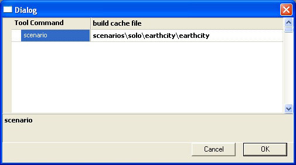

# How-To - Build a Cache (Map) File

A **cache** file is a compilation of all of the tags associated with a scenario, condensed into a single file called a **.map* tag. The resulting **.map** tag resides in the H2EK\\h2_maps_win64_dx11\\ folder.

Running the game from a cache file is a good approximation of what the final build will be like. Tag builds allow you to quickly modify and sync assets for the game, but the only way to test what the shipping fill rate will be is to run a **cache build**.

## BUILDING MAP WITH TOOL

You can build a cache file (the .map tag) using the tool command **build-cache-file**. This will build the .map tag from the scenario tag that you specify.

```
build-cache-file [scenario]
```

For example, the command to build and run the cache file for Alpha Gas Giant would be:

```
tool build-cache-file scenarios\solo\alphagasgiant\alphagasgiant
```

More information on how to set up a mod can be found in the [Excession Tool](../../Excession/ExcessionOverview.md) documentation.

## BUILDING MAP WITH GUERILLA

1. Choose **File → Run Tool**....

2. Select tool command **build-cache-file**

3. Select the .scenario file that you want to build the cache file for.



Fig 1. build-cache-file with the earthcity scenario selected.
