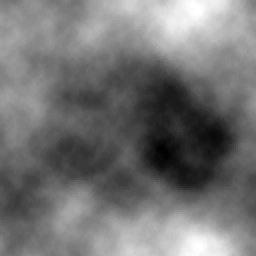
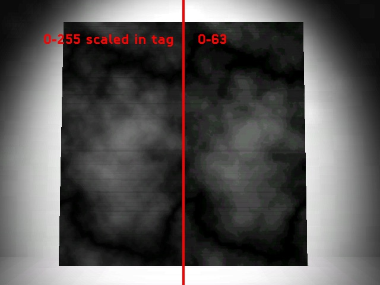
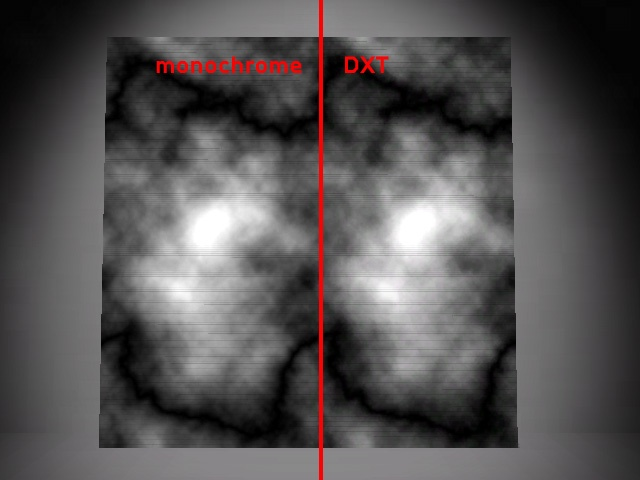

# How-To - Create Effective Bitmaps

Everyone understands that compression affects the quality of bitmaps but it’s important to also understand that there are ways to make the most of the bits we have.

## Bitmap Values

The most important thing is to use the full value range whenever possible. There is a maximum of 256 values in any bitmap - no matter what the compression scheme. Authoring bitmaps that use a limited value range will create posterized bitmaps.

| Use This | Not This|
|----------|---------|
|||

It’s possible to “turn down” a bitmaps value range in the game. For example in the specular (which uses the alpha channel of the base_map) you can use a darker color for the specular_color, which will allow you to use a wider value range that gives you better control over the effect you are trying to achieve.

Here’s an example with a cloud map. The left half of this image uses a full value range bitmap (0-255) that is scaled in the tag while the right half uses a bitmap with a value range of 0-63:

Fig 1. Difference between full range of 0-255 on the left and a range of 0-63 on the right.

This actually makes a bigger improvement than increasing the bit-depth. In this final example, the left half of this image uses a monochrome compression setting (8 bits/pixel) while the right half used DXT1 (4 bits/pixel). The left half (monochrome) uses twice as much memory as the right.

Fig 1. Difference between monochrome and DXT1 compressions.
