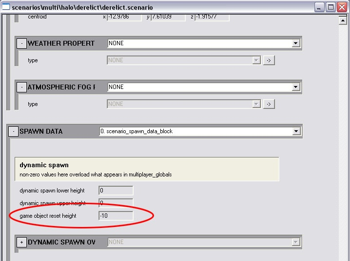

# How-To - Set Object Reset Heights in MP

The height at which netgame objects like flags and balls reset to their original location is set globally. You'll want to reset this to a more reasonable value for your level so that objects don't fall forever before resetting. This can be done in the Scenario tag, about 2/3 of the way down.

Fig 1. The game object reset height field in the scenario tag.
