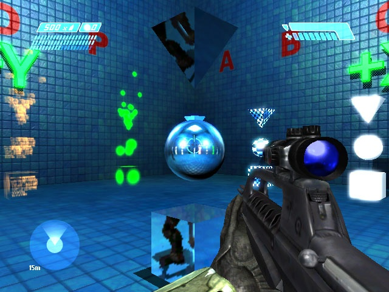
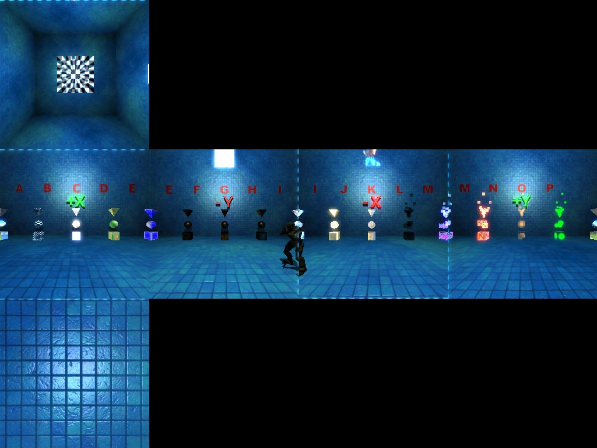

# How-To - Using screenshot_cubemap Command

There is a console command called

```
screenshot_cubemap
```

...that renders a cube map of an environment from the viewpoint of the camera.

## **How to Use**

Position the camera at the point where you want to render the cubemap. It doesn't matter which way the camera is pointing - the cube map is always rendered in the correct XYZ orientation.

> [!NOTE]
> that you must be in the flying camera, otherwise you will render the HUD into the cube map.

Open the console (by pressing the ~ key) and type in:

```
screenshot_cubemap [name]
```

This will create a TIF file called name.tif in your Halo 2 directory. You can then convert it into a bitmap tag for use in the game as an environment map.

| Screenshot Location | Generated Cubemap |
|---------------------|-------------------|
|||
