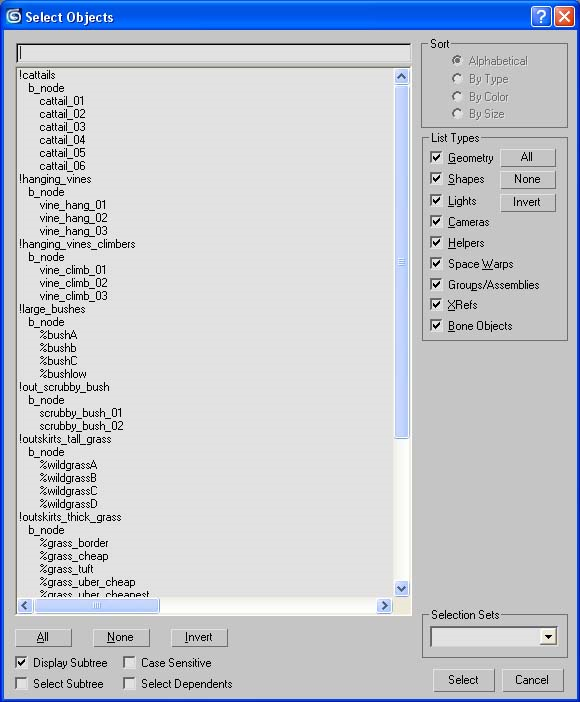
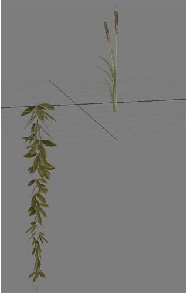
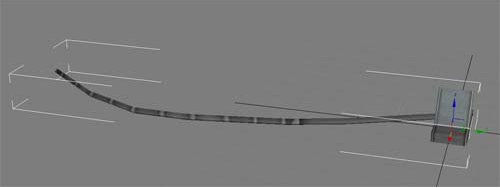

# Modeling

Decorators have several unique quirks related to their modeling:

- The Center of the model is the origin for the decorator

- All decorators must be part of a set

- Each set can have only one material type

- All decorators in a set should have a similar number of verts

- No scaling should be present on a decorator

## Decorator Heirarchy

The general heirarchy of a decorator file for use with the decorator export script is as follows:

```
!decorator_set_name1

  b_node

    decoratorN
```

```
!decorator_set_name2

  b_node

    decoratorN
```

```
!decorator_set_nameN

  b_node

    decoratorN
```

Where decorator_set_name is the name of the decorator set and decoratorN represents any number of decorators. See Figure 1 for the heirarchy of a max file.



Figure 1 - Decorator File Heirarchy.

Each ! node will create a decorator set and render model as well as an ASS file. Though not needed, the only character that should be present on meshes is % preceding the decorator name.

## Model Orientation

Decorators can work in several ways.



Figure 2 - Model Orientation.

There are three instances of orientation. Decorators can:

- Maintain their max alignment when painted. This is most often used for decorators that need to maintain a vertical orientation, such as cat tails or hanging vines. Figure 2 shows a hanging vine. It's designed to appear to be hanging straight down affected by gravity and should not change its rotation with the surface it's placed on.

- Align themselves to the normal of whatever they are painted on. This instance is fairly common and is used for any leaf or ground cover— most grasses and bushes work this way.

- Be set to "hang" against a surface. This instance is used for specialized applications such as the wire on wall decorator (see Figure 3).



Figure 3 - Wire on Wall Decorator.

## Light Sampling

Decorator sample for lights from the center of their bounding box, which encompasses all vertexes in the entire decorator set. This means that decorators in a set should be of similar size as well as similar vertex count
