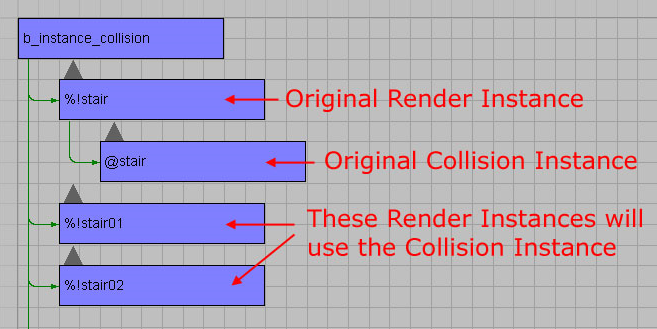

# Collision

Environment instance objects (a.k.a. poops) will use the renderable geometry as the collision unless you specify a collision model. It's often advantageous (i.e., cheaper) to use a simpler model for collision.

## **Setting up Collision in 3ds Max**

- The collision model must use the **@** symbol at the begining of the name (it does not need the instance %)

- The collision model needs to be a **child** of the render model

- **Only the original instance needs to have a collision model defined** — it then becomes a resource for the instance and is repeated with every new instance

For example, **%!stair** has the collision model **@stair** associated with it

Figure 1 - Hierarchy.

## **Materials**

Collision models use game shaders (either .shader or .shader_terrain) to define their global material type. You cannot input the global material type directly, as you can with object (biped, crate, scenery, etc.) collision.

## **Lighting Notes**

The render geometry is used for lightmapping. Objects sample the render model's lightmap for lighting.
