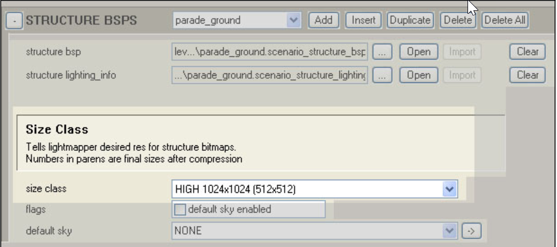

# Lightmap Resolution for Structures

With our current lightmapping system, we have the ability to change the resolution of the lightmap bitmaps used on structures (bsp geometry). You can change the size of the bitmaps used down from the standard 1024×1024 to 512×512 or even 256×256. This can make running lightmap jobs up to 4 and 16 times faster (respectively). This is most useful for iterating through changes (before doing final lightmaps) and for smaller, multiplyer maps.

Here's how to change the resolution of lightmaps on your structures (BSP geometry):

1. After importing your BSP for the first time, open the **.scenario** tag in Guerilla (make sure it is checked out).

2. In the tag block where the BSP references are (about 3/4 of the way down the tag), is an area called **Size Classification**. The default will be set to 1024×1024. Change it to either 512 or 256.

Figure 1 - The Size Classification area of the .scenario tag.

3. Once you've changed the lightmap resolution, you need to re-import the BSP for the new settings to take effect. Run Tool to reimport the BSP.

4. Run lightmaps.
