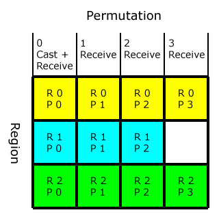
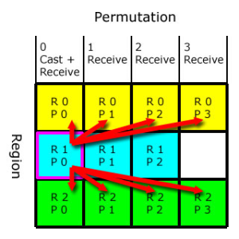
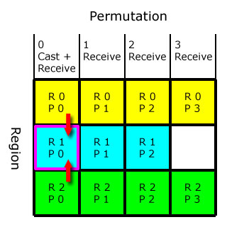
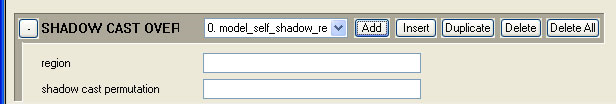

# Notes

PRT stands for Pre-Computed Radiance Transfer and is a way of storing multiple per-vertex lighting solutions. At runtime, these possible solutions are compared to light probe information to light the object on a per-vertex basis.

- **Console Command**: render_disable_prt

## **PRT Regions and Permutations**

Assume you have an object with three regions: Region zero has four permutations, region one has three permutations and region two has four permutations.

Only the initial permutation will cast and receive shadows— all other permutations can only receive shadows.

And note:

- Regions can shadow themselves.

- A region will never cast shadows on permutations of the same region.

Figure 1 - Permutation Example

For example: Permutation zero of region one (R1P0) will cast shadows on: R0P0, R0P1, R0P2, R0P3, R2P0, R2P1, R2P2 and R2P3 — but not on R1P1 and R1P2 (see Figure 2).

Figure 2 - Casting Shadows

Permutation zero of region one (R1P0) will receive shadows from R0P0 and R2P0 only (and itself, of course). See Figure 3.

Figure 3 - Receiving Shadows

## **Setting Default Shadow-Casting Permutation**

