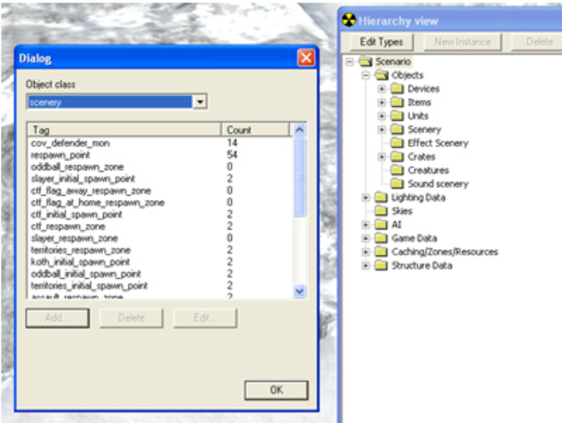
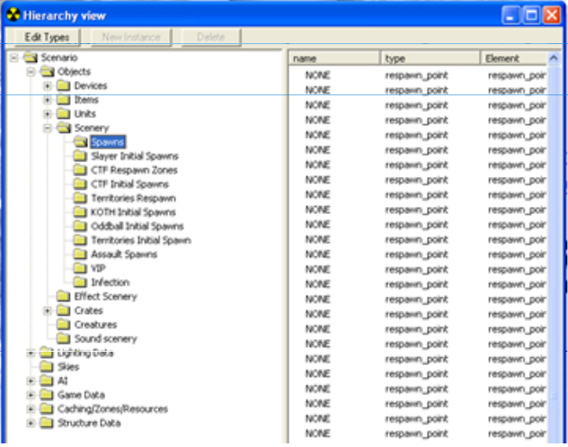
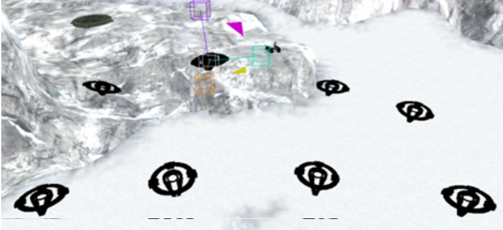
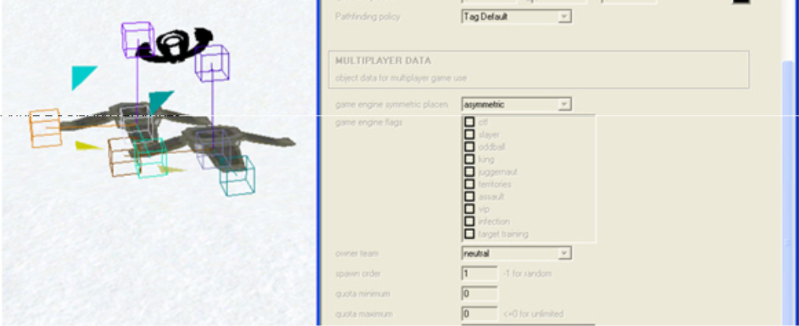
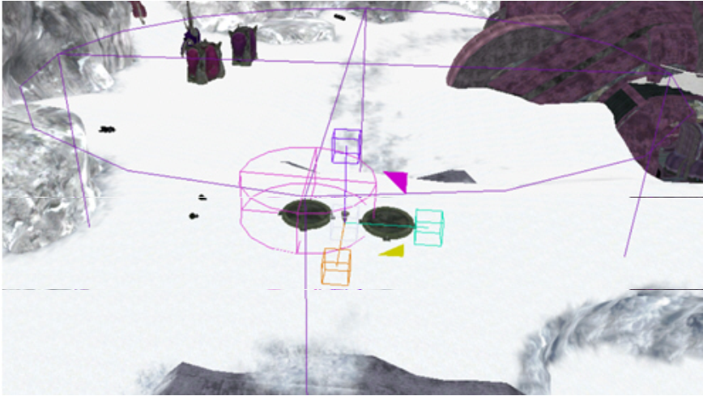
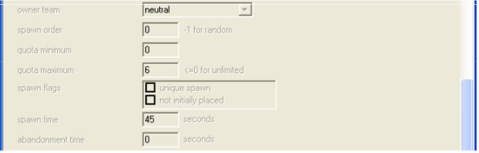
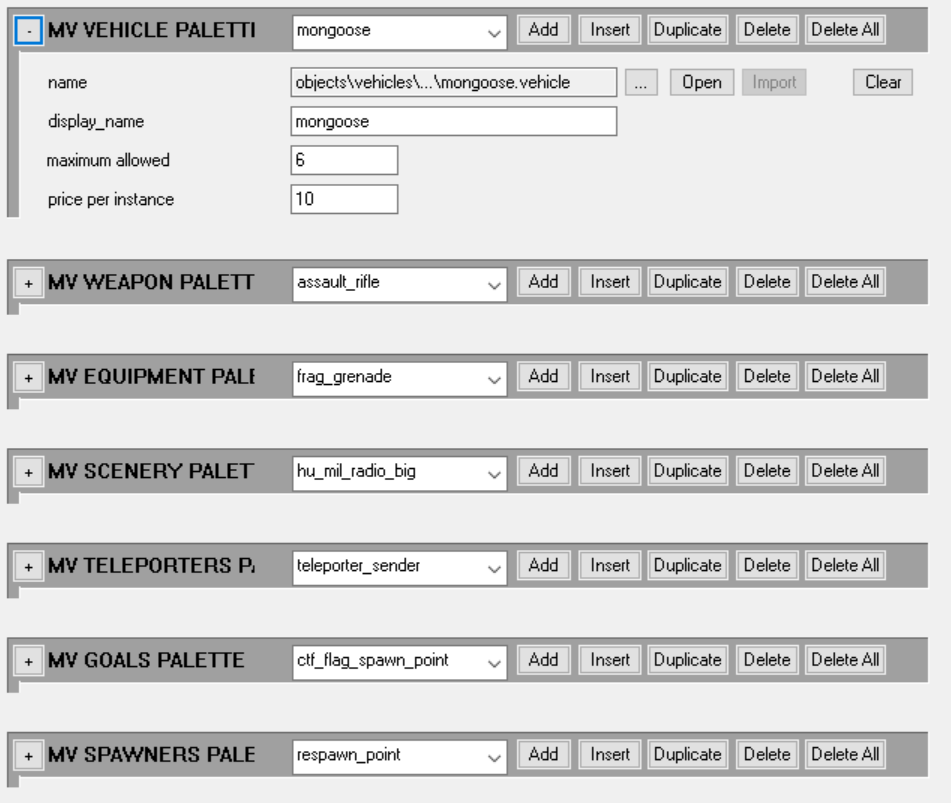

# Multiplayer Map Setup

This is an overview of how to set up multiplayer maps in Halo 3 using Sapien with some Guerilla tidbits thrown in as well.

## Where to Start

Where to Start
First things first, make sure you have your scenario open in Sapien. You also need to have at least the scenario tag checked out, but you'll also want to check out the resources of whatever you are working on. Ensure this directory writable: tags/levels/multi/snowbound.

Don't worry about the changes you make to the scenario on your machine, you can always Get Latest on the entire directory to restore the scenario to the state it was at before you started working on it.

Using Snowbound as our example, make sure you have the scenario tag (levels\multi\snowbound\snowbound.scenario), and the scenery resource (levels\multi\snowbound\resources\snowbound.scenario_scenery_resource).

The scenery resource is what allows you to place all scenery objects and crates (spawn points, respawn zones, flag spawn object, etc.), or basically all the design setup for MP maps apart from weapons, vehicles, grenades, and equipment. You'll be doing most of your work, in terms of sheer map setup, in the scenery resource tag.

If this is a new map, you'll also have to make sure that it will load as an MP map, and the first thing you'll need to do is open the scenario tag in Guerilla. At the very top of the tag, make sure the type is set to multiplayer.

Next, you'll want to scroll down about 50% of the way down the tag until you find a chunk called PLAYER STARTING P.

Add a new starting player then set the following options:

- primary weapon Assault Rifle (objects\weapons\rifle\assault_rifle.weapon)
- primaryrounds loaded = 32
- primaryrounds total = 96
- starting fragmentation grenade = 2.

This will allow you to spawn in the level with an AR and two frags.

## Populating the Map

To do this, in your Hierarchy view click Edit Types. A dialog window will pop up, and since we'll want to add spawn points first (you can't spawn into the map without them), we'll start there. This method is how you'll eventually add everything in the map, but we'll start simple.



Figure 1 - Edit Types dialog

Under Object class make sure scenery is highlighted then click the Add button.

Navigate to objects\multi\spawning\respawn_point.scenery and add the respawn point. To place one down, follow these steps:

1. In Hierarchy View click the + by the Objects folder to show its subfolders.
1. Highlight Scenery.
1. Go to the Game window and right click— this will place down a blank node.
1. Go to the Properties palette type and choose respawn_point.

You'll see that empty node become a respawn point.



Figure 2 - Respawn Points

Figure 2 (above) shows subfolders in Scenery such as Slayer Initial Spawns, CTF Initial Spawns, etc. These are present just for organizational purposes right now even though they're not used. However, they will be used as you add more things to your map.

To make a subfolder right-click on the Scenery folder in the Hierarchy view and create a new folder.

A quick note about respawn points

Respawn points are where the player will respawn in the game and it's a subtle art to place them. A good rule of thumb is to try to respawn players in safe areas with their backs against a wall and facing towards a recognizable object or location in the level. These work across every game type. Place a few of these down to get a feel for it.

## Initial Spawn Points

Every game engine looks for Initial Spawn Points when a match first starts, and this is where the first player starts on his team. They are broken up by game engine, so there are initial spawn points for CTF, Slayer, Assault, and every other engine in the game. For full map setup, you'll need to do this for every engine, but start with CTF so you can get a good feel for it.

Once again you need to add the objects into the palette. Go to your Hierarchy view, click Edit Types, select Object class scenery, and this time navigate to objects\multi\ctf\ctf_initial_spawn_point.scenery.

Once you place one of these down, you need to set the team designation. To do this, highlight your ctf_inital_spawn_point, and then go into the Properties palette. Almost all the way at the bottom is a drop-down list called owner team, and this is where you set whether this is the defending initial spawn or the attacking initial spawn. You only need to place one of these per team, because if you set up the map correctly, it will spawn the first person on the team at this point, and then try to spawn everyone else on the team near that person.



Figure 3 - Initial Spawn Points

Figure 3 (above) shows a highlighted point. This is the ctf defender initial spawn point. Notice how all the other respawn points are clustered around it. That will ensure that all your teammates spawn together.

Do the same thing for the attacker ctf initial spawn point, so you have one for each team.

Next we'll move onto placing the flag spawn and return points.

## Game Engine Crates

You've placed the spawn points, but you still need the flag to show up in a CTF game.

1. Go to the Hierarchy view andd click Edit Types.
1. Switch your Object class to crate.
1. Navigate to objects\multi\ctf\ctf_flag_spawn_point.crate and objects\multi\ctf\ctf_flag_return_area.crate and add them both. Place them in a similar way to how you placed the respawn points, but this time since they are crates you'll need to use the Crates subdirectory, which is located below Scenery in the Hierarchy view.
1. Place one of each crate for each team.
1. Set the owner team in the Properties palette of each crate.
1. Place both the defender's ctf_flag_spawn_point.crate and ctf_flag_return_area.crate close to their initial spawn points, and preferably in the direction they are facing (also doing the same for the attacker). This helps players when they spawn so they immediately see where their flag is and what they have to defend.

## Respawn Zones

Respawning zones are probably one of the more nuanced and difficult to manage things of the MP map setup. There are few rules that apply to every map (because they are all different), but you need to always be aware that wherever you set them up, that is where the player on that team will spawn. The fewer you place on the map the better, and in some cases bigger is better. Oftentimes covering one side of the map with a huge respawn zone is the best way to tackle them, especially on symmetric maps. If you ensure that the player will spawn where they are supposed to (e.g. not in the flag room in a CTF game), then you're on the right track.

Here's how to place them:

1. Go into the Hierarchy view, click Edit Types.
1. Ensure your Object class is set to scenery.
1. Navigate to objects\multi\ctf\ctf_respawn_zone.scenery and add it. You'll also see the flag_away and flag_at_home respawn zones as well. Don't worry about them for now as they are a little more complicated and we only try to use them in maps when we really need to.
1. Place these the same way you place respawn points (since they are also scenery objects).

Once you've placed a node down, set the type to ctf_respawn_zone. They look like a little spike that sticks in the ground. Placing these down is just one part of the process, you also have to designate their shape. To do this, with your respawn zone highlighted, go into the Properties palette and scroll all the way down to the bottom to where you see boundary shape. If set to unused, it will default to a cylinder, but you can also set it to a box (we don't use sphere).

Underneath there are four numbers that can be changed to make the respawn zone the size you need it to be (the size is in world units (WU)). Look for boundary width or radius and that's where you start.

- Radius— the radius of the cylinder
- Box length— only used when the boundary shape is a box
- Positive height— how high up the volume goes
- Negative height— how far down it goes (you don't need to use negative numbers here)

If you want to see a visual representation of the zone, in your Tool window just check the flag for Draw transparent geometry. You will see respawn zones as a white wireframe. They will update in real time as you change the numbers. If you are not seeing the wireframes then make sure you have mp_debug_goal_object_boundary_geometry 1 in your editor_init.txt.

## Territories

Some game engines use specific crate setups unlike any other. In Territories, for example, you have to set up the map for both Territories (Asymmetric) and Land Grab (Symmetric). To set up a map for Territories, first you have to add the territory flag into your map.

 Using the same procedure as before, and adding crates this time, navigate to objects\multi\territories\territory_static.crate and add it.

Since you are basically setting the map up twice, we're going to learn how to set these up so they only show up only in one game type. First let's set up the map for Territories, which is the asymmetric variant.

1. Place a territory_static.crate down.
1. In the Properties palette scroll down to the MULTIPLAYER DATA section and you'll see a drop-down called game engine symmetric placement (see Figure 4).
1. Set game engine symmetric placement to asymmetric for Territories and symmetric for Land Grab.



Figure 4 - Placing Territories

The next thing that we haven't gone over yet, and is integral to Territories, is the idea of spawn ordering. Notice a little further down in the Properties palette you'll see a box marked spawn order— this is how you number your territories. You'll always start your first numbering with 0, and then increase from there. So, in a five flag territories setup, you would have 0, 1, 2, 3, and 4 for your spawn ordering. When you're playing a game of Territories your flag that is spawn order 0 will be Territory 1 in game.

Another part of Territory setup is setting the boundaries of the capture volume. By default, there is a 3 wu radius cylinder that the player has to be in to cap a territory. After much playtesting, we realized that in most cases this too small in open areas. So, it's a good idea in most cases to increase the size of the capture volume. You do this the same way you set up respawn zone boundaries. You want to make sure the boundary positive height is almost 2 wu, so players don't get out of the volume when they are jumping and capturing. The actual radius size is mostly personal preference and map placement dependant, but don't be too stingy. If you check the Draw transparent geometry flag in the Tool window you can see your territory volumes. They will be a blue-green colored wireframe. If you are not seeing the wireframes then make sure you have mp_debug_goal_object_boundary_geometry 1 in your editor_init.txt.

A quick note about the name text field in the Properties palette; you'll notice that we have almost everything named in our maps. This becomes very important as your maps get more and more set up. If you get into a good habit of naming things early on, you won't be confused when you have to come back and fix or tweak things.

## Destination Zones

Both VIP and Juggernaut use game engine crates we call Destination Zones, they are essentially waypoints on the map that the user has to get to. There is one for each game engine, but let's go over the VIP version first. Remember, what is talked about here applies to the Juggernaut version as well. They are both set up the same way, and the only thing that differs is where you place them on the map.

First you have to bring them into your map by navigating to objects\multi\vip\vip_destination_static.crate. Place one on your map and then in the Properties palette scroll down to spawn order again. Set up the spawn order like you did for Territories, starting with 0 as your first destination zone and increasing from there. Since these are used in Escort, it's important for the first destination zone to be far away from the defending team's initial spawn.

For Juggernaut your placement can be a little looser.

## Hills

For King of the Hill, we're going to use objects with volumes again, just like the respawn zones. Add a hill marker by navigating to objects\multi\koth\koth_hill_static.crate. It uses the same model as the respawn zones, so don't worry about that. Since the hills move and can be in different locations, you'll need to use the spawn order box in the Properties palette. Once again, use 0 as the first hill you want to show up and then increase the number for subsequent hills.



Figure 5 - Placing Hills

With hills, we can choose between two shapes, cylinders or boxes. You set this under boundary shape in the Properties palette. When you have chosen the proper shape for your hill, you can use the boundary width or radius, boundary box length (just for boxes), boundary positive height, and boundary negative height to adjust its size. Also remember that if you check the Draw transparent geometry flag in the Tool window, you can see what the hill looks like. Hill boundaries are purple wireframes in Sapien. If you are not seeing the wireframes then make sure you have "mp_debug_goal_object_boundary_geometry 1" in your editor_init.txt.

## Oddball

The oddball spawn points are the locations you place for the Oddball to spawn. To place them in your map add a crate as usual and navigate to objects\multi\oddball\oddball_ball_spawn_point.crate. Like territories, hills, and destination zones you have to set the spawn order. A good rule is to always place the first oddball spawner in a neutral position on the map that both teams have to work equally hard to get to. In other words, having it in a central location that is approximately the same distance from each team's initial spawn point is a good way to think of placement for the first oddball spawner.

## The Numbers

Those are the main ingredients for setting up the maps from a spawning and game engine standpoint. Each game engine has its own set of Initial Spawn Points, Respawn Zones, and game engine crates (VIP Destination Zone, Oddball Spawn Point). Setting things up for each game engine is something that becomes second nature after a bit, but making it fun is done through careful thought and lots of playtesting.

For reference on what a full map setup looks like, you could look at either Chill (as a symmetric map) or High Ground (for asymmetric). Listed below are the approximate numbers of objects per game engine, you may need to add more depending on the map and game engine:

**Slayer**

- 4× Slayer Initial Spawn point scenery objects (Defender, Attacker, 3rd and 4th Party)

**Oddball**

- 4× Oddball Initial Spawn point scenery objects (Defender, Attacker, 3rd and 4th Party)
- 5× Oddball Spawn Point crate (First one should be in a neutral location)

**King of the Hill**

- 4× KOTH Initial Spawn point scenery objects (Defender, Attacker, 3rd, and 4th Party)
- 3× KOTH Static crate objects (Set the size the same way you did the Respawn zones)

**Capture the Flag**

- 2× CTF Initial Spawn point scenery objects (Defender and Attacker)
- 2× CTF Respawn zone scenery objects (Defender and Attacker)
- 2× CTF Flag Spawn Point crate (Defender and Attacker)
- 2× CTF Flag Return Point crate (Defender and Attacker)

**Assault**

- 2× Assault Initial Spawn point scenery objects (Defender and Attacker)
- 2× Assault Respawn zone scenery objects (Defender and Attacker)
- 2× Assault Flag Spawn Point crate (Defender and Attacker)
- 2× Assault Flag Return Point crate (Defender and Attacker)

**Territories**

- 4× Territories Initial Spawn point scenery objects (Defender, Attacker, 3rd and 4th Party)
- 2× Territories Respawn zone scenery objects (Defender and Attacker)
- 10× Territory Static crates (5 of them symmetric and 5 asymmetric for Territories and Land Grab respectively)

**Juggernaut**

- 5× Juggernaut Destination Zones

**Infection**

- 2× Infection Initial Spawn point scenery objects (Defender and Attacker)

**VIP**

- 4× VIP Initial Spawn Point scenery objects (Defender, Attacker, 3rd and 4th Party)
- 5× VIP Destination Static crate (First one should be away from where the defending team spawns)

## Weapons

Now comes the fun part, where we get to set up weapons on the map. At this point we're going to finally branch out into other resource tags than just scenery. To place weapons you'll need to make sure you have the weapons resource tag checked out (levels\multi\snowbound\resources\snowbound.scenery_weapons_resource). This is in the same folder that the scenery resource tag was in. Once you have that checked out, you can add weapons to the map the same way you always add things:

In the Hierarchy view go to Objects -> Items -> Weapons, and then click on Edit Types. In the dialog window, make sure weapons is the object class and then navigate to objects\weapons\rifle\battle_rifle\battle_rifle.weapon to place a Battle Rifle. Grab the other weapons you think you want to place on this map the same way.

Once you've collected a little arsenal in your palette you can start placing them around the level. Place them like any other object, and once you're happy with how it is sitting make sure you hit the Lock Placement to Object button located at the top of the Properties palette. This basically tells the game to keep the exact position for your delicately placed weapon. It will also respawn in that place.



Figure 6 - Weapon Selection

Placing a weapon is just the first step, however, and now we get our hands dirty with quotas and respawn times.

Each weapon can be set with a quota maximum, which can be found towards the bottom of the Properties palette. This tells the game how many of that type of weapon can be on the map at any given moment. So, for something like the Mauler it would be OK to have 6 of them on the map, you can set the quota maximum to 6. Obviously, each weapon is different, and you want to be careful with more powerful weapons like the Spartan Laser, Sniper, Shotgun, Sword, and Hammer; these you want to give low max quotas like 2 or 3 depending on the map. It's also very important that each separate instance of the same weapon have the same max quota. So, all your Maulers should be set to 6.

We can also set individual spawn timers for each weapon. These timers work in conjunction with the quotas, to make sure there are always weapons on the map when you want them to be. To set these find the spawn time text box in the lower part of the Properties palette, its right under the quotas. Common weapons like SMGs, and Spike Rifles usually have a low respawn time (~15 seconds), but more powerful weapons should have longer respawn times. The Sniper or Shotgun, for instance, can have anywhere from 90 to 180 second respawn depending on the map. These are all preference and how you feel the map to play, but if you want to get a good feeling for how we set up the existing maps, check out any of them for reference.

On every weapon you place make sure the flag does accelerate (moves due to) is checked. This allows weapons to be pushed around by explosions.

>[!Important]
>Ensure the following weapons are always in your map palette. They don't have to be placed, the game just needs to know they are in memory. These are the base weapons that are available in Player Traits, and they are mandatory for the game to function as designed:
> - energy_blade
> - magnum
> - needler
> - plasma_pistol
> - assault_rifle
> - battle_rifle
> - shotgun
> - smg
> - sniper_rifle
> - rocket_launcher
> - brute_shot
> - gravity_hammer
> - spartan_laser

## Equipment and Grenades

Placing equipment and grenades is just like placing weapons, but you use a different resource tag. Both grenades and equipment fall under the Equipment category. Make sure you have the equipment resource checked out (levels\multi\snowbound\resources\snowbound.scenario_equipment_resource), and then start populating. In the Hierarchy view go to Objects -> Items -> Equipment, and then click on Edit Types. Make sure the object class is set to equipment, and then add grenades and whatever equipment pieces you want for your map.

One big rule we've been using in our MP maps is that we are only using two grenade types per map; so it's always frags and then we choose between either brute or plasmas as our secondary. Once you have all the grenades and equipment you want to use, start placing them. We also need to set quotas and spawn times for them.

Grenades are unique in that there can be a lot of them on the map, and we want them to respawn quickly. So, by default set their quota maximum to 32 and leave their spawn time 0. When you leave one of the spawn time at 0, it will use the default set up in the main tag, and for grenades that default is 15 seconds.

Equipment should be treated more like power weapons on the quota and spawn times. A typical piece of equipment would allow for two on the map (quota maximum of 2) and a spawn time of 60 – 90 seconds. Once again these are personal preference and size of the map. So, some tweaking and playtesting will be required.

On every piece of equipment and grenade you place make sure the flag does accelerate (moves due to) is checked. This allows weapons to be pushed around by explosions.

## Vehicles

Placing vehicles is just like placing everything else we've learned about, but once again we're using a different resource tag. In order to add and place vehicles you need the vehicle resource tag checked out (levels\multi\snowbound\resources\snowbound.scenario_vehicles_resource). In the Hierarchy view go to Objects -> Units -> Vehicles, and then click on Edit Types. Make sure the object class is set to vehicles and then add whichever vehicles are appropriate for your map.

Stand-alone turrets are technically vehicles so you add them here and not in the weapons category.

> [Note]
> turret.vehicle tags are in the objects\weapons directory rather than the objects\vehicles directory.

Just like weapons, you need to set a quota maximum and spawn times for your vehicles. These are dependent on the vehicle and the size of the map. For instance, it's fine to have a higher quota for Mongoose and have their respawn set to 10 seconds, but you wouldn't do that for a Scorpion or Banshee.

Make sure each vehicle has the create at rest flag unchecked. This is located under placement flags at the top of the Properties palette window and allows vehicles to spawn in and react to whatever is around them, instead of rigidly sitting there.

## Objects

Once the level is a little further along, you'll want to start adding in flavor objects to fill out the world. You'll need the scenery resource checked out, and it's just like adding in the game object crates like the flag stand. You do this by once again clicking on Edit Types and setting the object class to crate. Click the Add button and browse to the objects you want to add.

To place an object, right click anywhere on the level to create a new node, then in the Properties palette at the very top is the type pull down menu. Choose from the existing objects you have added to place the one you want. Once you have it properly placed and it has come to rest, click the lock placement to object button at the top of the Properties palette. This will make sure it's location is exactly where you want it to be when the object spawns and respawns into the level.

Once you have finished setting up all the crates you want, the last thing you'll have to do is count the total number of each one, and set that number as its max quota in the Properties palette. The easiest way to do this is to look at the objects in the Hierarchy view and sort them by type. Do this by clicking the type button at the top of the pane in the Hierarchy view. Then Shift-click all the objects of the same type, count them up, and while they are all selected go into the Properties palette and set all of their quota maximum  to that number. So, if you have 8 crates, make sure each individual one has a quota maximum of 8. This will stop them from respawning in weird ways.

## Trigger Volumes

One of the final things you will set up in a map is a kill volume. Most maps need this in some way or another, and it's up to you to decide where they go. First of all, to set one up you need to check out the trigger volume resource (levels\multi\snowbound\resources\snowbound.scenario_trigger_volumes_resource). Once you have the resource checked out, in the Hierarchy view open the Game Data section. Under the game data heading you'll see a Trigger Volumes sub-heading. Click in that sub-heading and then go into the Game window. Find the area you want to place a kill volume and right-click the mouse to create a cube.

To make the trigger volume fill the area where you don't want people to be, you can highlight a side of the cube and drag it to make it bigger. You want to make sure the trigger volume actually extends beyond the bounds of your bsp so you don't take any chances with someone being able to skirt around it. Better to be safe than sorry.

So, now that you've finished making this cube, we need one final thing to make this into a death box. When you highlight your trigger volume, look in the Properties palette and in the name box type kill_box. The game automatically converts any trigger volume with the works "kill" into a death volume. So, you can name it kill_house, kill_town, or any other number of things, as long as it starts with kill in the name. That's it— you've set up a kill volume!

After the Kill Volume there is one final volume you have to place on every MP map. After the soft ceilings are in place, you'll need to place the "safe_zone" volume that kills MP players when they leave it. This is a last ditch way to keep people from going places they shouldn't. Think of it as the reverse of a kill volume, in that everything inside it is all fine and cozy, anything that leaves the box, dies. So, create a trigger volume that encompasses and is just outside the soft ceiling, and then name it "safe_zone". Make sure it's far enough out from the soft ceilings so you can't boost as the monitor in Forge and get outside and mysteriously die. After you do a thorough check, you're done with trigger volumes.

## Forge Setup

Setting up the Forge palette for a level is something done exclusively in Guerilla. It is all done in the scenario tag, so check that out for your level. The quickest way to set these up is to open the tag in the alternate mode. So, hold down the Alt key on your keyboard while double-clicking on the scenario tag in Guerilla. Once the tag is open, scroll down to the group of items that start with mv in their name, the first of which is the mv vehicle palette.



Figure 7 - Scenario Tag in Guerilla

When you double-click on one of the cells, you will see the items that make up that list. In the case of the vehicle palette, it will show you which vehicles are in the forge palette for that level.

There are certain palette items that never change across all the maps; these include the equipment, teleporters, goals, and spawners. Since these are already set up on all the shipping Halo 3 maps, the easiest thing to do is just a simple copy/paste.

Here's how...

1. Double-click the mv equipment palette in Deadlock.
1. Drag-select all of the entries and hit ctrl - c to copy all of them.
1. Back out to the main tree view again.
1. Double-click the equipment palette in your level then click the plus symbol to add more entries. Since the equipment palette has 15 things, create 15 cells.
1. Drag-select the blank cells and hit ctrl - v to paste them all in.

After you have copied all the ones that never change from existing maps (equipment, teleporters, goals, and spawners), you are ready to fill in your own things. You will have to make sure your weapon palette has the following guns:

- energy_blade
- magnum
- needler
- plasma_pistol
- assault_rifle
- battle_rifle
- shotgun
- smg
- sniper_rifle
- rocket_launcher
- brute_shot
- gravity_hammer
- spartan_laser

Once you have those in there, you can fill out the rest with first, whatever is definitely placed on your map. Do you have the Beam Rifle? Make sure it's in your Forge palette. Once you have all the weapons that are placed on your map in there, then it's time to get creative. Want to make sure there are Sentinel Beams so people can play Ghostbusters in Customs? Make sure it's in your weapon palette.

The same sequence goes for the rest of them as well. First, make sure all your pre-placed vehicles or scenery objects are in your forge palettes, but after that fill it in with fun things. Make sure there are big objects like crates and shipping containers. Look at prices from shipping maps, and go crazy. Remember this is what people will be using long after they get sick of our Matchmaking. Want a tank in that map, even if the default setup doesn't call for one? Make sure it's in your vehicle palette so players can put it in there with Forge.

## A Note About Memory

There's a finite amount of memory available for each map and each weapon and vehicle takes up its share. It's often the case that weapons, vehicles, and other objects have to be cut from the final version of the map in order to come in under memory restrictions. Each map is examined on a case-by-case basis so there is no hard and fast rule on how many vehicles or weapons can go into a particular map, but every map gets something cut— don't be upset if this happens to you!

## Miscellaneous

There are plenty of little things that need to be done on all of the maps; game object reset height, physics volumes, etc. This is where you'll find all of them.

Game Object Reset Height: This is how you tell the game objects (flag, oddball, bomb, etc.) to reset if they fall below the play area. In Guerilla if you open the scenario tag in Alt mode, scroll down to the cell spawn data and double-click it. There is an option called game object reset height, and you set the Z height where the object should respawn. The easiest way to get this number is just by creating a dummy node in your map in Sapien and dragging it down to a point outside and below the play space. Check the Z height, and then put that number into the cell.

Physics Volume shapes: In every map, we need to put a set of shapes that can be used later if necessary. These crates would be used if some glitches are ever found and need to be plugged up at a later date for Matchmaking. The following objects need to be placed far outside the playable space on your map. They are located in tags\objects\multi and you need two of each in every map:

- box_l
- box_m
- box_xl
- box_xxl
- box_xxxl
- wall_l
- wall_m
- wall_xl
- wall_xxl
- wall_xxxl

Garbage Volumes: In any map that has an open area or bottomless pit, there needs to be a garbage collection volume. This allows the game to clean up things that are sitting down there, which helps performance. An example would be the bottom of the level in Guardian. Since many bodies, weapons, grenades, etcz. fall down there it needs to be routinely purged.

To do this, set up a Trigger volume and name it garbage. Then make sure your script for the level has the following in it:

```
(script continuous guardian_main

(add_recycling_volume garbage 0 5)

(sleep 300)

)
```

Obviously you need to make sure the name of your map is in place of "guardian" in the above script.
