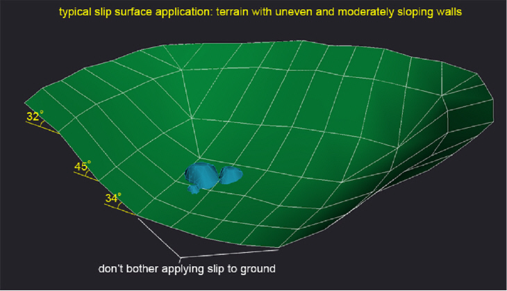
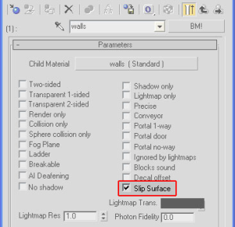
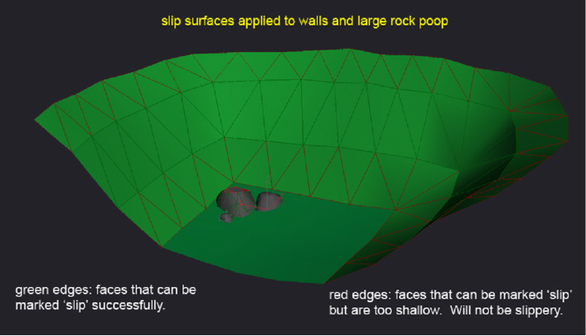
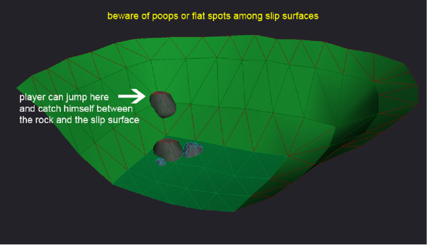

# Create Slip Surfaces

A typical Halo environment is rolling terrain with tall bounding walls (see Figure 1). Unfortunately the slopes aren't sheer cliffs, nor do they slope upward at an even rate. All too often we discover that a player can exploit a poly or two and run, hop, or otherwise scale these slopes until they are outside of the world. To fix this we have slip surfaces. You can make any Bungie Material (BM!) into a slippery one by clicking the Slip Surface check-box in 3ds Max (see Figure 2).

Figure 1  - Uneven and sloping walls

Figure 2  - Slip Surface Checkbox

Although it may be simpler to apply a single shader to the entire terrain, you should avoid applying slip to areas that you intend the player to travel (this eliminates the need to debug staircases, one-foot drop-offs, etc.). In our example, this means creating two material slots for our terrain: one for the ground and another for the walls.

Also, the engine will evaluate every poly you designate as a slip surface and determine if it is actually suitable for slipping. This means you can quickly grab all the sloped surfaces and make them slip without worrying too much about the occasional flat spot. This also means you can apply slip to poops and the system will determine which faces should be slippery based on each instance's particular orientation.

> ![Note]
> The current standard is 35 degrees from horizontal. Anything above that will become slippery.

Once you import your level, you can check out your slip surfaces in the game through the debug menu: debug -> environment -> debug_structure_slip_surfaces. Any surface marked with a slip material will have colored edges. Red means the face was too shallow to make slippery, green means it's slippery. Figure 3 is a 3ds Max screenshot approximating what you'll see in the game engine.

Figure 3  - Edges that can and cannot be made slippery

Players can become trapped or defeat your slip surfaces if there are poops or jagged crannies in your sloped walls. If wedged between slip surfaces the player may become immobile, especially if he's in a vehicle. If non-slip faces (like tree root and rock poops) exist among slippery ones, then players can find ways of traveling along these, thus defeating the purpose of slip surfaces altogether. In these cases you will have to make these offending polygons render-only or slippable (slip surface material and all exposed faces are steeper than 35 degrees). If this won't work for you, then placing a soft ceiling around the offending area will help.

Figure 4  - Flat spot among slip surfaces

> [!Note]
> - Bipeds can not form ground planes on these surfaces and vehicles can not drive on them.
> - Currently if you make one of these surfaces more shallow than 35 degrees we flag it as an error.

## Create a Slip Surface

For Halo 3 has the ability to update and add Slip Surfaces to the Structure Design file, thus eliminating the need to create lightmaps every time we change a surface to be slippery. The new slip surfaces only work on angles greater than 35°, same as the other way of doing slip surfaces.

To use the new slip surfaces, the level must have a structure design file. This is located in the structure_design folder in the level name folder. You should Xref the scene from the actual file.

**To create a new slip surface**

1. Create a plane above the surface that the player will intersect with. This plane must have material type +slip_surface:name.
1. After you've created the plane and added the material type, you need to export the structure_design to an ASS file.
1. Import the ASS file as structure design from inside Guerilla.
1. Open the structure file and add any structure_design files to your BSPs.
1. Save and Xsync.
